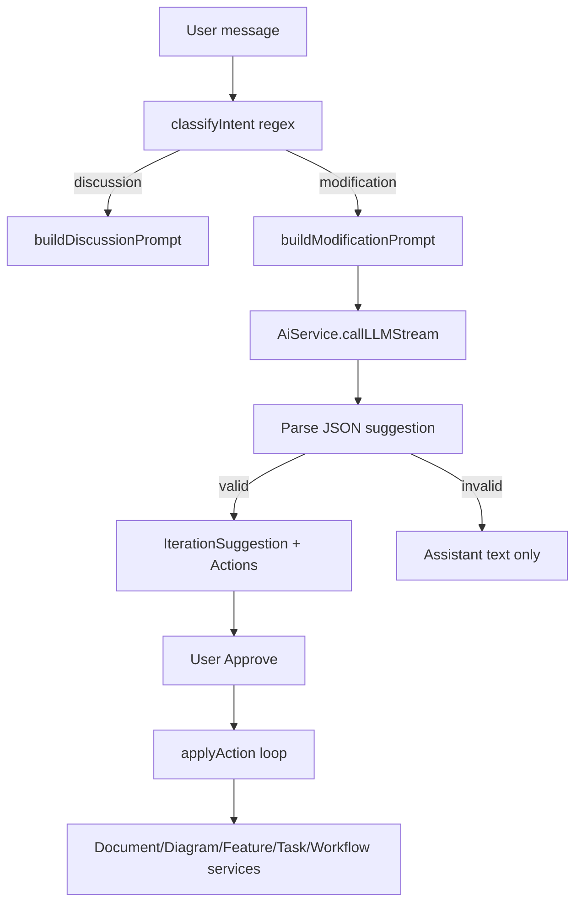
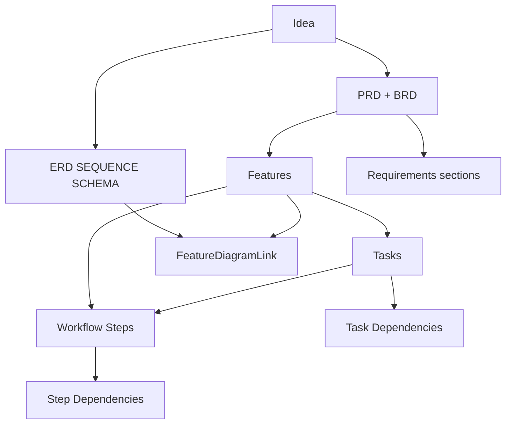
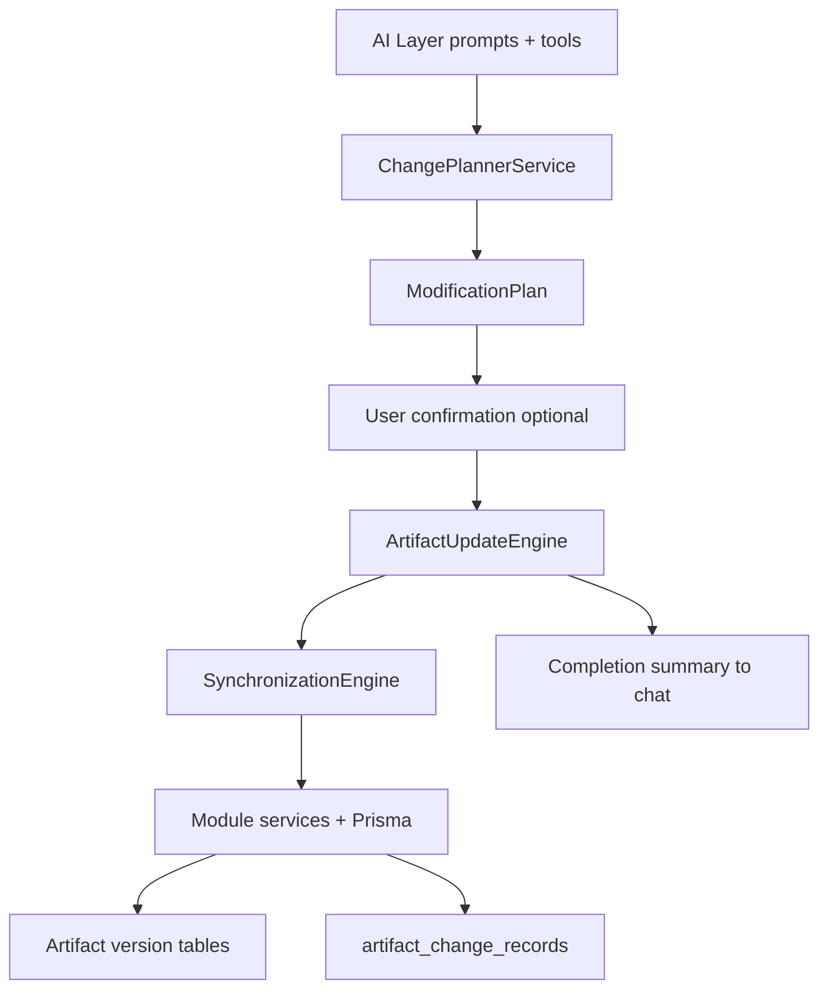

# Artifact Modification Engine — Design Document Plan

## Deliverable

Create **[docs/modules/module-06-artifact-modification-engine.md](docs/modules/module-06-artifact-modification-engine.md)** — a standalone specification that supersedes scattered Module 6 notes in [docs/modules/module-06-remediation-plan.md](docs/modules/module-06-remediation-plan.md) and [documents/modules/updated_module_6.md](documents/modules/updated_module_6.md) for **modification behavior**. Existing docs remain as historical remediation context; the new doc becomes the canonical design for how PAD modifies artifacts.

---

## Key Findings from Codebase Analysis

### What exists today

Module 6 is a **suggest-then-apply** copilot, not a modification engine:



Core files:
- Orchestrator: [server/src/modules/iteration/iteration.service.ts](server/src/modules/iteration/iteration.service.ts) (`processFeedbackInBackground`, `handleModificationResponse`, `applyAction`)
- Intent: [server/src/modules/iteration/iteration-intent.classifier.ts](server/src/modules/iteration/iteration-intent.classifier.ts)
- Context: [server/src/modules/iteration/iteration-context.builder.ts](server/src/modules/iteration/iteration-context.builder.ts)
- Prompt: [server/src/modules/ai/prompts/iteration-modification.prompt.ts](server/src/modules/ai/prompts/iteration-modification.prompt.ts)
- Schema: [server/prisma/schema.prisma](server/prisma/schema.prisma) lines 355–419
- Types: [server/src/modules/iteration/types/IIteration.ts](server/src/modules/iteration/types/IIteration.ts)

Per-artifact versioning **already exists** (`document_versions`, `diagram_versions`, `feature_versions`, `task_versions`, `workflow_step_versions`) but is **not linked** to iteration suggestions.

### Why modifications fail (root causes)

| Failure point | Current behavior | Example: "Replace MongoDB with PostgreSQL" |
|---|---|---|
| Intent classification | Regex defaults to `discussion` | "How would we switch to Postgres?" → no suggestion |
| LLM output | Single call must produce valid fenced JSON | Prose-only response → chat only, no card |
| Approval gate | Nothing persists until user clicks Approve | User expects instant apply |
| Action validity | No pre-validate `targetId` / `newContent` | Hallucinated UUID → 404 on apply |
| REGENERATE | Treated as MODIFY with static content | Does not call `DiagramService.regenerateDiagram` |
| Cross-module sync | Prompt-only; no enforced cascade | PRD updated but ERD/tasks left stale |
| Transactions | Sequential loop; partial failure → still `applied` | 3/5 actions fail silently |
| Context limits | 5000-char truncation per artifact | Full PRD/ERD cannot fit in one LLM pass |

---

## Document Structure (14 Required Sections)

### 1. Current Architecture

Document the **as-built** pipeline with sequence diagram and component table:

- **Frontend**: [web/hooks/use-iteration-chat.ts](web/hooks/use-iteration-chat.ts), [web/components/workspace/UnifiedChat.tsx](web/components/workspace/UnifiedChat.tsx), [SuggestionCard.tsx](web/components/features/iteration/SuggestionCard.tsx)
- **REST**: `GET/POST /api/v1/iterations/idea/:ideaId`, `POST /suggestion/:id/approve|reject`
- **Socket events**: `message:stream`, `suggestion:new`, `ai:state`, `artifact:updated`
- **applyAction** delegation map per module (DOCUMENT → `DocumentService.updateDocument`, etc.)
- Relationship to initial generation pipeline (Modules 1–5 via `AiService`)

Include explicit boundary: **IterationService is a thin orchestrator**, not an engine.

### 2. Existing Problems

Structured gap analysis with severity:

- **P0 — No reliable apply path**: JSON parse failures, invalid IDs, empty `newContent`
- **P0 — No change planning**: Single LLM shot replaces planner
- **P1 — No synchronization engine**: Cross-artifact consistency is aspirational (prompt text only)
- **P1 — REGENERATE broken**: Schema supports it; prompt and apply path don't
- **P1 — No transactional apply / rollback**
- **P2 — Manual approval only** (design choice vs bug — document both modes)
- **P2 — Idea/analysis not modifiable** via iteration
- **P2 — Requirements not first-class** (embedded in PRD/BRD HTML)

Map each user example to current vs desired:

| User request | Current | Desired |
|---|---|---|
| "Replace MongoDB with PostgreSQL" | Explains changes; maybe suggestion card; apply often fails | All 6+ artifact types updated, persisted, synced |
| "Add role-based access control" | May classify as discussion; partial suggestion | PRD + features + tasks + diagrams + workflow |
| "Split monolith into microservices" | Context too large; truncated | Planner decomposes into phased actions |
| "Add audit logging" | Single-feature suggestion possible | Cascade to docs, tasks, workflow steps |

### 3. Artifact Inventory

Full table for each artifact type:

| Artifact | Table | Owner module | Version table | Iteration support |
|---|---|---|---|---|
| Idea | `ideas` | idea | none | none |
| PRD/BRD | `documents` | document | `document_versions` | CREATE/MODIFY/DELETE |
| Requirements | embedded in `documents.content` | document (logical) | via document versions | indirect via DOCUMENT |
| Diagrams (ERD/SEQUENCE/SCHEMA/FLOWCHART) | `diagrams` | diagram | `diagram_versions` | CREATE/MODIFY/DELETE |
| Features | `features` | feature | `feature_versions` | CREATE/MODIFY/DELETE |
| Tasks | `tasks` | task | `task_versions` | CREATE/MODIFY/DELETE |
| Workflow | `workflows` + `workflow_steps` | workflow | `workflow_step_versions` | step CREATE/MODIFY/DELETE only |
| Feature↔Diagram links | `feature_diagram_links` | feature | none | not exposed in iteration |

Note: no filesystem artifact store; exports are ephemeral.

### 4. Dependency Graph

Document upstream/downstream relationships and sync rules:



**Synchronization rules** to specify:
- Tech stack change (DB) → Documents (tech sections) → ERD → Tasks (migration) → Workflow (setup steps)
- New feature → PRD section → Feature row → Tasks → Workflow step
- Diagram entity change → linked Features (if any) → Tasks referencing that entity
- Delete feature → cascade tasks, unlink diagrams, remove workflow steps

Document **ordering constraints** for apply (e.g., DOCUMENT before FEATURE before TASK before WORKFLOW).

### 5. Intent Detection Design

Evolve from regex classifier to **multi-signal detection**:

| Category | Examples | Route |
|---|---|---|
| `discussion` | "Explain the architecture" | Discussion prompt, no plan |
| `question` | "Why was Redis selected?" | Discussion prompt, cite artifacts |
| `modification` | "Replace Redis with RabbitMQ" | Change Planner pipeline |
| `modification_implicit` | "We should use Postgres instead" | Modification (lower confidence → confirm) |
| `clarification_needed` | "Make it better" | Ask clarifying question |

Proposed architecture:
- **Phase 1**: Enhance regex + add confidence score (reuse [iteration-intent.classifier.ts](server/src/modules/iteration/iteration-intent.classifier.ts))
- **Phase 2**: LLM intent classifier with structured output `{ intent, confidence, affectedModules[] }`
- Required AI outputs per intent documented

### 6. Change Planner Design

New component: **`ChangePlannerService`** (spec only)

**Input**: user message + full project graph (not truncated blob)
**Output**: `ModificationPlan`:

```typescript
interface ModificationPlan {
  id: string;
  userRequest: string;
  summary: string;
  affectedArtifacts: PlannedArtifactChange[];
  dependencyOrder: string[];  // artifact IDs in apply order
  estimatedActions: number;
  requiresConfirmation: boolean;
}
```

**Planner phases**:
1. **Analyze** — parse intent, extract change domain (tech stack, feature, security, architecture)
2. **Impact analysis** — walk dependency graph, enumerate affected artifacts
3. **Action generation** — per artifact: CREATE | MODIFY | DELETE | REGENERATE with rationale
4. **Validation** — verify targetIds exist, flag missing artifacts, estimate token cost
5. **Present** — return plan to user before apply (or auto-apply if configured)

Example plan for "Replace MongoDB with PostgreSQL":
- Affected: PRD (tech stack), BRD (constraints), ERD (entity syntax), 3 tasks, 2 workflow steps
- Required changes listed per artifact with action type
- Ordering: DOCUMENT → DIAGRAM → FEATURE → TASK → WORKFLOW

Document planner **does not write DB** — only produces plan consumed by Update Engine.

### 7. Artifact Update Engine Design

New component: **`ArtifactUpdateEngine`** wrapping existing module services

**Responsibilities**:
- Execute `PlannedArtifactChange` actions in dependency order
- Route to correct service method per module/action type
- Fix REGENERATE: call `DocumentService.regenerateDocument`, `DiagramService.regenerateDiagram`, etc.
- Pre-validate targets before write (ID exists, content non-empty, schema valid)
- Return per-action result `{ success, artifactId, versionId?, error? }`

**Update strategies per artifact**:

| Module | CREATE | MODIFY | DELETE | REGENERATE |
|---|---|---|---|---|
| DOCUMENT | `docRepo.createDocument` | `DocumentService.updateDocument` | `docRepo.deleteDocument` | `DocumentService.regenerateDocument` (AI) |
| DIAGRAM | `diagramRepo.create` | `DiagramService.updateDiagram` | delete | `DiagramService.regenerateDiagram` (AI) |
| FEATURE | `FeatureService.createFeature` | `FeatureService.updateFeature` | delete | re-extract from docs |
| TASK | `TaskService.createTask` | `TaskService.updateTask` | delete | re-suggest via AI |
| WORKFLOW | add step | `updateWorkflowStep` | delete step | regenerate affected steps |

**Validation strategy**: JSON schema per action type; Mermaid syntax check for diagrams; HTML sanity for documents.

**Error handling**: collect failures; do not mark plan `applied` if critical actions fail; support retry of failed actions only.

### 8. Synchronization Engine Design

New component: **`SynchronizationEngine`**

**Trigger**: after primary artifact update OR as part of planner impact analysis

**Process**:
1. Receive change event `{ module, artifactId, changeType, changeSummary }`
2. Query dependency graph for downstream artifacts
3. Generate sync actions (may invoke AI for REGENERATE downstream artifacts)
4. Queue sync actions with lower priority than user-initiated changes
5. Detect conflicts (e.g., task references deleted feature)

**Ordering rules**:
- Upstream before downstream
- Deletes in reverse order (workflow steps → tasks → features → docs)
- Parallel within same tier when no interdependency

**Conflict resolution**:
- **Auto-merge**: additive changes (new feature → append tasks)
- **Regenerate**: content drift (doc changed → re-suggest tasks)
- **Block + notify**: destructive conflict (delete feature with active workflow step)
- **User choice**: present conflict card in chat

### 9. AI Integration Design

Layered architecture — AI never writes DB directly:



**AI roles**:
- **Intent classifier** — structured intent output
- **Impact analyzer** — given change domain, list affected artifacts (tool call)
- **Content generator** — per-artifact regeneration (reuse existing generation prompts)
- **Plan summarizer** — human-readable modification summary

**Tooling interface** (spec):
- `listArtifacts(ideaId, module?)` — returns IDs + metadata
- `getArtifact(artifactId)` — full content
- `proposeChange(artifactId, changeDescription)` — returns draft content, not persisted
- `validatePlan(plan)` — checks IDs, ordering, completeness

Replace monolithic JSON-in-markdown with **structured multi-step AI calls**.

### 10. Versioning Design

**Existing**: per-artifact version tables with `changelog` field (currently `"AI Applied Iteration"`).

**New requirements**:

| Entity | Purpose |
|---|---|
| `artifact_change_records` | Links iteration/plan → artifact version(s) |
| `modification_plans` | Stores planner output + status |
| `modification_plan_actions` | Individual planned/applied actions with result |

**Fields for `artifact_change_records`**:
- `planId`, `suggestionId`, `module`, `artifactId`, `versionNumber`, `previousVersionNumber`, `changeType`, `summary`, `appliedAt`, `appliedBy` (user/system)

**Rollback support**:
- Per-artifact revert via existing `revertToVersion` APIs
- Plan-level rollback: revert all artifacts in reverse apply order
- UI: "Undo last modification" in chat

**Audit trail**: chat message → plan → actions → version snapshots (full chain queryable).

### 11. Database Changes

Proposed new Prisma models (spec):

```
ModificationPlan
  id, sessionId, userMessage, status (draft|confirmed|applying|applied|failed|rolled_back)
  summary, createdAt, appliedAt

ModificationPlanAction
  id, planId, module, targetId, actionType, newContent, status, error, artifactVersionId

ArtifactChangeRecord
  id, planId, module, artifactId, fromVersion, toVersion, changelog, createdAt
```

Extend `IterationSuggestion`:
- Add `planId` FK (bridge old suggestion UI to new engine)
- Add `failureReason`, `appliedActionCount`, `totalActionCount`

Migration strategy: backward-compatible; existing suggestions map to single-action plans.

### 12. API Changes

**New endpoints** (spec):

| Method | Path | Purpose |
|---|---|---|
| POST | `/iterations/idea/:ideaId/plan` | Generate modification plan (preview) |
| GET | `/iterations/plan/:planId` | Get plan + actions + status |
| POST | `/iterations/plan/:planId/confirm` | Confirm and execute plan |
| POST | `/iterations/plan/:planId/rollback` | Rollback plan changes |
| GET | `/iterations/idea/:ideaId/changes` | Change history for idea |

**Socket events** (new):
- `plan:created`, `plan:progress` (per-artifact status), `plan:complete`, `plan:failed`
- Extend `ai:state` phases: `planning`, `validating`, `applying`, `syncing`

**Existing endpoints**: keep approve/reject for backward compat; internally delegate to Update Engine.

### 13. Acceptance Criteria

Measurable criteria proving modifications work:

1. **Content mutation**: After "Replace MongoDB with PostgreSQL" + confirm, PRD `content` contains "PostgreSQL" and not "MongoDB" (string match test)
2. **Persistence**: Changes survive page refresh (GET artifact returns updated content)
3. **Cross-artifact sync**: ERD mermaid updated; at least one task references PostgreSQL setup
4. **Dependency ordering**: Documents updated before tasks (timestamp/version order)
5. **Version history**: `artifact_change_records` links plan to new version numbers
6. **Rollback**: Rollback restores previous version content for all affected artifacts
7. **Summary**: Chat receives structured completion message listing all modified artifacts
8. **Failure handling**: Invalid plan does not partially apply; user sees which actions failed
9. **Intent accuracy**: Modification phrases classified correctly ≥90% on test suite
10. **No silent failures**: Zero cases where status=`applied` but zero artifact versions created

Include test scenario matrix for the 4 example user requests.

### 14. Implementation Roadmap

Phased delivery aligned to dependencies:

**Phase 0 — Foundation** (1–2 weeks)
- Extract `ArtifactUpdateEngine` from `applyAction` with validation + proper REGENERATE
- Fix known bugs: partial-apply status, targetId validation
- Unit tests for apply path

**Phase 1 — Change Planner** (2–3 weeks)
- `ChangePlannerService` with dependency graph walker
- Impact analysis without full content generation
- Plan preview UI (extend SuggestionCard → PlanCard)
- New DB models: `ModificationPlan`, `ModificationPlanAction`

**Phase 2 — Synchronization Engine** (2 weeks)
- Downstream sync rules implementation
- Conflict detection
- Ordered apply with transaction boundaries

**Phase 3 — AI Tooling** (2 weeks)
- Multi-step AI calls replacing monolithic JSON prompt
- Per-artifact regeneration via existing generation prompts
- Intent classifier v2 (LLM-based)

**Phase 4 — Versioning & Rollback** (1–2 weeks)
- `ArtifactChangeRecord` model
- Plan-level rollback API + UI
- Change history panel

**Phase 5 — UX Polish** (1 week)
- Progress indicators (`planning` → `applying` → `syncing` → `done`)
- Modification summary card
- Optional auto-apply mode (config)

---

## UX Flow (to include in doc)

Example flow for "Replace MongoDB with PostgreSQL":

1. User sends message
2. PAD: `ai:state` → `planning` — "Analyzing project..."
3. Planner returns plan with 6 affected artifacts
4. PAD: shows plan card — "This will update PRD, ERD, 3 tasks, workflow. Confirm?"
5. User confirms
6. PAD: `applying` — per-artifact progress via `plan:progress`
7. Sync engine updates downstream artifacts
8. PAD: `done` — summary with bullet list of changes
9. Panels refresh via `artifact:updated`

---

## Relationship to Existing Docs

| Doc | Role after AME spec |
|---|---|
| [documents/modules/module_6_iterative_feedback_chat_based_updates.md](documents/modules/module_6_iterative_feedback_chat_based_updates.md) | Original module requirements (aspirational) |
| [docs/modules/module-06-remediation-plan.md](docs/modules/module-06-remediation-plan.md) | Historical gap analysis + UI fixes already applied |
| [documents/modules/updated_module_6.md](documents/modules/updated_module_6.md) | Copilot refactor plan (partially implemented) |
| **New AME spec** | **Canonical design for modification behavior** |

Cross-reference, do not duplicate UI polish details from [module-06-chat-ui-polish-plan.md](docs/modules/module-06-chat-ui-polish-plan.md).

---

## Writing Approach

1. Read final state of key files one more time before writing (ensure applyAction line numbers accurate)
2. Write all 14 sections in order with mermaid diagrams where specified
3. Include code citations to current implementation as "as-built" references
4. Clearly label **Current** vs **Proposed** in each design section
5. No code changes, no new TypeScript files — markdown only
