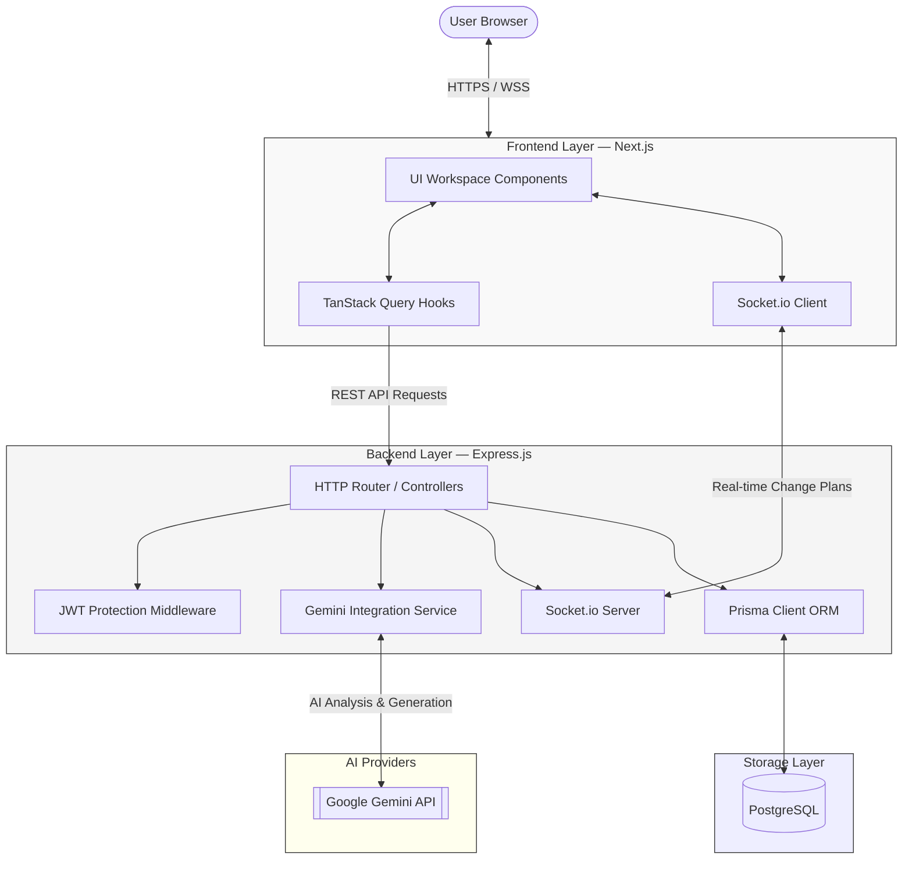
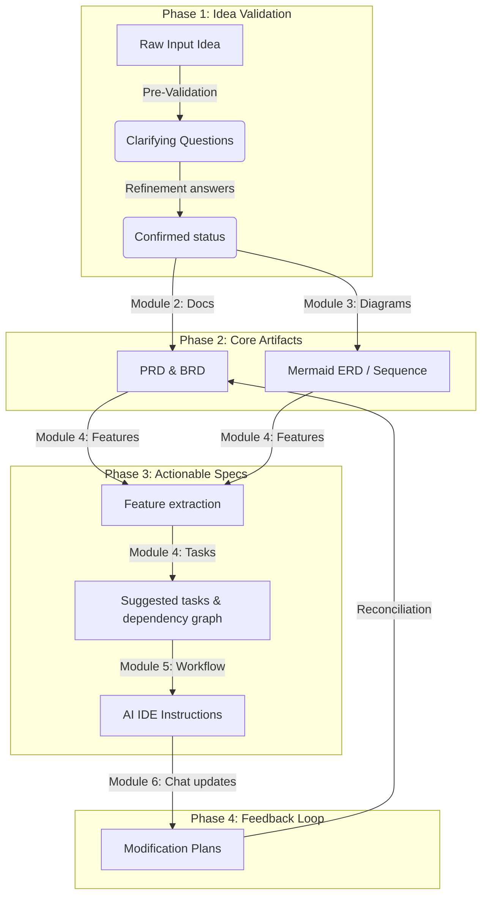

# PAD — Product Architecture Designer

<div align="center">


**[Documentation](#documentation--api-reference) · [Architecture](#architecture) · [Getting Started](#getting-started) · [Modules](#project-structure--modules) · [Contributing](#contributing)**

</div>

> AI-powered system design platform that transforms raw software ideas into complete, production-ready SDLC artifacts.

---

PAD is a modern web application designed to accelerate software engineering planning. Starting from a simple client brief or business idea, PAD automatically generates system design documents, interactive UML diagrams, structured feature breakdowns, actionable tasks with dependency graphs, and IDE-compatible workflow instructions — all powered by Google Gemini and live-editable inside a unified React workspace.

---

## Table of Contents

- [Why PAD](#why-pad)
- [Architecture](#architecture)
- [How It Works](#how-it-works)
- [Tech Stack](#tech-stack)
- [Project Structure & Modules](#project-structure--modules)
- [Getting Started](#getting-started)
- [Configuration](#configuration)
- [Documentation & API Reference](#documentation--api-reference)

---

## Why PAD

Traditional software pre-development planning (gathering requirements, drawing database schemas, and writing task lists) takes days. **PAD** reduces this to minutes while offering features that maintain standard-compliant rigor:

- **AI-Powered Intake & Pre-Validation**: Proactively extracts missing details, suggestions, risks, and clarifying questions from your raw brief before building anything.
- **Synchronized Artifact Set**: Requirements (PRD/BRD), Diagrams (ERD, Sequence, Flowcharts), Features, and Tasks are linked semantically.
- **MermaidJS Live Editor**: Review and edit generated architecture diagrams with real-time browser preview.
- **Version Control with Reversion**: Supports full version history for all requirements, diagrams, features, and tasks, enabling you to revert any artifact to any previous commit version.
- **Interactive Chat-Based Updating**: Refine your system designs recursively via an AI chat. PAD compiles recommendations into a *Modification Plan* outlining specific changes across all modules, which can be approved or rolled back with one click.

---

## Architecture

PAD is built as a split client-server monolith with real-time Socket.io state synchronization and background worker queues.



---

## How It Works

PAD models document planning into sequential, dependency-aware phases:



---

## Tech Stack

| Layer | Technologies |
|---|---|
| **Frontend Framework** | Next.js 16 (App Router), React 19, Vite, Tailwind CSS, shadcn/ui |
| **API Client & State** | TanStack Query v5 (React Query), Socket.io Client |
| **Backend Runtime** | Node.js + Express.js |
| **Language** | TypeScript |
| **Database & ORM** | PostgreSQL + Prisma ORM |
| **Generative AI** | Google Gemini API (via `@google/generative-ai`) |
| **Authentication** | JSON Web Tokens (JWT) + HTTP Headers |
| **Diagram Engine** | MermaidJS Live Rendering |

---

## Project Structure & Modules

```
PAD/
├── server/                    # Node.js Express backend
│   ├── prisma/                # Prisma schema & migrations
│   │   └── schema.prisma      # PostgreSQL models
│   ├── src/
│   │   ├── modules/           # Module controllers, services, and routes
│   │   │   ├── ai/            # Gemini client logic
│   │   │   ├── auth/          # User login, registration, and forget password
│   │   │   ├── diagram/       # Mermaid generation & versions
│   │   │   ├── document/      # PRD/BRD generation & versions
│   │   │   ├── feature/       # Feature requirements & linkings
│   │   │   ├── iteration/     # Chat sessions & Modification Plans
│   │   │   ├── task/          # Feature tasks & dependency tree
│   │   │   └── workflow/      # Cursor/Copilot script exports
│   │   └── middlewares/       # Express middlewares (JWT guards, errors)
│   └── README.md              # Server development readme
└── web/                       # Next.js frontend
    ├── src/
    │   ├── app/               # App Router pages
    │   ├── components/        # React components (dialogs, sidebars, charts)
    │   │   └── providers/     # QueryProvider, ThemeProvider, StreamingProvider
    │   ├── features/          # Module components and hooks
    │   │   ├── chat/          # Unified chat panel & modification plans
    │   │   ├── diagrams/      # Diagram editor & versions
    │   │   ├── documents/     # PRD/BRD text fields & versions
    │   │   ├── features/      # Feature requirements listing
    │   │   ├── ideas/         # Idea workspace sidebar & pre-validation
    │   │   └── workflow/      # Workflow IDE checklist export
    │   ├── api/               # apiClient, errors, and logging interceptors
    │   └── README.md          # Frontend development readme
```

---

## Getting Started

### Prerequisites

- [Node.js](https://nodejs.org/) v18+
- [PostgreSQL](https://www.postgresql.org/) v16+
- [pnpm](https://pnpm.io/) package manager (`npm install -g pnpm`)
- Google Gemini API Key

---

### Step-by-Step Installation

#### 1. Setup the Database & Server Backend
```bash
cd server
pnpm install

# Create environment file
cp .env.example .env
# Edit .env and supply your DATABASE_URL and GEMINI_API_KEY
```

Run database migrations:
```bash
pnpm prisma db push
```

Start the server:
```bash
pnpm dev
```
The server will run on `http://localhost:8080`.

---

#### 2. Setup the Frontend Client
```bash
cd ../web
pnpm install

# Create environment file
cp .env.example .env.local
# Edit .env.local and confirm NEXT_PUBLIC_API_URL is pointing to the server
```

Start Next.js dev server:
```bash
pnpm dev
```
Open `http://localhost:3000` in your web browser.

---

## Configuration

### Server Environment Variables (`server/.env`)

| Variable | Description | Default |
|---|---|---|
| `DATABASE_URL` | PostgreSQL connection string | `postgresql://...` |
| `PORT` | Backend port | `8080` |
| `JWT_SECRET` | Secret key for signing authorization tokens | — |
| `GEMINI_API_KEY` | **Required.** Google Gemini API Key | — |

---

## Documentation & API Reference

All requests must pass authentication via the `Authorization: Bearer <JWT_Token>` header, except for registration/login endpoints.

---

### 1. Authentication (`/api/v1/auth`)

#### Register a New Account
- **Endpoint**: `POST /api/v1/auth/register`
- **Body**:
  ```json
  {
    "firstName": "John",
    "lastName": "Doe",
    "email": "john.doe@example.com",
    "password": "secure_password"
  }
  ```

#### Authenticate & Login
- **Endpoint**: `POST /api/v1/auth/login`
- **Body**:
  ```json
  {
    "email": "john.doe@example.com",
    "password": "secure_password"
  }
  ```
- **Response**: Returns JWT token and user profile details.

---

### 2. Idea Pre-Validation (`/api/v1/ideas`)

#### Submit a Software Brief
- **Endpoint**: `POST /api/v1/ideas`
- **Body**: `{"rawText": "A SaaS app for tracking gym workouts with friends"}`
- **Response**: Returns an `idea` object containing `status: "draft"`.

#### Run AI Pre-Validation (Streaming)
- **Endpoint**: `POST /api/v1/ideas/:id/analyze`
- **Response**: Streams chunks of analysis including missing details, suggestions, and clarifying questions.

#### Submit Clarification Answers
- **Endpoint**: `POST /api/v1/ideas/:id/refine`
- **Body**:
  ```json
  {
    "answers": [
      { "question": "What platforms are supported?", "answer": "iOS and Android" }
    ]
  }
  ```

#### Confirm Workspace
- **Endpoint**: `POST /api/v1/ideas/:id/confirm`
- **Response**: Sets `status` to `"confirmed"`, permitting requirements document generation.

---

### 3. Requirements Documents (`/api/v1/documents`)

#### Generate PRD & BRD
- **Endpoint**: `POST /api/v1/documents/generate/:ideaId`
- **Response**: Auto-generates the complete requirement texts and sets status to `"published"`.

#### Update Document Content
- **Endpoint**: `PUT /api/v1/documents/:id`
- **Body**: `{"title": "Updated Title", "content": "Markdown...", "changelog": "Commit details"}`
- **Response**: Increments document version and returns the latest document record.

#### Revert to a Version
- **Endpoint**: `POST /api/v1/documents/:id/revert/:version`
- **Response**: Restores the document's body to the requested version number.

---

### 4. System Architecture Diagrams (`/api/v1/diagrams`)

#### Generate Mermaid Diagrams
- **Endpoint**: `POST /api/v1/diagrams/generate/:ideaId`
- **Response**: Returns array of diagrams (ERD, Sequence, Flowcharts).

#### Update Diagram Mermaid Code
- **Endpoint**: `PUT /api/v1/diagrams/:id`
- **Body**: `{"mermaidCode": "erDiagram...", "changelog": "Edit layout"}`

---

### 5. Features & Tasks (`/api/v1/features`, `/api/v1/tasks`)

#### Extract Features from PRD/BRD
- **Endpoint**: `POST /api/v1/features/extract/:ideaId`

#### Suggest Feature Tasks
- **Endpoint**: `POST /api/v1/tasks/suggest/:featureId`
- **Response**: Returns recommended tasks with effort estimates and dependency indicators.

#### Manage Task Dependencies
- **Endpoint**: `POST /api/v1/tasks/:id/dependencies/:dependsOnId`

---

### 6. Chat Iterations & AME (`/api/v1/iterations`)

#### Post Iteration Message
- **Endpoint**: `POST /api/v1/iterations/idea/:ideaId/message`
- **Body**: `{"content": "Add a user profile picture feature"}`
- **Response**: Generates a **Modification Plan** listing required edits.

#### Confirm & Apply Modification Plan
- **Endpoint**: `POST /api/v1/iterations/idea/:ideaId/plan/:planId/confirm`
- **Response**: Automatically edits documents, diagrams, features, or tasks outlined in the plan.

#### Rollback Modification Plan
- **Endpoint**: `POST /api/v1/iterations/idea/:ideaId/plan/:planId/rollback`
- **Response**: Restores all changed artifacts back to their version states prior to confirmation.

---

## Contributing

1. Fork the repository and create your feature branch: `git checkout -b feature/amazing-feature`
2. Commit your changes following conventions: `git commit -m 'feat: Add amazing feature'`
3. Push to the branch: `git push origin feature/amazing-feature`
4. Open a Pull Request.

---

## License

This project is licensed under the Elrayes License. See [LICENSE](LICENSE) for details.
