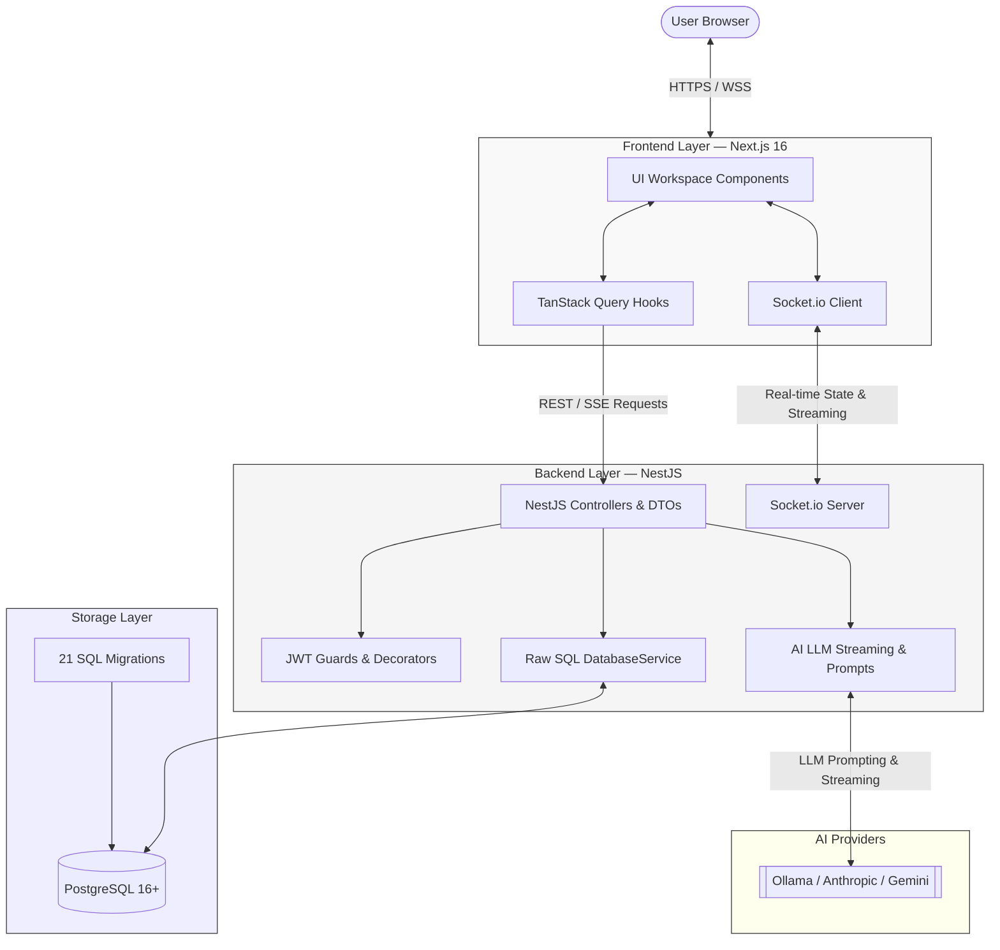
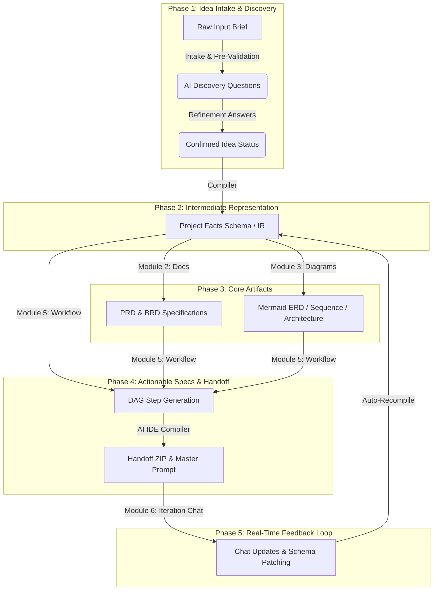

# PAD — Product Architecture Designer

<div align="center">


**[Documentation](#documentation--api-reference) · [Architecture](#architecture) · [How It Works](#how-it-works) · [Tech Stack](#tech-stack) · [Getting Started](#getting-started)**

</div>

> AI-powered system design platform that transforms raw software ideas into complete, production-ready SDLC artifacts, structured Intermediate Representation (IR), and AI IDE handoff packages.

---

PAD is a modern web application designed to accelerate software engineering planning. Starting from a simple client brief or business idea, PAD automatically generates system design documents (PRD/BRD), interactive UML diagrams (ERD, Sequence, Architecture), structured Intermediate Representation schemas, actionable DAG execution steps, and AI IDE handoff packages for Cursor, Copilot, and Windsurf — all live-editable inside a unified Next.js workspace with real-time Socket.io state synchronization.

---

## Table of Contents

- [Why PAD](#why-pad)
- [Architecture](#architecture)
- [How It Works](#how-it-works)
- [Tech Stack](#tech-stack)
- [Project Structure & Modules](#project-structure--modules)
- [Getting Started](#getting-started)
- [Configuration](#configuration)
- [Documentation & API Reference](#documentation--api-reference)

---

## Why PAD

Traditional software pre-development planning (gathering requirements, drawing database schemas, aligning architectural constraints, and writing task lists) takes days. **PAD** reduces this to minutes while maintaining standard-compliant rigor:

- **AI-Powered Intake & Pre-Validation**: Proactively extracts missing details, suggestions, risks, and clarifying questions from your raw brief before building anything.
- **Intermediate Representation (IR)**: Compiles all project facts, database models, entities, relationships, and business rules into a normalized, single source of truth.
- **Synchronized Artifact Set**: Requirements (PRD/BRD), Diagrams (ERD, Sequence, Flowcharts), and Workflow steps remain semantically consistent with the IR.
- **MermaidJS Live Editor & Multi-Tier Fallback**: Review and edit generated architecture diagrams with real-time browser preview and multi-tier validation fallback.
- **AI IDE Handoff Compiler**: Generates downloadable ZIP packages containing `.cursorrules`, `.windsurfrules`, architecture context, and database specifications for downstream coding assistants.
- **Interactive Chat-Based Iteration**: Refine system designs recursively via an AI chat. PAD applies schema changes and autocompiles downstream documents and diagrams in real-time.

---

## Architecture

PAD is built as a split client-server monolith with real-time Socket.io state synchronization, SSE streaming, and raw parameterized SQL persistence.



---

## How It Works

PAD models system design into sequential, dependency-aware phases:



---

## Tech Stack

| Layer | Technologies |
|---|---|
| **Frontend Framework** | Next.js 16 (App Router), React 19, Tailwind CSS, shadcn/ui |
| **API Client & State** | TanStack Query v5 (React Query), Socket.io Client |
| **Backend Runtime** | Node.js + NestJS 12 (TypeScript) |
| **Database & Migrations** | PostgreSQL 16+, Raw SQL (`pg.Pool` via `DatabaseService`), 21 atomic migrations |
| **Generative AI** | Multi-Provider (Ollama, Gemini, Claude) with SSE & Socket Streaming |
| **Authentication** | Passport JWT, `@CurrentUser()`, role guards |
| **API Documentation** | Swagger OpenAPI at `/api/docs` |
| **Diagram Engine** | MermaidJS Live Rendering with multi-tier validation |

---

## Project Structure & Modules

```
PAD/
├── server/                    # NestJS backend server
│   ├── migrations/            # 21 atomic SQL schema migrations
│   ├── scripts/               # Migration runner (migrate.ts)
│   ├── src/
│   │   ├── database/          # DatabaseService & raw SQL engine
│   │   ├── common/            # Filters, interceptors, middleware & guards
│   │   ├── modules/
│   │   │   ├── ai/            # Multi-provider LLM service & prompts
│   │   │   ├── auth/          # JWT authentication, login, registration
│   │   │   ├── user/          # User profiles & role management
│   │   │   ├── file/          # Document upload & text extractors (PDF/MD)
│   │   │   ├── guideline/     # Architectural guidelines
│   │   │   ├── idea/          # Idea intake & state machine
│   │   │   ├── discovery/     # Discovery sessions & questions
│   │   │   ├── document/      # PRD & BRD generation & versioning
│   │   │   ├── diagram/       # Mermaid diagrams & multi-tier validation
│   │   │   ├── ir/            # Project IR compiler & patcher
│   │   │   ├── workflow/      # Workflow DAG & AI IDE handoff compiler
│   │   │   └── iteration/     # Chat sessions, streaming & schema patching
│   │   ├── app.module.ts      # Root NestJS module
│   │   └── main.ts            # NestJS bootstrap & Swagger configuration
│   └── README.md              # Server development readme
└── web/                       # Next.js frontend application
    ├── src/
    │   ├── app/               # Next.js App Router pages
    │   ├── components/        # React components (dialogs, sidebars, charts)
    │   ├── features/          # Feature components, hooks & queries
    │   └── api/               # API client, error handling, interceptors
    └── README.md              # Frontend development readme
```

---

## Getting Started

### Prerequisites

- [Node.js](https://nodejs.org/) v18+
- [PostgreSQL](https://www.postgresql.org/) v16+
- [pnpm](https://pnpm.io/) package manager (`npm install -g pnpm`)
- Local Ollama instance or cloud AI API keys

---

### Step-by-Step Installation

#### 1. Setup the Database & Backend Server
```bash
cd server
pnpm install

# Create environment file
cp .env.example .env
# Edit .env and supply your DATABASE_URL, JWT_SECRET, and AI provider credentials
```

Apply database migrations:
```bash
pnpm migrate:up
```

Start the NestJS server:
```bash
pnpm dev
```
The server will run on `http://localhost:5000` with Swagger docs at `http://localhost:5000/api/docs`.

---

#### 2. Setup the Frontend Client
```bash
cd ../web
pnpm install

# Create environment file
cp .env.example .env.local
# Edit .env.local and confirm NEXT_PUBLIC_API_URL points to the server
```

Start Next.js dev server:
```bash
pnpm dev
```
Open `http://localhost:3000` in your web browser.

---

## Configuration

### Server Environment Variables (`server/.env`)

| Variable | Description | Default |
|---|---|---|
| `DATABASE_URL` | PostgreSQL connection string | `postgresql://...` |
| `PORT` | Backend port | `5000` |
| `JWT_SECRET` | Secret key for signing authorization tokens | — |
| `OLLAMA_URL` | Ollama Server URL (if using local AI) | `http://localhost:11434` |
| `OLLAMA_MODEL` | Main LLM Model name | `qwen3.5:4b` |

---

## Documentation & API Reference

Interactive Swagger OpenAPI documentation is available at:
**`http://localhost:5000/api/docs`**

---

## Contributing

1. Fork the repository and create your feature branch: `git checkout -b feature/amazing-feature`
2. Commit your changes following conventions: `git commit -m 'feat: add amazing feature'`
3. Push to the branch: `git push origin feature/amazing-feature`
4. Open a Pull Request.

---

## License

This project is licensed under the Elrayes License. See [LICENSE](LICENSE) for details.
