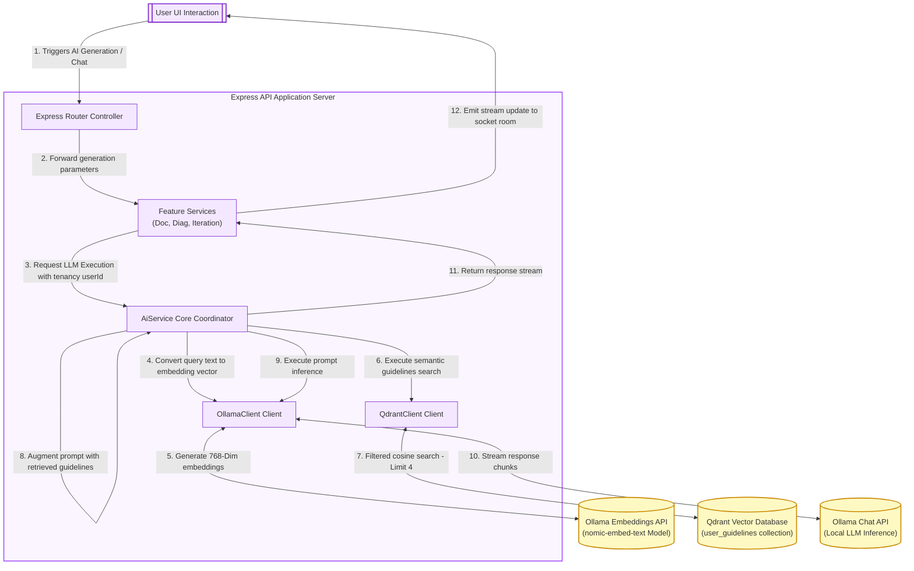

```mermaid
flowchart TD
    %% External Inputs & LLM/Vector Targets
    user[["User UI Interaction"]]
    ollama_emb[("Ollama Embeddings API\n(nomic-embed-text Model)")]
    qdrant_db[("Qdrant Vector Database\n(user_guidelines collection)")]
    ollama_chat[("Ollama Chat API\n(Local LLM Inference)")]

    %% App Server Pipeline
    subgraph AppServer [Express API Application Server]
        controller["Express Router Controller"]
        service["Feature Services\n(Doc, Diag, Iteration)"]
        ai_core["AiService Core Coordinator"]
        ollama_client["OllamaClient Client"]
        qdrant_client["QdrantClient Client"]
    end

    %% Styling configurations (Yellow & Purple Theme)
    style user fill:#f3e8ff,stroke:#7e22ce,stroke-width:2px
    style AppServer fill:#faf5ff,stroke:#a855f7,stroke-width:2px
    style controller fill:#f3e8ff,stroke:#7e22ce,stroke-width:1px
    style service fill:#f3e8ff,stroke:#7e22ce,stroke-width:1px
    style ai_core fill:#f3e8ff,stroke:#7e22ce,stroke-width:1px
    style ollama_client fill:#f3e8ff,stroke:#7e22ce,stroke-width:1px
    style qdrant_client fill:#f3e8ff,stroke:#7e22ce,stroke-width:1px

    style ollama_emb fill:#fef9c3,stroke:#ca8a04,stroke-width:2px
    style qdrant_db fill:#fef9c3,stroke:#ca8a04,stroke-width:2px
    style ollama_chat fill:#fef9c3,stroke:#ca8a04,stroke-width:2px

    %% Flow links
    user --->|1. Triggers AI Generation / Chat| controller
    controller --->|2. Forward generation parameters| service
    service --->|3. Request LLM Execution with tenancy userId| ai_core
    ai_core --->|4. Convert query text to embedding vector| ollama_client
    ollama_client <--->|5. Generate 768-Dim embeddings| ollama_emb
    ai_core --->|6. Execute semantic guidelines search| qdrant_client
    qdrant_client <--->|7. Filtered cosine search - Limit 4| qdrant_db
    ai_core --->|8. Augment prompt with retrieved guidelines| ai_core
    ai_core --->|9. Execute prompt inference| ollama_client
    ollama_client <--->|10. Stream response chunks| ollama_chat
    ai_core --->|11. Return response stream| service
    service --->|12. Emit stream update to socket room| user
```
