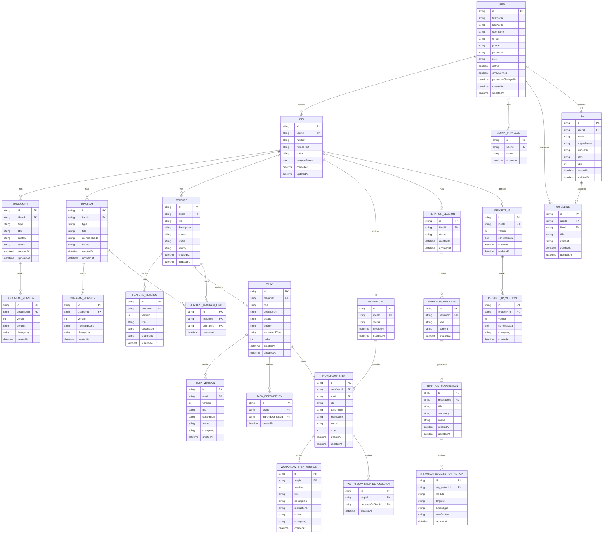

```mermaid
erDiagram
    %% Relations
    USER ||--o{ IDEA : "creates"
    USER ||--o{ ADMIN_PRIVILEGE : "has"
    USER ||--o{ GUIDELINE : "manages"
    USER ||--o{ FILE : "uploads"

    IDEA ||--o{ DOCUMENT : "has"
    IDEA ||--o{ DIAGRAM : "has"
    IDEA ||--o{ FEATURE : "has"
    IDEA ||--|o WORKFLOW : "defines"
    IDEA ||--|o ITERATION_SESSION : "has"
    IDEA ||--|o PROJECT_IR : "defines"

    DOCUMENT ||--o{ DOCUMENT_VERSION : "tracks"
    DIAGRAM ||--o{ DIAGRAM_VERSION : "tracks"
    FEATURE ||--o{ FEATURE_VERSION : "tracks"
    TASK ||--o{ TASK_VERSION : "tracks"
    WORKFLOW_STEP ||--o{ WORKFLOW_STEP_VERSION : "tracks"
    PROJECT_IR ||--o{ PROJECT_IR_VERSION : "tracks"

    FEATURE ||--o{ TASK : "contains"
    FEATURE ||--o{ FEATURE_DIAGRAM_LINK : "links"
    DIAGRAM ||--o{ FEATURE_DIAGRAM_LINK : "links"

    TASK ||--o{ TASK_DEPENDENCY : "defines"
    TASK ||--o{ WORKFLOW_STEP : "maps"

    WORKFLOW ||--o{ WORKFLOW_STEP : "contains"
    WORKFLOW_STEP ||--o{ WORKFLOW_STEP_DEPENDENCY : "defines"

    ITERATION_SESSION ||--o{ ITERATION_MESSAGE : "contains"
    ITERATION_MESSAGE ||--|o ITERATION_SUGGESTION : "generates"
    ITERATION_SUGGESTION ||--o{ ITERATION_SUGGESTION_ACTION : "defines"

    FILE ||--|o GUIDELINE : "attaches"

    %% Entities & Attributes
    USER {
        string id PK
        string firstName
        string lastName
        string username
        string email
        string phone
        string password
        string role
        boolean active
        boolean emailVerified
        datetime passwordChangedAt
        datetime createdAt
        datetime updatedAt
    }

    ADMIN_PRIVILEGE {
        string id PK
        string userId FK
        string name
        datetime createdAt
    }

    IDEA {
        string id PK
        string userId FK
        string rawText
        string refinedText
        string status
        json analysisResult
        datetime createdAt
        datetime updatedAt
    }

    DOCUMENT {
        string id PK
        string ideaId FK
        string type
        string title
        string content
        string status
        datetime createdAt
        datetime updatedAt
    }

    DOCUMENT_VERSION {
        string id PK
        string documentId FK
        int version
        string content
        string changelog
        datetime createdAt
    }

    DIAGRAM {
        string id PK
        string ideaId FK
        string type
        string title
        string mermaidCode
        string status
        datetime createdAt
        datetime updatedAt
    }

    DIAGRAM_VERSION {
        string id PK
        string diagramId FK
        int version
        string mermaidCode
        string changelog
        datetime createdAt
    }

    FEATURE {
        string id PK
        string ideaId FK
        string title
        string description
        string source
        string status
        string priority
        datetime createdAt
        datetime updatedAt
    }

    FEATURE_VERSION {
        string id PK
        string featureId FK
        int version
        string title
        string description
        string changelog
        datetime createdAt
    }

    TASK {
        string id PK
        string featureId FK
        string title
        string description
        string status
        string priority
        string estimatedEffort
        int order
        datetime createdAt
        datetime updatedAt
    }

    TASK_VERSION {
        string id PK
        string taskId FK
        int version
        string title
        string description
        string status
        string changelog
        datetime createdAt
    }

    TASK_DEPENDENCY {
        string id PK
        string taskId FK
        string dependsOnTaskId FK
        datetime createdAt
    }

    FEATURE_DIAGRAM_LINK {
        string id PK
        string featureId FK
        string diagramId FK
        datetime createdAt
    }

    WORKFLOW {
        string id PK
        string ideaId FK
        string status
        datetime createdAt
        datetime updatedAt
    }

    WORKFLOW_STEP {
        string id PK
        string workflowId FK
        string taskId FK
        string title
        string description
        string instructions
        string status
        int order
        datetime createdAt
        datetime updatedAt
    }

    WORKFLOW_STEP_DEPENDENCY {
        string id PK
        string stepId FK
        string dependsOnStepId FK
        datetime createdAt
    }

    WORKFLOW_STEP_VERSION {
        string id PK
        string stepId FK
        int version
        string title
        string description
        string instructions
        string status
        string changelog
        datetime createdAt
    }

    PROJECT_IR {
        string id PK
        string ideaId FK
        int version
        json schemaData
        datetime createdAt
        datetime updatedAt
    }

    PROJECT_IR_VERSION {
        string id PK
        string projectIRId FK
        int version
        json schemaData
        string changelog
        datetime createdAt
    }

    ITERATION_SESSION {
        string id PK
        string ideaId FK
        string status
        datetime createdAt
        datetime updatedAt
    }

    ITERATION_MESSAGE {
        string id PK
        string sessionId FK
        string role
        string content
        datetime createdAt
    }

    ITERATION_SUGGESTION {
        string id PK
        string messageId FK
        string title
        string summary
        string status
        datetime createdAt
        datetime updatedAt
    }

    ITERATION_SUGGESTION_ACTION {
        string id PK
        string suggestionId FK
        string module
        string targetId
        string actionType
        string newContent
        datetime createdAt
    }

    FILE {
        string id PK
        string userId FK
        string name
        string originalname
        string mimetype
        string path
        int size
        datetime createdAt
        datetime updatedAt
    }

    GUIDELINE {
        string id PK
        string userId FK
        string fileId FK
        string title
        string content
        datetime createdAt
        datetime updatedAt
    }
```
