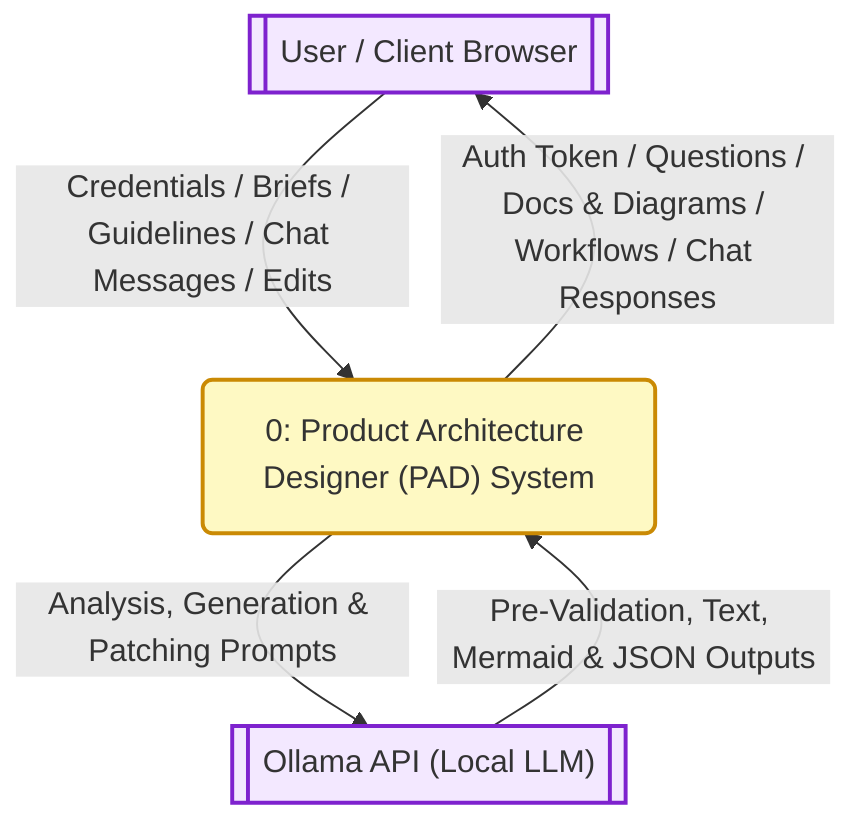

```mermaid
flowchart TB
    %% External Entities (Styled as double-lined boxes)
    user[["User / Client Browser"]]
    ollama[["Ollama API (Local LLM)"]]

    %% Central Process (Context System Boundary)
    PAD("0: Product Architecture Designer (PAD) System")

    %% Styling configurations (Yellow & Purple Theme)
    style user fill:#f3e8ff,stroke:#7e22ce,stroke-width:2px
    style ollama fill:#f3e8ff,stroke:#7e22ce,stroke-width:2px
    style PAD fill:#fef9c3,stroke:#ca8a04,stroke-width:2px

    %% Data Flows
    
    %% User <---> PAD System Flows
    user -->|Credentials / Briefs / Guidelines / Chat Messages / Edits| PAD
    PAD -->|Auth Token / Questions / Docs & Diagrams / Workflows / Chat Responses| user

    %% PAD System <---> Ollama API Flows
    PAD -->|Analysis, Generation & Patching Prompts| ollama
    ollama -->|Pre-Validation, Text, Mermaid & JSON Outputs| PAD
```
