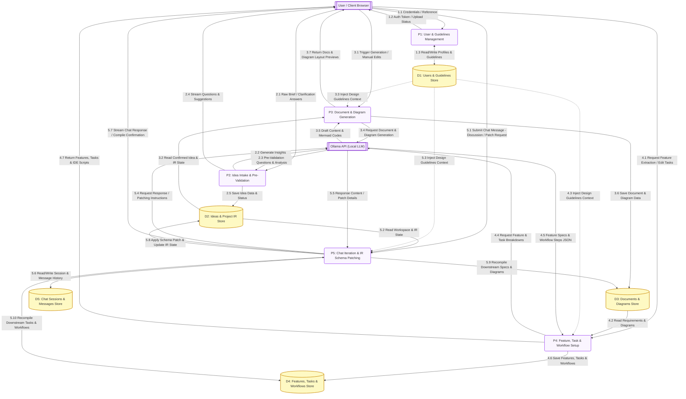

```mermaid
flowchart TB
    %% External Entities (Styled as double-lined boxes)
    user[["User / Client Browser"]]
    ollama[["Ollama API (Local LLM)"]]

    %% Processes (Rounded boxes)
    P1("P1: User & Guidelines Management")
    P2("P2: Idea Intake & Pre-Validation")
    P3("P3: Document & Diagram Generation")
    P4("P4: Feature, Task & Workflow Setup")
    P5("P5: Chat Iteration & IR Schema Patching")

    %% Data Stores (Database tables represented as cylindrical shape)
    D1[("D1: Users & Guidelines Store")]
    D2[("D2: Ideas & Project IR Store")]
    D3[("D3: Documents & Diagrams Store")]
    D4[("D4: Features, Tasks & Workflows Store")]
    D5[("D5: Chat Sessions & Messages Store")]

    %% Styling configurations (Yellow & Purple Theme)
    style user fill:#f3e8ff,stroke:#7e22ce,stroke-width:2px
    style ollama fill:#f3e8ff,stroke:#7e22ce,stroke-width:2px
    
    style P1 fill:#faf5ff,stroke:#a855f7,stroke-width:2px
    style P2 fill:#faf5ff,stroke:#a855f7,stroke-width:2px
    style P3 fill:#faf5ff,stroke:#a855f7,stroke-width:2px
    style P4 fill:#faf5ff,stroke:#a855f7,stroke-width:2px
    style P5 fill:#faf5ff,stroke:#a855f7,stroke-width:2px

    style D1 fill:#fef9c3,stroke:#ca8a04,stroke-width:2px
    style D2 fill:#fef9c3,stroke:#ca8a04,stroke-width:2px
    style D3 fill:#fef9c3,stroke:#ca8a04,stroke-width:2px
    style D4 fill:#fef9c3,stroke:#ca8a04,stroke-width:2px
    style D5 fill:#fef9c3,stroke:#ca8a04,stroke-width:2px

    %% Relationships and Data Flows
    
    %% P1: User & Guidelines Management
    user -->|1.1 Credentials / Reference Files| P1
    P1 -->|1.2 Auth Token / Upload Status| user
    P1 <-->|1.3 Read/Write Profiles & Guidelines| D1

    %% P2: Idea Intake & Pre-Validation
    user -->|2.1 Raw Brief / Clarification Answers| P2
    P2 -->|2.2 Generate Insights Request| ollama
    ollama -->|2.3 Pre-Validation Questions & Analysis| P2
    P2 -->|2.4 Stream Questions & Suggestions| user
    P2 -->|2.5 Save Idea Data & Status| D2

    %% P3: Document & Diagram Generation
    user -->|3.1 Trigger Generation / Manual Edits| P3
    D2 -->|3.2 Read Confirmed Idea & IR State| P3
    D1 -.->|3.3 Inject Design Guidelines Context| P3
    P3 -->|3.4 Request Document & Diagram Generation| ollama
    ollama -->|3.5 Draft Content & Mermaid Codes| P3
    P3 -->|3.6 Save Document & Diagram Data| D3
    P3 -->|3.7 Return Docs & Diagram Layout Previews| user

    %% P4: Feature, Task & Workflow Setup
    user -->|4.1 Request Feature Extraction / Edit Tasks| P4
    D3 -->|4.2 Read Requirements & Diagrams| P4
    D1 -.->|4.3 Inject Design Guidelines Context| P4
    P4 -->|4.4 Request Feature & Task Breakdowns| ollama
    ollama -->|4.5 Feature Specs & Workflow Steps JSON| P4
    P4 -->|4.6 Save Features, Tasks & Workflows| D4
    P4 -->|4.7 Return Features, Tasks & IDE Scripts| user

    %% P5: Chat Iteration & IR Schema Patching
    user -->|5.1 Submit Chat Message - Discussion / Patch Request| P5
    D2 -->|5.2 Read Workspace & IR State| P5
    D1 -.->|5.3 Inject Design Guidelines Context| P5
    P5 -->|5.4 Request Response / Patching Instructions| ollama
    ollama -->|5.5 Response Content / Patch Details| P5
    P5 <-->|5.6 Read/Write Session & Message History| D5
    P5 -->|5.7 Stream Chat Response / Compile Confirmation| user
    P5 -->|5.8 Apply Schema Patch & Update IR State| D2
    P5 -->|5.9 Recompile Downstream Specs & Diagrams| D3
    P5 -->|5.10 Recompile Downstream Tasks & Workflows| D4
```
