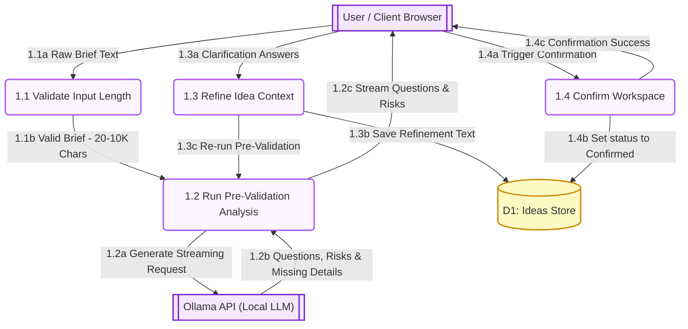
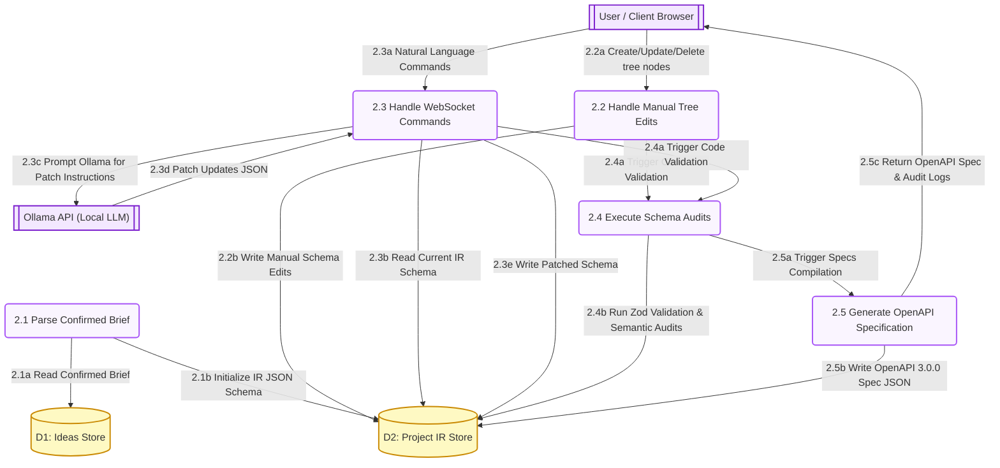
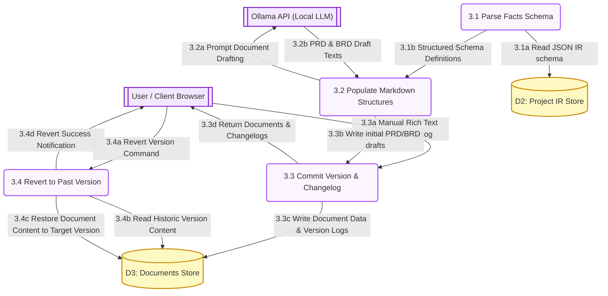
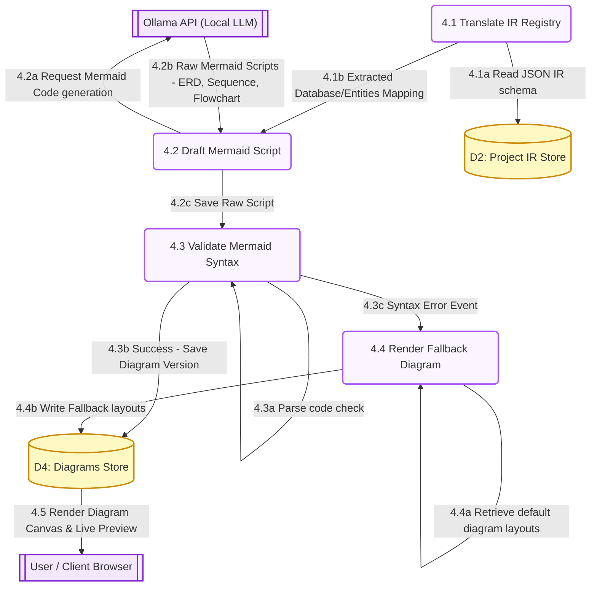
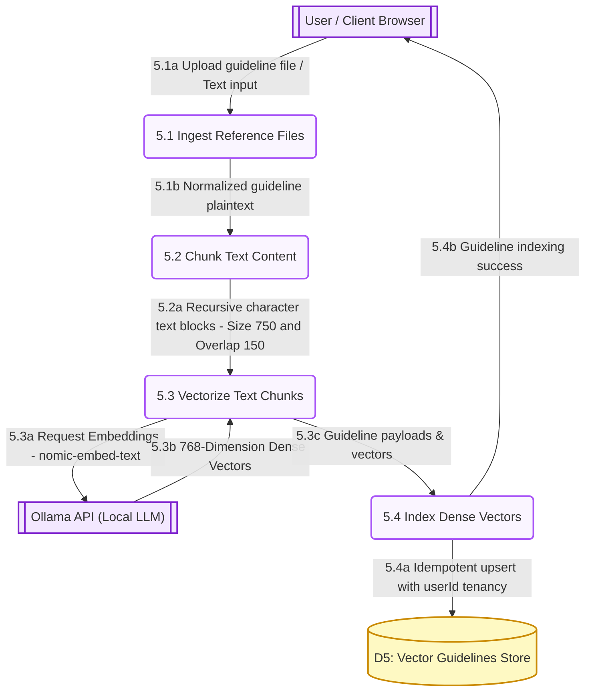

# DFD Level 2 process decompositions

This document contains the Level 2 Data Flow Diagram (DFD) decompositions for each of the 5 main processes of the PAD system.

---

## 1. Process 1.0: Intake Process DFD

---

## 2. Process 2.0: IR Compiler Process DFD

---

## 3. Process 3.0: Documentation Process DFD

---

## 4. Process 4.0: Diagram Generation Process DFD

---

## 5. Process 5.0: RAG Indexing Process DFD

