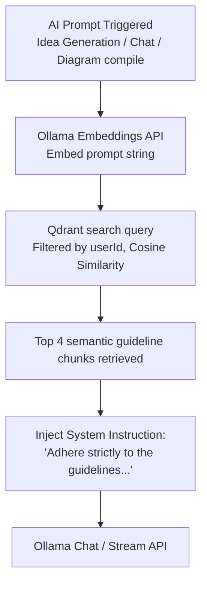

# Features and Functionalities of Product Architecture Designer (PAD)

This document provides a detailed catalog of the software features, system architecture, database models, and API endpoints of the **Product Architecture Designer (PAD)** platform.

---

## 1. System Overview

**Product Architecture Designer (PAD)** is an AI-powered system design and planning platform. It acts as an accelerator for software engineering planning by transforming a simple natural language idea or client brief into a set of production-ready, synchronized Software Development Life Cycle (SDLC) artifacts:
- Complete system requirements (PRD and BRD documents).
- System architecture and database diagrams (MermaidJS diagrams for ERD, Sequence, and Architecture/Flowchart).
- Actionable feature lists and tasks, mapped with dependencies.
- Technology-agnostic application models (Facts Schema / Intermediate Representation).
- Actionable IDE-compatible development workflows.

All of these assets are linked semantically to a single source of truth called the **Intermediate Representation (IR)** schema, allowing users to modify the entire architecture through direct editing or real-time natural language chat interactions.

---

## 2. Product Architecture & Tech Stack

PAD uses a split client-server monolithic architecture with the following detailed flow:

```mermaid
graph TB
    %% Nodes
    User([User Web Browser])

    subgraph Client [Client UI Layer - Next.js React Application]
        UI[Workspace UI Pages]
        State[React & React Query Cache State]
        
        subgraph Views [Modular Views]
            IntakeView[Idea Intake & Refinement UI]
            DocsView[PRD/BRD Document Editor]
            DiagsView[MermaidJS Canvas & Script Editor]
            FeaturesView[Feature List & Task Board]
            WorkflowView[Workflow Checklist]
            IRView[Facts Registry IREditor Tree]
            ChatView[Unified Chat Interface]
            GuidelineView[Guideline Upload Dashboard]
        end
        
        SIO_C[Socket.io Client Listener]
    end

    subgraph API_GW [Express API Gateway & Security]
        Router[HTTP Router Middleware]
        AuthGuard[JWT Auth Guard Middleware]
        RateLimiter[Express Rate Limiter]
        UploadMiddleware[Multer File Upload Middleware]
    end

    subgraph Server_Services [Backend Application Modules]
        UserService[UserService & UserRepo]
        IdeaService[IdeaService & IdeaRepo]
        IRService[IRService & IRRepo]
        DocService[DocumentService & DocRepo]
        DiagService[DiagramService & DiagRepo]
        FeatureService[FeatureService & FeatureRepo]
        TaskService[TaskService & TaskRepo]
        WorkflowService[WorkflowService & WorkflowRepo]
        GuidelineService[GuidelineService & GuidelineRepo]
        IterationService[IterationService & IterationRepo]
    end

    subgraph AI_Core [AI & RAG Execution Orchestrator]
        AiService[AiService Core]
        Ollama[Ollama API Client]
        QdrantClient[Qdrant DB Client]
        IntentClassifier[Intent Classifier Service]
        ContextBuilder[Iteration Context Builder]
    end

    subgraph Data [Storage Layer]
        DB[(PostgreSQL Relational DB)]
        VectorDB[(Qdrant Vector DB)]
        Disk[(Server Disk Uploads)]
    end

    subgraph External_AI [External AI Engines]
        OllamaServer[Ollama Local Server]
        EmbedModel[nomic-embed-text Model]
        GenModel[Ollama Model (e.g. Qwen / Llama)]
    end

    %% Client and HTTP/Socket Relationships
    User -->|Views & Inputs| UI
    UI <---> State
    UI ---> Views
    
    %% HTTP Requests
    Views --->|REST APIs: JSON/Multipart| RateLimiter
    RateLimiter ---> AuthGuard
    AuthGuard ---> Router
    
    %% Socket Connections
    ChatView <--->|WebSocket WSS: message:new / ai:state| SIO_C
    SIO_C <--->|Real-time Socket Rooms| SIO_S[Socket.io Server]
    Router ---> SIO_S

    %% Route to Services
    Router ---> UserService
    Router ---> IdeaService
    Router ---> IRService
    Router ---> DocService
    Router ---> DiagService
    Router ---> FeatureService
    Router ---> TaskService
    Router ---> WorkflowService
    Router ---> GuidelineService
    Router ---> IterationService

    %% Services database interactions
    UserService & IdeaService & IRService & DocService & DiagService & FeatureService & TaskService & WorkflowService & GuidelineService & IterationService --->|Prisma Client ORM Queries| DB
    GuidelineService --->|Saves Guidelines Files| Disk

    %% Iteration Service specific links
    IterationService <--->|Classifies chat message| IntentClassifier
    IterationService <--->|Builds contextual prompt| ContextBuilder
    IterationService --->|Triggers schema change| IRService
    
    %% AI Core interactions
    IdeaService & DocService & DiagService & FeatureService & WorkflowService & IterationService & IntentClassifier & ContextBuilder --->|Calls generation/classification| AiService
    
    %% RAG Pipeline Data Flow
    GuidelineService --->|1. Chunks guidelines & requests embeddings| AiService
    AiService --->|2. Fetches semantic guidelines| QdrantClient
    QdrantClient --->|3. Searches/Queries cosine similarity vectors| VectorDB
    AiService --->|4. Constructs RAG prompt & calls LLM| Ollama
    Ollama --->|5. Sends payload & system instructions| OllamaServer
    OllamaServer --->|Embeddings| EmbedModel
    OllamaServer --->|Chat & JSON Generation| GenModel
```

### Core Technologies

| Technology | Layer / Purpose | Details |
|---|---|---|
| **TypeScript** | Language | Used across both frontend and backend for type-safety. |
| **Next.js 16** | Frontend Framework | React 19 App Router workspace client. |
| **Tailwind CSS & shadcn/ui**| Client Styling & Component Library | Modern dark-mode UI with consistent theme tokens. |
| **TanStack Query (React Query) v5**| Frontend Data Synchronization | Handles query caching, updates, and mutation requests. |
| **Socket.io Client/Server** | Real-time Synchronization | Drives real-time chat, AI state signals, and workspace refresh triggers. |
| **Node.js + Express.js** | Backend API Runtime | Standard HTTP / WebSocket monolith server. |
| **PostgreSQL + Prisma ORM** | Primary Storage | Relational database modeling users, ideas, documents, diagrams, features, tasks, workflows, IRs, and version control. |
| **Ollama Service** | Generative AI Execution | Hosts LLM (e.g. Qwen/Llama) for text generation, code drafting, and embedding generation (`nomic-embed-text`). |
| **Qdrant DB** | Vector Storage | Used for RAG (Retrieval-Augmented Generation) mapping user guidelines to system prompts. |
| **MermaidJS** | Diagram Rendering | Client-side engine rendering generated system flowcharts, database schemas, and sequence charts. |

---

### 2.1 Retrieval-Augmented Generation (RAG) Pipeline

The RAG pipeline allows developers to customize the code-generation logic, diagrams architecture, and system design rules generated by the AI to align with their team's best practice guidelines. 

#### A. Data Ingestion & Indexing Pipeline
```mermaid
flowchart LR
    Upload[Guideline Input: Plaintext / File]
    FileRead[FS File Reader / BOM Remover]
    Splitter[LangChain RecursiveTextSplitter\nSize: 750 | Overlap: 150]
    Embed[Ollama Embeddings API\nModel: nomic-embed-text]
    VectorStore[Qdrant Vector Database\nCollection: user_guidelines]

    Upload -->|Upload file / Save text| FileRead
    FileRead -->|Raw Guidelines Text| Splitter
    Splitter -->|Logical Text Chunks| Embed
    Embed -->|768-Dim Dense Embeddings| VectorStore
```
1. **Ingestion**: Plaintext inputs or raw uploaded guideline files are read from local disk storage. 
2. **Text Chunking**: The text content is normalized (BOM headers stripped) and passed into LangChain's `RecursiveCharacterTextSplitter`. Chunks are created with a `chunkSize` of `750` characters and a `chunkOverlap` of `150` characters to prevent context loss at chunk boundaries.
3. **Embeddings Generation**: The local `OllamaClient` invokes the embeddings generation model (`nomic-embed-text` outputting 768-dimension vectors) for each individual chunk.
4. **Vector Database Upsert**: The dense vector points are written to Qdrant. Each point payload is populated with:
   - `userId`: Mapped for user tenancy and isolation.
   - `guidelineId`: Foreign reference identifier matching database primary key.
   - `title`: Guideline title or file name.
   - `text`: Raw text representation of that chunk.
   - `chunkIndex`: Monotonically increasing index.
   - Deterministic UUID generated by hashing `guidelineId-chunkIndex` via SHA-256 for idempotent writes.

#### B. Retrieval & Prompt Augmentation Pipeline

1. **Trigger**: When a user triggers any AI command (Generating a PRD, compiling database schema diagrams from the IR, or posting chat messages).
2. **Query Vectorization**: The prompt content or user instruction is converted into a query embedding vector via Ollama embeddings.
3. **Similarity Search**: A cosine similarity search queries Qdrant vectors. A hard filter matches only chunks belonging to the current `userId`, ensuring complete workspace security. The search retrieves the **top 4** highest-scoring chunks.
4. **Context Injection**: The text blocks from the retrieved chunks are formatted into a system-instruction template:
   ```markdown
   Adhere strictly to the following best practice system design and architecture decisions uploaded by the user:
   [Guideline 1] "Title": Text
   ...
   Strictly prioritize these design decisions in your choices.
   ```
5. **Inference**: The augmented prompt is sent to the local Ollama LLM endpoint, which generates structured or streaming text responses compliant with user specifications.

---

## 3. Core Software Modules & Features

PAD is divided into 8 distinct functional modules, detailed below.

---

### Module 1: Idea Intake & Pre-Validation

This module handles the initial stage of capturing, analyzing, and refining raw application ideas.

- **Raw Software Brief Intake**: Users input raw description text of their software idea. Minimum character length is enforced (20 characters) up to a maximum limit (10,000 characters) to ensure sufficient context.
- **AI-Powered Streaming Pre-Validation**: When submitted, the raw brief is sent to the AI engine to analyze details. The analysis returns:
  - **Missing Details**: Critical details that are missing from the input brief.
  - **Complementary Suggestions**: Value-add feature suggestions that match the application concept.
  - **Constraints & Risks**: Potential technical, security, or business risks.
  - **Clarifying Questions**: Direct questions to clarify target users, scope, integrations, and deployment.
- **Refinement Questionnaire Flow**: Users answer the generated clarifying questions. The replies are appended to the workspace text and sent back to the AI for recursive re-analysis until details are locked.
- **Idea Confirmation**: Once the user is satisfied, they confirm the workspace. This sets the idea status to `"confirmed"`, lockable to future modifications, and initializes downstream generation services.

---

### Module 2: Document Generation (PRD & BRD)

Once an idea is confirmed, PAD compiles extensive documentation templates.

- **Dual-Document Generation**: Generates:
  - **Product Requirements Document (PRD)**: Outlines user stories, functional requirements, technical stacks, and system constraints.
  - **Business Requirements Document (BRD)**: Highlights business value, scope, target market, risks, and financial projections.
- **Rich-Text Editor Layout**: Documents are presented in a rich text editor supporting real-time manual updates, headers, and list formatting.
- **Version History & Commit Log**: Any save action on a document creates a new version record. Every version tracks:
  - Sequential version index (`v1`, `v2`, etc.).
  - Complete document contents at that version.
  - Optional custom changelog text (e.g., "Updated checkout flow requirements").
- **One-Click Reversion**: Users can browse the history of a document and revert the body text back to any previous version.
- **Exporting Capabilities**: Documents can be exported as **Markdown (`.md`)** or structured **HTML** for distribution.

---

### Module 3: System Architecture Diagrams

This module provides visual architectures compiled from the requirements.

- **MermaidJS Diagram Generation**: Automatically generates diagrams representing system components in Mermaid syntax:
  - **Entity Relationship Diagram (ERD)**: Physical database tables and relationships.
  - **Sequence Diagram**: Detailed client-server-database execution flow.
  - **System Architecture (Schema)**: Topography of sub-systems, logical blocks, API layers, and queues.
- **Live Canvas Editor**: An editor rendering Mermaid JS scripts in a split view. Allows developers to manually edit the Mermaid diagram code with instant visual preview.
- **Fallback Rendering Logic**: If the AI returns invalid Mermaid syntax, the backend intercepts parsing failures and displays standard valid visual templates for editing.
- **Diagram Version Control**: Every manual edit is saved as a version snapshot, allowing developers to track changes and rollback diagram configurations.

---

### Module 4: Feature Breakdown & Task Management

Transforms requirements into actionable, developer-friendly checklists.

- **Feature Extraction**: Scrapes generated requirements (PRD/BRD) to extract specific, modular software feature items. Features are saved with description, priority (`low | medium | high | critical`), and source (`auto | manual | ai_suggested`).
- **Feature-Diagram Linking**: Links architectural diagrams directly to features (e.g., mapping a Database ERD to a "User Registration" feature).
- **Task Suggestions**: AI automatically suggests granular development tasks for each feature.
- **Task Metadata**: Tracks titles, descriptions, status (`planned | in_progress | completed | blocked`), estimated efforts (e.g., `2h`, `1d`, `1w`), and ordering.
- **Task Dependency Mapping**: Users can draw dependency relationships between tasks (e.g., "Implement JWT Auth Service" must complete before "Create Profile Page API"). The database models these as one-to-many relationships, forming a directed acyclic graph (DAG).
- **Task Versioning**: Supports version snapshots on modifications.

---

### Module 5: Actionable Implementation Workflow

Generates developer workflows ready for IDE use.

- **AI-IDE Instructions Generation**: Combines the verified features, tasks, and task dependencies to create a sequential, step-by-step implementation guide.
- **Actionable Step Cards**: Each workflow step details:
  - **Title and Description**: High-level summary of what is being built in the step.
  - **IDE Integration Instructions**: Custom prompt/script commands for IDE AI assistants (such as Cursor or Copilot) specifying exactly where to write code, which files to modify, and how to verify.
- **Dependency Guard Rules**: A business rule prevents developers from marking a step as `"in_progress"` if its prerequisite task dependencies are not yet `"completed"`.
- **Workflow Export**: The entire workflow can be exported as a single Markdown guide containing structured prompts for AI IDE tools.

---

### Module 6: Unified Chat Assistant

A real-time socket-enabled chat panel inside the workspace workspace.

- **Real-Time Streaming Interactions**: Chat is driven by Socket.io, allowing system thinking states, token streams, and notifications to sync instantly with the UI.
- **Intent Classification Engine**: The assistant classifies user chat entries into two intents:
  - **`discussion`**: Normal Q&A, brainstorming, or technical queries about the workspace.
  - **`ir_modification`**: Requests that change database schemas, business rules, logical modules, or roles.
- **Retrieved-Context Injection (RAG)**: Chat references guidelines and repository policies in the user’s workspace to tailor system design advice.

---

### Module 7: Facts Schema & IR Engine

The central source of truth for the entire workspace. Rather than parsing raw Markdown documents, PAD compiles system layouts into a technology-agnostic Intermediate Representation (IR).

```
Project Workspace (Confirmed Idea)
   │
   └──► [IR Schema (Facts Registry)]  ◄─── Direct tree edits or Chat patches
           │
           ├──► Data Entities (Tables, Types, Attributes, PKs, Nulls)
           ├──► Logical Relationships (1:1, 1:N, N:M)
           ├──► User Roles & Permitted Scopes
           ├──► Logical Modules & Boundaries
           └──► Business Constraints & Validation Rules
                 │
                 ▼ (Compile Action)
           ┌─────┴─────────────────────────────────────┐
           │                                           │
           ▼                                           ▼
   OpenAPI Specification (JSON)                 Downstream Compilation
                                            (PRDs, BRDs, Diagrams)
```

- **Facts Schema Trees**:
  - **Data Entities**: Tables, field names, data types (string, number, boolean, date, text), primary keys, and nullability flags.
  - **Entity Relationships**: Relationship mappings (e.g., `User` has `one-to-many` relationships with `Idea`).
  - **Logical Modules**: Abstract module names, descriptions, and inter-module dependencies.
  - **User Roles & Actions**: Defines roles (e.g., `Client`, `Admin`) and lists allowed operations (e.g., `read_draft`, `publish_document`).
  - **Business Rules**: Constraints that define the application (e.g., "A client cannot submit more than 3 drafts daily").
- **Interactive Tree Editor (`IREditor`)**: A drag-and-drop/input form allowing developers to add, edit, or delete items in the Facts tree. Every edit automatically saves a draft.
- **AI Natural Language Schema Patching**: Users can type schema updates in the chat (e.g., "Add an avatar URL field to the User entity and create a Profile model"). The intent classifier detects `ir_modification`, calls the LLM to patch the IR JSON schema, and saves it.
- **Automated Compilation**: Clicking **Compile Assets** takes the IR schema and:
  - Generates a **Swagger/OpenAPI 3.0.0 JSON Specification** defining all CRUD routes, response bodies, and request payloads.
  - Updates downstream PRD/BRD text documents.
  - Redraws the Database ERD, sequence diagrams, and architecture maps.

---

### Module 8: Architecture Guidelines & Uploads

Users can force PAD's AI engine to adhere to specific corporate architecture guidelines or code styles.

- **Guideline Input**: Users upload plain text guidelines or physical text files containing development guidelines.
- **Qdrant Vector Indexing**: The file contents are chunked, transformed into vector embeddings via Ollama's `nomic-embed-text` model, and indexed in Qdrant with user filtering attributes.
- **RAG Context Retrieval**: During all AI generations (documents, diagrams, IR updates, or chat sessions), the system queries Qdrant for guidelines matching the prompt, appending them as prompt instructions.

---

## 4. Database Schema Structure (Prisma ORM)

Here is a breakdown of the Postgres relational models configured in the database:

### Core Users & Roles
- **`users` Table**: Stores basic user profiles (`firstName`, `lastName`, `email`, `password`, `role`).
- **`admin_privileges` Table**: Associates specific access rights with administrator accounts.

### Intake
- **`ideas` Table**: The primary workspace anchor mapping user ids to raw intake text, refined context text, idea status (`draft | confirmed`), and raw analysis results.

### Documents & Versions
- **`documents` Table**: Stores generated documentation meta details (`ideaId`, `type` e.g. "PRD"/"BRD", `title`, `content`, `status`).
- **`document_versions` Table**: A composite unique table mapping versions (`version`, `content`, `changelog`) to parent documents.

### Diagrams & Canvas
- **`diagrams` Table**: Stores system design layout configs (`ideaId`, `type` e.g. "ERD"/"SEQUENCE"/"SCHEMA", `title`, `mermaidCode`).
- **`diagram_versions` Table**: Stores snapshot histories of Mermaid scripts.
- **`feature_diagram_links` Table**: Joint table matching features to diagrams.

### Features & Actionable Tasks
- **`features` Table**: High-level application blocks (`ideaId`, `title`, `description`, `source`, `priority`).
- **`tasks` Table**: Task lists (`featureId`, `title`, `description`, `status`, `priority`, `estimatedEffort`).
- **`task_dependencies` Table**: Self-referential join table linking a dependent task to its pre-requisites (`taskId` / `dependsOnTaskId`).

### Implementation Workflow
- **`workflows` Table**: Holds workflow settings mapped to ideas.
- **`workflow_steps` Table**: Tracks step guides (`workflowId`, `taskId`, `title`, `description`, `instructions`, `status`).
- **`workflow_step_dependencies` Table**: Join table mapping workflow steps to pre-requisites.

### Facts Schema (IR)
- **`project_ir` Table**: Holds the current parsed JSON Facts registry (`schemaData`).
- **`project_ir_versions` Table**: Tracks database schema iterations.

### Reference Guidelines
- **`files` Table**: Stores metadata of uploaded guidelines.
- **`guidelines` Table**: Holds text content and links files to user profiles.

---

## 5. System API Endpoints (Express Router)

All endpoints require the HTTP Header `Authorization: Bearer <JWT_Token>` unless marked otherwise.

### 1. Authentication (`/api/v1/auth`)
- `POST /login` (Public): Authenticates email/password and returns a JWT token.
- `POST /register` (Public): Registers a new user account.
- `POST /register-verification` (Public): Handles registration verification checks.
- `POST /forget-password` (Public): Sends verification codes.
- `POST /reset-password` (Public): Updates account password with verification parameters.
- `POST /logout`: Invalidates session context.
- `GET /me`: Returns details of the currently authenticated user.

### 2. User Administration (`/api/v1/users`)
- `GET /`: Lists user accounts (Super Admin scope).
- `POST /`: Creates a user account.
- `GET /batch` / `POST /batch`: Batch processes user profiles.
- `GET /min-batch`: Optimized listing of user accounts.
- `GET /statistics`: Aggregates usage statistics.
- `GET /:id` / `PUT /:id` / `DELETE /:id`: User CRUD operations.
- `PATCH /:id/status`: Toggles account suspension.
- `PATCH /:id/password`: Resets a user's password.
- `PUT /:id/profile`: Updates profile details.
- `PATCH /:id/profile/password`: Updates account password.

### 3. Ideas & Pre-Validation (`/api/v1/ideas`)
- `POST /`: Submits a raw software brief.
- `GET /`: Lists ideas owned by the authenticated user.
- `GET /:id`: Retrieves a specific idea workspace details.
- `POST /:id/analyze`: Triggers streaming AI validation (returns missing details, questions).
- `POST /:id/refine`: Submits answers to clarifying questions to re-analyze.
- `POST /:id/confirm`: Confirms the idea, locks refinement, and enables downstream compiles.

### 4. Facts Schema Engine (`/api/v1/ideas/:id/ir`)
- `GET /:id/ir`: Fetches the current JSON Facts registry (Data entities, modules, roles, rules).
- `POST /:id/ir`: Saves manual edits to the JSON schema, updating the draft version.
- `POST /:id/ir/generate`: Compiles initial IR directly from confirmed briefs.
- `POST /:id/ir/patch`: Submits a natural language update string to patch the IR.
- `POST /:id/ir/compile`: Compiles the IR, generating an OpenAPI spec, downstream PRD/BRD, and diagrams.

### 5. Requirements Documents (`/api/v1/documents`)
- `POST /generate/:ideaId`: Automatically generates PRD and BRD from confirmed ideas.
- `GET /idea/:ideaId`: Lists all documents compiled for a specific idea.
- `GET /:id`: Retrieves a document's details.
- `DELETE /:id`: Deletes a document.
- `GET /:id/full`: Retrieves a document alongside its complete version history stack.
- `PUT /:id`: Saves document text edits and increments version.
- `GET /:id/versions`: Returns the document's version history logs.
- `POST /:id/revert/:version`: Reverts document body back to the specified version.
- `POST /:id/regenerate`: Tells the AI to regenerate the PRD/BRD.
- `GET /:id/export/:format`: Exports document as `markdown` or `html`.

### 6. System Architecture Diagrams (`/api/v1/diagrams`)
- `POST /generate/:ideaId`: Automatically drafts ERD, Sequence, and Schema diagrams.
- `GET /idea/:ideaId`: Fetches all diagrams for an idea.
- `GET /:id`: Retrieves a diagram configuration.
- `GET /:id/full`: Retrieves a diagram with all saved version logs.
- `PUT /:id`: Saves changes to a Mermaid script and saves a version log.
- `GET /:id/versions`: Retrieves version history for a diagram.
- `POST /:id/regenerate`: Tells the AI to regenerate the diagram.

### 7. Feature Requirements (`/api/v1/features`)
- `POST /extract/:ideaId`: Generates features from compiled requirements documents.
- `POST /`: Creates a manual feature.
- `GET /idea/:ideaId`: Lists all features in a workspace.
- `GET /:id`: Retrieves a specific feature.
- `PUT /:id` / `DELETE /:id`: Feature edits and deletions.
- `GET /:id/full`: Retrieves feature data along with related tasks.
- `GET /:id/versions`: Lists feature versions.
- `POST /:id/diagrams/:diagramId` / `DELETE /:id/diagrams/:diagramId`: Links or unlinks diagrams to features.

### 8. Feature Tasks (`/api/v1/tasks`)
- `POST /suggest/:featureId`: Automatically suggests tasks for a feature.
- `POST /`: Manually creates a task.
- `GET /feature/:featureId`: Lists all tasks for a feature.
- `GET /:id` / `PUT /:id` / `DELETE /:id`: Task CRUD operations.
- `GET /:id/full`: Retrieves a task with its dependency tree.
- `PATCH /:id/status`: Updates a task's status.
- `GET /:id/versions`: Lists task version history.
- `POST /:id/dependencies/:dependsOnId` / `DELETE /:id/dependencies/:dependsOnId`: Configures task dependencies.

### 9. Developer Workflows (`/api/v1/workflows`)
- `POST /generate/:ideaId`: Builds a sequential implementation workflow step guide from features and tasks.
- `GET /idea/:ideaId`: Retrieves the workflow steps checklist.
- `PATCH /steps/:id`: Updates step status or text, enforcing dependency block rules.
- `GET /:id/export`: Exports the workflow steps checklist as Markdown.

### 10. Iterative Chat Assistant (`/api/v1/iterations`)
- `GET /idea/:ideaId`: Fetches or creates the chat iteration session.
- `POST /idea/:ideaId/message`: Posts a chat message, classifying intent to either stream a response or apply schema patches.

### 11. Reference Guidelines (`/api/v1/guidelines`)
- `POST /`: Saves text guidelines.
- `GET /`: Lists user guidelines.
- `POST /upload`: Uploads a text file as a guideline and indexes it.
- `DELETE /:id`: Deletes guidelines and clears vector embeddings from Qdrant.
- `GET /files/:fileId/download`: Downloads uploaded guideline files.
