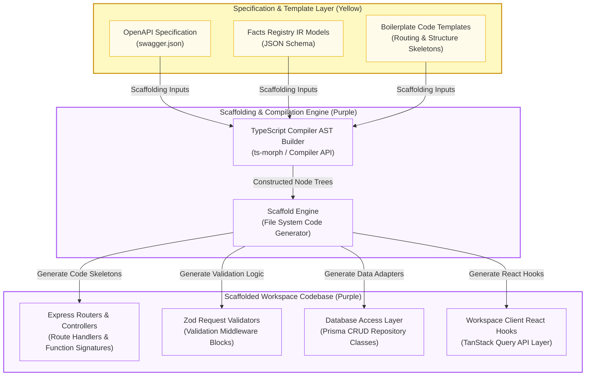

# Future Work: Code Scaffolding & Skeleton Generation Compiler

This document details the architectural design and system data flow for the proposed **Code Scaffolding & Skeleton Generation Compiler** (feature specification 10.4.3), planned for future execution. This system compiles OpenAPI specifications and Facts Registry IR schemas into physical TypeScript/React workspaces, bridging the gap between design planning and real-world implementation.

---

## 1. System Architecture & Generation Flow

The diagram below outlines the inputs, compilation middleware, and code asset categories generated by the engine.

---

## 2. Compilation & Scaffolding Steps

The scaffolding compiler executes four core compilation transformations:

### 2.1 AST Node Definition (Express Routers & Controllers)
For each endpoint route and parameter configuration declared inside the OpenAPI paths definitions:
1.  **Node Initialization**: The engine instantiates an AST controller/router node using `ts-morph` or the native TypeScript Compiler API.
2.  **Import Injections**: Explicitly imports the target Express request/response interfaces (`Request`, `Response`, `NextFunction`) and database client instances.
3.  **Signature Declaration**: Generates boilerplate controller handlers, complete with Typed request params, typed query variables, and typed return body skeletons ready for developers to implement business logic.

### 2.2 Zod Middleware Scaffolding (Validation Layer)
To intercept and validate incoming payloads before they hit business logic controllers:
1.  **Schema Traversals**: Traverses the global OpenAPI schema components schema-by-schema.
2.  **Zod Schema Parsing**: Emits a matching TypeScript validation block utilizing the `zod` library (e.g., translating `type: string, format: email` to `z.string().email()`).
3.  **Middleware Composition**: Wraps these schemas into Express interceptor middlewares that return structured JSON validation error details (HTTP status code `400 Bad Request`) upon validation failure.

### 2.3 Database Access Layer Generation (Prisma Repositories)
Maps relational facts and database entities into high-performing data manipulation layers:
1.  **Entity Parsing**: Scrapes entities and relations from the central IR facts model schema.
2.  **CRUD Repository Class Scaffolding**: Writes clean TypeScript repository classes (e.g., `UserRepository`).
3.  **Data Driver Interfacing**: Includes boilerplate implementations for typical database queries, mapping them directly to Prisma methods (e.g., `this.prisma.user.create()`, `this.prisma.user.findUnique()`, `this.prisma.user.update()`, `this.prisma.user.delete()`).

### 2.4 Workspace Client Layer Compilation (TanStack Query Hooks)
To synchronize React UI elements with the scaffolded backend routes:
1.  **Hook Construction**: Compiles individual React hooks utilizing `@tanstack/react-query` corresponding to the Express endpoint signatures.
2.  **Hook Types**:
    *   `use[Entity]Query` (for `GET` operations) with customized query keys and cache settings.
    *   `use[Entity]Mutation` (for `POST`, `PUT`, `DELETE` operations) with optimistic UI update functions and query cache invalidations.
3.  **Real-Time Handles**: Automatically configures Socket.io room hooks inside the client scaffold to handle push notifications when state compilation completes.
