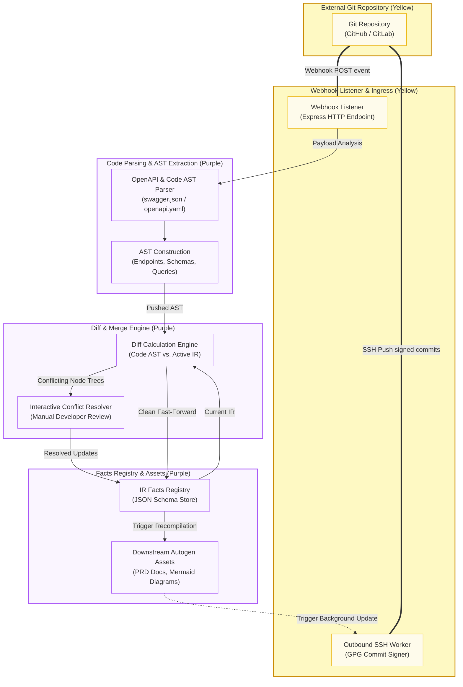

# Future Work: Bidirectional Git Synchronization Architecture

This document details the architectural design and system data flow for the proposed **Bidirectional Git Synchronization Architecture** (feature specification 10.4.2), planned for future execution. This system integrates the PAD Facts Registry directly with collaborative Git workflows (such as GitHub or GitLab) to provide instant bidirectional syncing between system specifications and repository code.

---

## 1. System Architecture Diagram

The flowchart below represents the data flow, components, and boundaries separating external repository hosts from internal compiler systems.

---

## 2. Sync Logic & Pipeline Breakdown

The integration flow operates across two distinct pipelines:

### 2.1 Outbound Pipeline (PAD-to-Git)
Triggered automatically when a developer confirms a workspace update or rolls back a document version:
1.  **Background Activation**: The Express server triggers a lightweight background worker.
2.  **Repository Setup**: The worker clones the target Git repository over SSH using server-side keys.
3.  **Asset Exporting**: Re-compiles clean, latest revisions of the OpenAPI specification (`openapi.json`), markdown requirements documents (`PRD.md`), and Mermaid flowchart diagrams (`.svg` representations).
4.  **Commit Signing**: Commits the modifications and signs the transaction using a server-managed GPG key to verify commit authenticity.
5.  **Pushing updates**: Publishes the signed commit to the designated branch on the remote Git repository.

### 2.2 Inbound Pipeline (Git-to-PAD)
Triggered when external developers push code edits directly to the remote repository:
1.  **Webhook Notification**: GitHub/GitLab pushes a webhook POST event containing commit payloads to the PAD Webhook Listener endpoint.
2.  **OpenAPI Specification Parsing**: The inbound parser reads updated `swagger.json` or `openapi.yaml` files, decomposing route parameters, schemas, and query arguments into an Abstract Syntax Tree (AST) structure.
3.  **Model Diff Engine**: Performs node-by-node AST validation against the active in-memory Facts Registry IR representation.
4.  **Interactive Conflict Resolution**:
    *   *Clean Updates*: Automatically applies non-destructive additions (e.g. newly pushed endpoints) directly back to the Facts Registry.
    *   *Conflict Detection*: Flags overlapping structural edits or deletions for manual developer resolution via the workspace dashboard interface.
5.  **Downstream Propagation**: Once updates are merged into the Facts Registry, the system automatically triggers compiler modules to regenerate downstream PRD specifications and update the web canvas.
