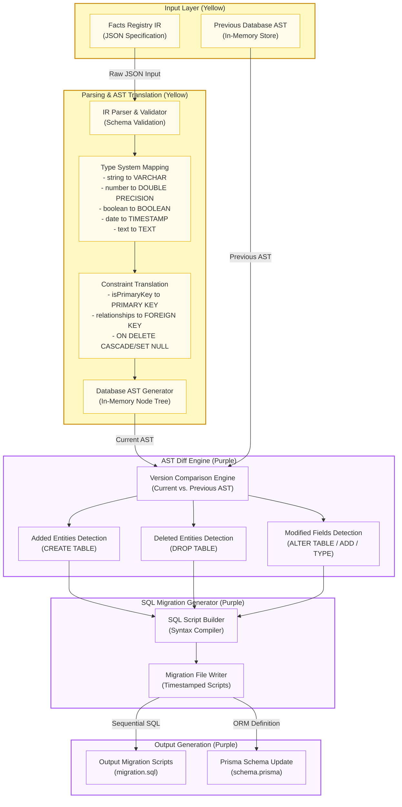

# Future Work: Automated SQL Schema Migration Compiler

This document details the architectural design and system data flow for the proposed **Automated SQL Schema Migration Compiler** (feature specification 10.4.1), planned for future execution. This component will enable developers to synchronize physical database configurations with the Facts Registry with a single click by generating Prisma schemas and SQL migrations directly from the project's Intermediate Representation (IR) JSON schema.

---

## 1. Compiler Pipeline & Data Flow Diagram

The diagram below outlines the conversion pipeline, highlighting the parsing, AST comparison, and target script generation steps.

---

## 2. Compilation Stages

### 2.1 Type System Mapping
The compiler translates abstract database-agnostic types registered inside the Facts Registry JSON structure to actual physical dialect equivalents in PostgreSQL:
*   `string` $\rightarrow$ `VARCHAR(255)`
*   `number` $\rightarrow$ `DOUBLE PRECISION`
*   `boolean` $\rightarrow$ `BOOLEAN`
*   `date` $\rightarrow$ `TIMESTAMP`
*   `text` $\rightarrow$ `TEXT`

### 2.2 Constraint & Relation Mapping
*   **Primary Keys**: Translates elements marked with `isPrimaryKey: true` directly to `PRIMARY KEY` specifications.
*   **Foreign Keys**: Inspects the `relationships` array to structure referential constraints. Emits standard target constraints such as `ON DELETE CASCADE` or `ON DELETE SET NULL` based on reference rules.

### 2.3 AST Differentiation Engine
To ensure schema updates preserve existing database records:
1.  **Current AST Representation**: Formulates an in-memory node-tree representation of the newly edited IR.
2.  **Previous AST Representation**: Pulls the previous committed revision AST from version control records.
3.  **Diffing Nodes**:
    *   *Added Nodes*: Identifies new tables/columns. Outputs `CREATE TABLE` / `ALTER TABLE ... ADD COLUMN` scripts.
    *   *Removed Nodes*: Outputs safe `DROP TABLE` or comment warnings for manual verification.
    *   *Modified Type Nodes*: Compiles `ALTER COLUMN TYPE` directives, ensuring type conversion functions (e.g. `USING value::type`) are injected.

### 2.4 SQL Migration Output
Writes incremental, sequential SQL files to the target workspace migrations directory (e.g. `migrations/20260613000000_update_schema.sql`), ensuring a complete, audit-ready version history of the database schema.
