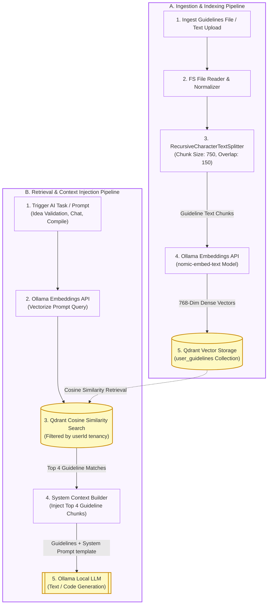

```mermaid
flowchart TD
    %% Ingestion Pipeline Subgraph
    subgraph Ingestion [A. Ingestion & Indexing Pipeline]
        upload["1. Ingest Guidelines File / Text Upload"]
        read["2. FS File Reader & Normalizer"]
        split["3. RecursiveCharacterTextSplitter\n(Chunk Size: 750, Overlap: 150)"]
        embed_i["4. Ollama Embeddings API\n(nomic-embed-text Model)"]
        qdrant_w[("5. Qdrant Vector Storage\n(user_guidelines Collection)")]

        upload ---> read
        read ---> split
        split --->|Guideline Text Chunks| embed_i
        embed_i --->|768-Dim Dense Vectors| qdrant_w
    end

    %% Retrieval Pipeline Subgraph
    subgraph Retrieval [B. Retrieval & Context Injection Pipeline]
        prompt["1. Trigger AI Task / Prompt\n(Idea Validation, Chat, Compile)"]
        embed_q["2. Ollama Embeddings API\n(Vectorize Prompt Query)"]
        qdrant_r[("3. Qdrant Cosine Similarity Search\n(Filtered by userId tenancy)")]
        construct["4. System Context Builder\n(Inject Top 4 Guideline Chunks)"]
        llm[["5. Ollama Local LLM\n(Text / Code Generation)"]]

        prompt ---> embed_q
        embed_q ---> qdrant_r
        qdrant_r --->|Top 4 Guideline Matches| construct
        construct --->|Guidelines + System Prompt template| llm
    end

    %% Storage Sync link
    qdrant_w -.->|Cosine Similarity Retrieval| qdrant_r

    %% Styling configurations (Yellow & Purple Theme)
    style Ingestion fill:#faf5ff,stroke:#a855f7,stroke-width:2px
    style upload fill:#faf5ff,stroke:#a855f7,stroke-width:1px
    style read fill:#faf5ff,stroke:#a855f7,stroke-width:1px
    style split fill:#faf5ff,stroke:#a855f7,stroke-width:1px
    style embed_i fill:#faf5ff,stroke:#a855f7,stroke-width:1px
    
    style Retrieval fill:#faf5ff,stroke:#a855f7,stroke-width:2px
    style prompt fill:#faf5ff,stroke:#a855f7,stroke-width:1px
    style embed_q fill:#faf5ff,stroke:#a855f7,stroke-width:1px
    style construct fill:#faf5ff,stroke:#a855f7,stroke-width:1px

    style qdrant_w fill:#fef9c3,stroke:#ca8a04,stroke-width:2px
    style qdrant_r fill:#fef9c3,stroke:#ca8a04,stroke-width:2px
    style llm fill:#fef9c3,stroke:#ca8a04,stroke-width:2px
```
