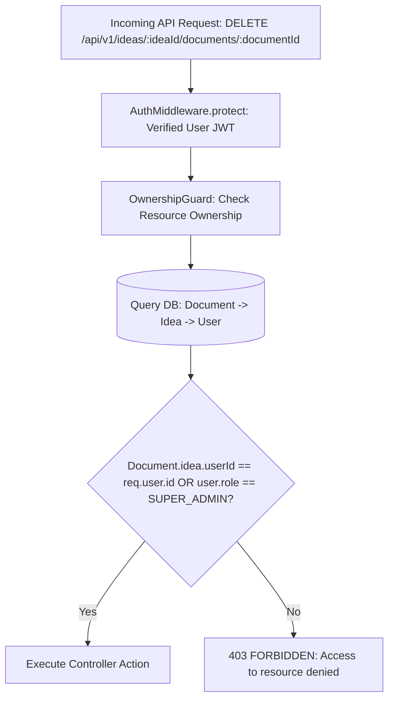

# Backend API & Services Architecture Improvement Plan

> **Domain**: Express API, Transport Layer, Authentication, Authorization & Service Decoupling  
> **Target Stack**: Node.js 20+, Express.js 4.21+ / 5.0, TypeScript 5.7+, JWT, AWS S3 / Cloudflare R2  
> **Status**: Technical Specification & Remediation Blueprint  

---

## 1. Executive Summary & Architectural Diagnostic

The PAD backend service provides REST endpoints and Socket.io events for project management, document generation, diagram compilation, and iterative AI refactoring.

A comprehensive review of `server/src/` reveals several architectural gaps that hinder production scale and developer integration:
1. **Single-Transport Authentication Bottleneck**: `AuthMiddleware.protect` only checks browser cookies (`request.cookies.jwt`), rejecting standard `Authorization: Bearer <token>` headers. This prevents integration with external API clients, automated CLI tools, mobile apps, and third-party IDE plugins.
2. **Missing Insecure Direct Object Reference (IDOR) Ownership Guards**: Endpoints accept resource IDs (`:ideaId`, `:documentId`, `:diagramId`, `:taskId`) without consistently asserting that the requesting user owns the parent `Idea` or belongs to the authorized organization.
3. **Coupling Business Logic to Express Transport**: Service methods in `DocumentService`, `DiagramService`, and `FeatureService` take Express `(next: NextFunction)` arguments and manually call `next(new AppError(...))`. This tightly couples pure domain logic to the HTTP transport layer and severely impairs unit testability.
4. **Local Disk Storage in Cloud Environments**: File uploads and generated handoff zip archives are stored on the local container filesystem (`./uploads` and `/tmp/handoffs`). In multi-container cloud deployments (ECS / Kubernetes), subsequent download requests to different replicas fail with HTTP 404 errors.
5. **Inconsistent Error Handling & Hardcoded Locales**: Error messages are inconsistently formatted, with some responses hardcoded in Arabic (`"غير مصرح لك، سجل الدخول وحاول مرة أخرى!"`) while the rest of the system is English, lacking standardized machine-readable error codes.

---

## 2. Universal Dual Cookie & Bearer Authentication

### Current Anti-Pattern (`server/src/middlewares/auth.middleware.ts#L10-L15`):
```typescript
// ANTI-PATTERN: Only checks cookie, breaks REST clients and CLI tools
const jwt = request.cookies.jwt;
if (!jwt) {
    return next(new AppError(401, "غير مصرح لك، سجل الدخول وحاول مرة أخرى!"));
}
```

### Production-Grade Universal Auth Middleware:

```typescript
import { Request, Response, NextFunction } from "express";
import AppError from "../utils/app-error";
import { verifyJWT } from "../utils/jwt";
import UserService from "../modules/user/user.service";
import { IUser } from "../modules/user/types/IUser";

export class AuthMiddleware {
    /**
     * Protect routes by validating JWT tokens from either:
     * 1. Authorization: Bearer <token> header (standard for APIs & SDKs)
     * 2. 'jwt' httpOnly cookie (standard for web browser sessions)
     */
    static async protect(req: Request, res: Response, next: NextFunction): Promise<void> {
        let token: string | undefined;

        // 1. Check Authorization Bearer Header
        const authHeader = req.headers.authorization;
        if (authHeader && authHeader.startsWith("Bearer ")) {
            token = authHeader.split(" ")[1];
        } 
        // 2. Fall back to secure httpOnly cookie
        else if (req.cookies && req.cookies.jwt) {
            token = req.cookies.jwt;
        }

        if (!token) {
            return next(
                new AppError(401, "Authentication required. Please provide a valid Bearer token or sign in.", "UNAUTHORIZED")
            );
        }

        try {
            // Verify token integrity and expiration
            const decoded = verifyJWT(token);
            const { id, iat } = decoded;

            // Fetch user profile from database or Redis cache
            const user = await UserService.getUserById(id);
            if (!user || !user.active) {
                return next(
                    new AppError(401, "User session is no longer active or user does not exist.", "USER_NOT_FOUND")
                );
            }

            // Check if password was changed after token issuance
            if (user.passwordChangedAt && iat) {
                const passwordChangedTimestamp = Math.floor(
                    new Date(user.passwordChangedAt).getTime() / 1000
                );
                if (passwordChangedTimestamp > iat) {
                    return next(
                        new AppError(401, "Password recently changed. Please authenticate again.", "PASSWORD_EXPIRED")
                    );
                }
            }

            // Attach strongly-typed user to request context
            req.user = user as IUser;
            next();
        } catch (err: any) {
            return next(
                new AppError(401, "Invalid or expired authentication token.", "INVALID_TOKEN")
            );
        }
    }
}
```

---

## 3. IDOR & Resource Ownership Authorization Guard

To prevent Insecure Direct Object References (IDOR), implement a generic ownership verification middleware:



### Reusable Ownership Middleware Implementation:

```typescript
import { Request, Response, NextFunction } from "express";
import AppError from "../utils/app-error";
import PrismaClientSingleton from "../data-server-clients/prisma-client";

type ResourceType = "idea" | "document" | "diagram" | "feature" | "task" | "workflow";

export const requireResourceOwnership = (resourceType: ResourceType, paramKey: string = "id") => {
    return async (req: Request, res: Response, next: NextFunction): Promise<void> => {
        const userId = req.user?.id;
        const userRole = req.user?.role;
        const resourceId = req.params[paramKey] || req.body[paramKey];

        if (!userId) {
            return next(new AppError(401, "Authentication required", "UNAUTHORIZED"));
        }

        if (userRole === "SUPER_ADMIN") {
            return next();
        }

        const prisma = PrismaClientSingleton.getPrismaClient();

        try {
            let isOwner = false;

            switch (resourceType) {
                case "idea": {
                    const idea = await prisma.idea.findUnique({
                        where: { id: resourceId },
                        select: { userId: true },
                    });
                    isOwner = idea?.userId === userId;
                    break;
                }
                case "document": {
                    const doc = await prisma.document.findUnique({
                        where: { id: resourceId },
                        select: { idea: { select: { userId: true } } },
                    });
                    isOwner = doc?.idea.userId === userId;
                    break;
                }
                case "diagram": {
                    const diag = await prisma.diagram.findUnique({
                        where: { id: resourceId },
                        select: { idea: { select: { userId: true } } },
                    });
                    isOwner = diag?.idea.userId === userId;
                    break;
                }
                case "feature": {
                    const feat = await prisma.feature.findUnique({
                        where: { id: resourceId },
                        select: { idea: { select: { userId: true } } },
                    });
                    isOwner = feat?.idea.userId === userId;
                    break;
                }
                case "task": {
                    const task = await prisma.task.findUnique({
                        where: { id: resourceId },
                        select: { feature: { select: { idea: { select: { userId: true } } } } },
                    });
                    isOwner = task?.feature.idea.userId === userId;
                    break;
                }
            }

            if (!isOwner) {
                return next(
                    new AppError(403, `You do not have permission to access or modify this ${resourceType}.`, "FORBIDDEN")
                );
            }

            next();
        } catch (error) {
            return next(new AppError(500, "Error validating resource ownership", "INTERNAL_ERROR"));
        }
    };
};
```

---

## 4. Standardized API Response & Error Envelopment

All REST responses must follow a consistent, predictable structure across both success and failure cases:

### Success Response Envelope:
```json
{
  "success": true,
  "statusCode": 200,
  "data": {
    "id": "c1f7b8e0-4a92-4d1b-b23a-1e432f7a9d01",
    "title": "Product Requirements Document (PRD)",
    "type": "PRD",
    "status": "published"
  },
  "meta": {
    "requestId": "req_8f1b93ac-4109-4112",
    "timestamp": "2026-09-11T02:25:00.000Z"
  }
}
```

### Error Response Envelope:
```json
{
  "success": false,
  "statusCode": 404,
  "error": {
    "code": "DOCUMENT_NOT_FOUND",
    "message": "The requested architecture document does not exist or has been deleted.",
    "details": []
  },
  "meta": {
    "requestId": "req_8f1b93ac-4109-4112",
    "timestamp": "2026-09-11T02:25:00.000Z"
  }
}
```

---

## 5. Cloud Object Storage Service (S3 / R2 Adapter)

Replace local filesystem writes (`./uploads` and `/tmp/handoffs`) with an abstracted cloud storage adapter:

```typescript
import { S3Client, PutObjectCommand, GetObjectCommand } from "@aws-sdk/client-s3";
import { getSignedUrl } from "@aws-sdk/s3-request-presigner";

export interface IStorageService {
    uploadFile(key: string, body: Buffer, contentType: string): Promise<string>;
    getPresignedDownloadUrl(key: string, expiresInSeconds?: number): Promise<string>;
    deleteFile(key: string): Promise<void>;
}

export class S3StorageService implements IStorageService {
    private s3: S3Client;
    private bucket: string;

    constructor() {
        this.bucket = process.env.S3_BUCKET_NAME || "pad-artifacts-prod";
        this.s3 = new S3Client({
            region: process.env.AWS_REGION || "us-east-1",
            credentials: {
                accessKeyId: process.env.AWS_ACCESS_KEY_ID || "",
                secretAccessKey: process.env.AWS_SECRET_ACCESS_KEY || "",
            },
            endpoint: process.env.S3_ENDPOINT, // Optional for Cloudflare R2 / MinIO
        });
    }

    async uploadFile(key: string, body: Buffer, contentType: string): Promise<string> {
        const command = new PutObjectCommand({
            Bucket: this.bucket,
            Key: key,
            Body: body,
            ContentType: contentType,
        });

        await this.s3.send(command);
        return `https://${this.bucket}.s3.amazonaws.com/${key}`;
    }

    async getPresignedDownloadUrl(key: string, expiresInSeconds: number = 3600): Promise<string> {
        const command = new GetObjectCommand({
            Bucket: this.bucket,
            Key: key,
        });

        return await getSignedUrl(this.s3, command, { expiresIn: expiresInSeconds });
    }

    async deleteFile(key: string): Promise<void> {
        // Implementation for object deletion
    }
}
```
