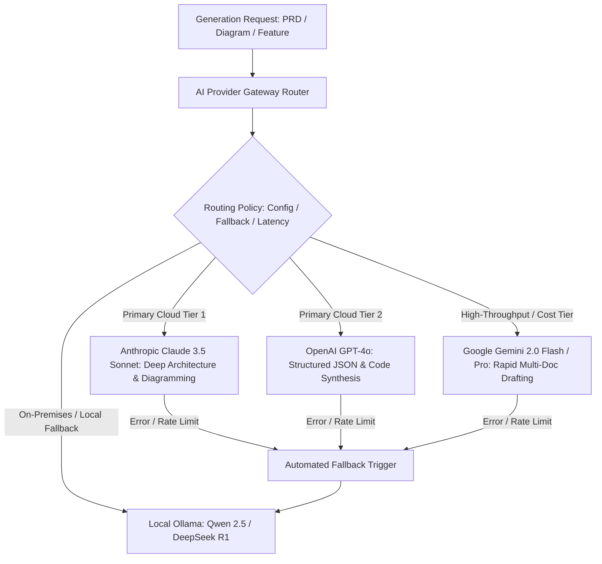
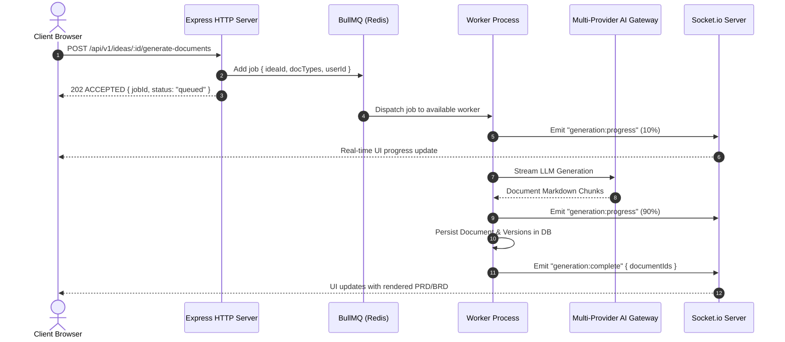

# AI Engine & Workflow Orchestration Architecture Improvement Plan

> **Domain**: LLM Integration, Multi-Provider Routing, Asynchronous Job Queues & Vector RAG  
> **Target Stack**: BullMQ, Redis 7, Anthropic SDK, OpenAI SDK, Google Generative AI, Ollama, Qdrant  
> **Status**: Technical Specification & Remediation Blueprint  

---

## 1. Executive Summary & Diagnostic

PAD's core value proposition is powered by Large Language Models: transforming natural language briefs into structured system designs, generating executable Mermaid diagrams, extracting feature dependency graphs, and compiling AI IDE workflow instruction packages.

However, the current AI integration layer is constrained by severe architectural limitations:
1. **Single-Provider Local Ollama Bottleneck**: The backend is hardcoded to a local Ollama instance (`server/src/modules/ai/ollama-client.ts`). Local LLM hosting cannot sustain global concurrent traffic or deliver the reasoning depth required for complex multi-tier system designs.
2. **Unmanaged Background Promises**: Heavy operations (such as Deep Research, Feature Extraction, and Chat Feedback Planning) are dispatched as fire-and-forget background promises in Node.js event loops. Process restarts or server crashes immediately result in silent job failure, zombie state in the database, and unhandled promise rejections.
3. **Absence of Rate Limiting & Cost/Token Management**: Outbound AI generation lacks token budgets, concurrency throttling, and structured retries with exponential backoff.
4. **Context Window Flooding**: Prompt compilers concatenate entire markdown documents and raw Mermaid code into prompt payloads without semantic chunking or prompt compression, leading to token exhaustion and latency spikes.
5. **Rigid Vector Database Initialization**: Qdrant client initialization in `server/src/data-server-clients/qdrant.ts` hardcodes vector dimensionality to 768 (`nomic-embed-text`), creating schema lock-in and preventing migration to high-performance cloud embedding models (such as OpenAI `text-embedding-3-small` / 1536 or Cohere).

---

## 2. Pluggable Multi-Provider AI Gateway

To support global commercial SaaS deployment while maintaining self-hosted / private on-premises capabilities, implement a unified **Multi-Provider AI Gateway**:



### Provider Interface Definition:

```typescript
export interface IAIOptions {
    temperature?: number;
    maxTokens?: number;
    jsonSchema?: Record<string, any>;
    systemPrompt?: string;
    timeoutMs?: number;
}

export interface IAIProvider {
    readonly providerName: string;
    chat(prompt: string, options?: IAIOptions): Promise<string>;
    chatStream(prompt: string, options?: IAIOptions): AsyncGenerator<string, void, unknown>;
    generateEmbeddings(text: string): Promise<number[]>;
}
```

### Unified Gateway Implementation with Circuit Breaker & Fallback:

```typescript
export class AIGatewayService {
    private providers: Map<string, IAIProvider> = new Map();
    private activeProviderName: string;

    constructor() {
        this.activeProviderName = process.env.AI_PROVIDER || "claude";
        this.initProviders();
    }

    private initProviders() {
        this.providers.set("claude", new AnthropicClaudeProvider());
        this.providers.set("openai", new OpenAIGPTProvider());
        this.providers.set("gemini", new GoogleGeminiProvider());
        this.providers.set("ollama", new LocalOllamaProvider());
    }

    async executeWithFallback(prompt: string, options?: IAIOptions): Promise<string> {
        const primaryProvider = this.providers.get(this.activeProviderName);
        if (!primaryProvider) throw new Error(`Unknown AI Provider: ${this.activeProviderName}`);

        try {
            return await primaryProvider.chat(prompt, options);
        } catch (error: any) {
            console.warn(`[AIGateway] Primary provider ${this.activeProviderName} failed: ${error.message}. Attempting fallback...`);

            // Fallback strategy: Cloud Alternate -> Local Ollama
            const fallbackChain = ["claude", "openai", "gemini", "ollama"].filter(
                (p) => p !== this.activeProviderName
            );

            for (const fallbackName of fallbackChain) {
                const fallbackProvider = this.providers.get(fallbackName);
                if (fallbackProvider) {
                    try {
                        console.log(`[AIGateway] Trying fallback provider: ${fallbackName}`);
                        return await fallbackProvider.chat(prompt, options);
                    } catch (fallbackErr: any) {
                        console.warn(`[AIGateway] Fallback provider ${fallbackName} failed: ${fallbackErr.message}`);
                    }
                }
            }

            throw new Error("[AIGateway] All AI providers exhausted without successful response.");
        }
    }
}
```

---

## 3. Asynchronous Job Processing with BullMQ + Redis

Migrate long-running generation tasks (such as deep market research, multi-document compilation, and handoff archive generation) off the synchronous HTTP event loop into a distributed **BullMQ** worker queue.



### BullMQ Worker Pipeline Definition:

```typescript
import { Queue, Worker, Job } from "bullmq";
import Redis from "ioredis";
import SocketService from "../../services/socket.service";
import PrismaClientSingleton from "../../data-server-clients/prisma-client";
import { AIGatewayService } from "./ai-gateway.service";

const redisConnection = new Redis(process.env.REDIS_URL || "redis://localhost:6379");

export const generationQueue = new Queue("ai-generation", { connection: redisConnection });

export const generationWorker = new Worker(
    "ai-generation",
    async (job: Job) => {
        const { ideaId, jobType, payload } = job.data;
        const socket = SocketService.getInstance();
        const aiGateway = new AIGatewayService();
        const prisma = PrismaClientSingleton.getPrismaClient();

        console.log(`[Worker] Starting job ${job.id} of type ${jobType} for Idea: ${ideaId}`);

        // Update progress in real-time
        await job.updateProgress(10);
        socket.emitToRoom(ideaId, "job:progress", { jobId: job.id, progress: 10, status: "Extracting Context" });

        switch (jobType) {
            case "DEEP_RESEARCH": {
                // Execute multi-phase research with progress milestones
                break;
            }
            case "DOCUMENT_GENERATION": {
                // Batch generate selected documents with streaming updates
                break;
            }
            case "ITERATION_PLAN_COMPILATION": {
                // Compile ProjectIR modification plan
                break;
            }
        }

        await job.updateProgress(100);
        socket.emitToRoom(ideaId, "job:complete", { jobId: job.id, status: "completed" });
    },
    {
        connection: redisConnection,
        concurrency: 5, // Sized per worker core
        limiter: {
            max: 50, // Rate limit: max 50 AI jobs per minute
            duration: 60000,
        },
    }
);
```

---

## 4. Vector Search & RAG Optimization in Qdrant

### Multi-Tenant Payload Filtering & Indexing:

```typescript
export class QdrantRAGService {
    private client: QdrantClient;
    private collectionName: string;

    constructor() {
        this.collectionName = process.env.QDRANT_COLLECTION || "pad_guidelines_v2";
        this.client = new QdrantClient({ url: process.env.QDRANT_URL });
    }

    async initCollection(dimension: number = 1536): Promise<void> {
        const collections = await this.client.getCollections();
        const exists = collections.collections.some((c) => c.name === this.collectionName);

        if (!exists) {
            await this.client.createCollection(this.collectionName, {
                vectors: {
                    size: dimension,
                    distance: "Cosine",
                },
                optimizers_config: {
                    default_segment_number: 2,
                },
            });

            // CRITICAL: Index userId and ideaId payloads for O(1) multi-tenant isolation
            await this.client.createPayloadIndex(this.collectionName, {
                field_name: "userId",
                field_schema: "keyword",
            });
            await this.client.createPayloadIndex(this.collectionName, {
                field_name: "ideaId",
                field_schema: "keyword",
            });
        }
    }

    async searchRelevantGuidelines(userId: string, queryEmbedding: number[], topK: number = 5) {
        return await this.client.search(this.collectionName, {
            vector: queryEmbedding,
            filter: {
                must: [{ key: "userId", match: { value: userId } }],
            },
            limit: topK,
            score_threshold: 0.75, // Reject low-confidence semantic matches
        });
    }
}
```
