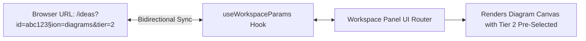

# Frontend Architecture & State Management Improvement Plan

> **Domain**: Next.js App Router, React 19, Client State Architecture & Query Optimization  
> **Target Stack**: Next.js 16, React 19, TanStack Query v5, Zustand, URL Search Params  
> **Status**: Technical Specification & Remediation Blueprint  

---

## 1. Executive Summary & Diagnostic

PAD's web frontend is built with **Next.js 16**, **React 19**, and **Tailwind CSS / shadcn/ui**. It delivers an interactive canvas for architecture review, Mermaid editing, document authoring, and task management.

However, a deep audit of the frontend code (`web/src/`) reveals several state management and rendering anti-patterns that degrade client-side performance, increase input latency, and break deep-linking:
1. **Root Context Re-Render Cascades**: In `web/src/features/auth/context/auth-context.tsx#L93-L108`, `AuthProvider` wraps the entire root application with an **unmemoized object literal value**. When minor internal state changes (e.g. `isLoading`, `isAuthOpen`, `authMode`), the entire virtual DOM tree of the workspace re-renders.
2. **Server State Duplication Anti-Pattern**: In `AuthProvider`, `AppSidebar.tsx` (`L57-L60`), and `OverviewPanel.tsx` (`L38-L43`), server data fetched via TanStack Query or `fetch()` is copied into local `useState` hooks inside `useEffect` listeners. This creates dual sources of truth, risks stale UI state, and triggers redundant render passes.
3. **Loss of URL State & Deep-Linking**: Active project IDs, selected workspace sections (`overview`, `documents`, `diagrams`, `features`, `workflow`, `iteration`), and active tabs are stored in ephemeral component memory. Refreshing the browser, clicking "Back", or sharing a link silently resets the user back to the default view.
4. **Monolithic Unmemoized Components**: `OverviewPanel.tsx` (689 lines) and `AppSidebar.tsx` (428 lines) combine data fetching, polling timeouts, modal dialogs, and rendering into monolithic components with inline callbacks, causing full-panel re-renders on every keystroke.
5. **Ad-Hoc Query Keys**: React Query keys are constructed as inconsistent string arrays across feature modules, preventing centralized cache invalidation and query deduplication.

---

## 2. Root Auth Context Refactoring & Value Memoization

### Current Anti-Pattern (`web/src/features/auth/context/auth-context.tsx#L93`):
```tsx
// ANTI-PATTERN: Fresh object literal generated on EVERY render of the root provider
return (
  <AuthContext.Provider
    value={{
      user,
      isAuthenticated: !!user,
      isLoading,
      login,
      logout,
      register,
      registerVerification,
      activate,
      isAuthOpen,
      setIsAuthOpen,
      authMode,
      setAuthMode,
    }}
  >
    {children}
  </AuthContext.Provider>
);
```

### Production-Grade Sliced & Memoized Architecture:

Separate high-frequency UI dialog state from low-frequency auth identity state using a dedicated Zustand store for dialogs and a memoized context for session identity:

```tsx
"use client";

import React, { createContext, useContext, useMemo, type ReactNode } from "react";
import { useMe, useLogin, useLogout } from "@/features/auth/api/authQueries";
import type { User } from "@/types/modules/users";

interface AuthContextValue {
  user: User | null;
  isAuthenticated: boolean;
  isLoading: boolean;
  login: (credentials: any) => Promise<void>;
  logout: () => void;
}

const AuthContext = createContext<AuthContextValue | null>(null);

export function AuthProvider({ children }: { children: ReactNode }) {
  // Read directly from React Query cache (single source of truth)
  const { data: meResponse, isLoading: isMeLoading } = useMe();
  const loginMutation = useLogin();
  const logoutMutation = useLogout();

  const user = useMemo(() => meResponse?.data?.user || null, [meResponse]);
  const isAuthenticated = useMemo(() => !!user, [user]);
  const isLoading = isMeLoading || loginMutation.isPending || logoutMutation.isPending;

  // Memoize stable callback functions
  const login = React.useCallback(
    async (payload: any) => {
      await loginMutation.mutateAsync(payload);
    },
    [loginMutation]
  );

  const logout = React.useCallback(() => {
    logoutMutation.mutate();
  }, [logoutMutation]);

  // CRITICAL: Memoize provider value object to prevent root-level re-render cascades
  const contextValue = useMemo<AuthContextValue>(
    () => ({
      user,
      isAuthenticated,
      isLoading,
      login,
      logout,
    }),
    [user, isAuthenticated, isLoading, login, logout]
  );

  return <AuthContext.Provider value={contextValue}>{children}</AuthContext.Provider>;
}

export const useAuth = () => {
  const context = useContext(AuthContext);
  if (!context) throw new Error("useAuth must be used within an AuthProvider");
  return context;
};
```

---

## 3. Canonical TanStack Query Key Factory

To eliminate duplicate queries and guarantee atomic cache invalidation, implement a structured query key factory:

```typescript
export const ideaQueryKeys = {
  all: ["ideas"] as const,
  lists: () => [...ideaQueryKeys.all, "list"] as const,
  list: (filters: { status?: string; search?: string }) => [...ideaQueryKeys.lists(), filters] as const,
  details: () => [...ideaQueryKeys.all, "detail"] as const,
  detail: (id: string) => [...ideaQueryKeys.details(), id] as const,
  ir: (id: string) => [...ideaQueryKeys.detail(id), "ir"] as const,
  documents: (id: string) => [...ideaQueryKeys.detail(id), "documents"] as const,
  diagrams: (id: string) => [...ideaQueryKeys.detail(id), "diagrams"] as const,
  features: (id: string) => [...ideaQueryKeys.detail(id), "features"] as const,
  tasks: (id: string) => [...ideaQueryKeys.detail(id), "tasks"] as const,
  workflow: (id: string) => [...ideaQueryKeys.detail(id), "workflow"] as const,
};
```

---

## 4. URL Search Params Synchronization for Workspace Deep-Linking

Replace local component memory with URL query parameters for workspace navigation:



### `useWorkspaceParams` Implementation:

```typescript
"use client";

import { useSearchParams, useRouter, usePathname } from "next/navigation";
import { useCallback, useMemo } from "react";

export type WorkspaceSection =
  | "overview"
  | "documents"
  | "diagrams"
  | "features"
  | "tasks"
  | "workflow"
  | "iteration"
  | "guidelines";

export function useWorkspaceParams() {
  const searchParams = useSearchParams();
  const router = useRouter();
  const pathname = usePathname();

  const activeIdeaId = searchParams.get("ideaId") || "";
  const activeSection = (searchParams.get("section") as WorkspaceSection) || "overview";
  const activeDocId = searchParams.get("docId") || undefined;
  const activeDiagramId = searchParams.get("diagramId") || undefined;

  const setParams = useCallback(
    (newParams: Record<string, string | undefined>) => {
      const current = new URLSearchParams(Array.from(searchParams.entries()));

      Object.entries(newParams).forEach(([key, value]) => {
        if (value === undefined || value === "") {
          current.delete(key);
        } else {
          current.set(key, value);
        }
      });

      const search = current.toString();
      const query = search ? `?${search}` : "";
      router.push(`${pathname}${query}`, { scroll: false });
    },
    [searchParams, router, pathname]
  );

  return useMemo(
    () => ({
      activeIdeaId,
      activeSection,
      activeDocId,
      activeDiagramId,
      setWorkspaceParams: setParams,
    }),
    [activeIdeaId, activeSection, activeDocId, activeDiagramId, setParams]
  );
}
```

---

## 5. Monolithic Component Decomposition Plan

Break down large single-file views into focused, memoized subcomponents:

```
web/src/features/ideas/components/OverviewPanel/
├── index.tsx                                # Slim container (~60 lines)
├── components/
│   ├── IdeaHeroCard.tsx                     # Memoized idea title, description & badge
│   ├── DiscoveryStatusSection.tsx           # Questionnaire status & triggers
│   ├── ArtifactGenerationSelector.tsx       # Document & diagram checklist options
│   ├── ResearchProgressCard.tsx             # Competitor & market research progress
│   └── NextStepActionBanner.tsx             # Action trigger (Move to Module 2/3)
```
