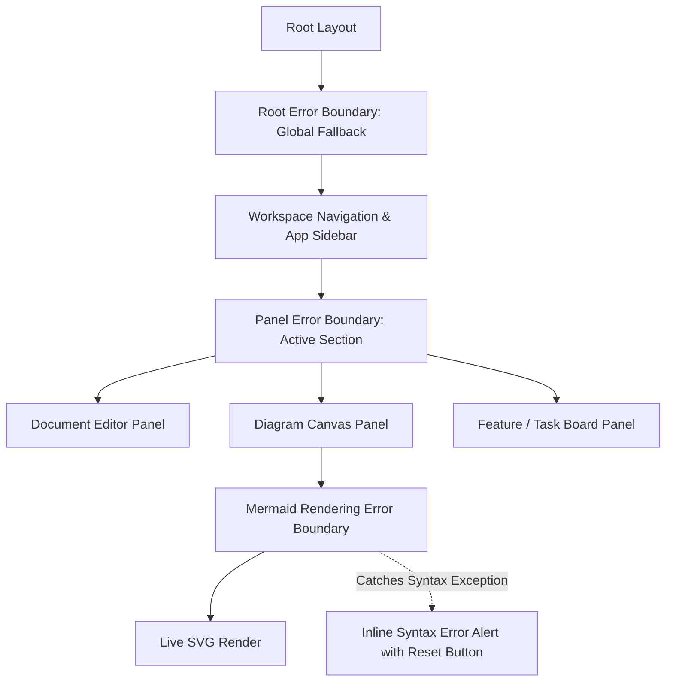

# Frontend Production Readiness & UX Hardening Plan

> **Domain**: Reliability, Error Containment, Bundle Optimization, A11y & Core Web Vitals  
> **Target Stack**: Next.js 16, React 19, Error Boundaries, Web Vitals, WCAG 2.1 AA  
> **Status**: Technical Specification & Remediation Blueprint  

---

## 1. Executive Summary & Diagnostic

A software system may render rapidly in local development, but in production with real users on varied hardware, network connections, and assistive technologies, resilience and accessibility dictate true quality.

A comprehensive production-readiness inspection of PAD's frontend revealed:
1. **Absence of Error Boundaries**: There are no React error boundaries wrapping high-risk client rendering surfaces (Mermaid live preview, Markdown syntax renderer, dynamic diagram zoom canvas). If Mermaid encounters invalid syntax or an API response contains unexpected fields, the **entire web app crashes to a blank white screen**.
2. **Bundle Bloat & Monolithic Imports**: Heavy client dependencies (`mermaid`, `html2pdf.js`, `recharts`, and icon sets) are loaded upfront in the main JavaScript chunk rather than dynamically split by route.
3. **Interactive Canvas Limitations**: The diagram canvas in `web/src/features/diagrams/components/DiagramCanvas.tsx` uses custom mouse dragging without trackpad pinch-to-zoom, wheel zoom, touch gestures for mobile/tablet, or viewport reset safety.
4. **Accessibility (WCAG 2.1 AA) Gaps**: Non-semantic clickable `div` elements, missing `aria-label` attributes on icon-only buttons in sidebars, unmanaged focus in custom modal dialogs, and color contrast ratios below 4.5:1 on muted badge text.
5. **Prototype Branding & Metadata Artifacts**: `web/src/app/layout.tsx` contains `generator: "v0.app"` and `package.json` contains `"name": "my-v0-project"`, lacking professional OpenGraph metadata and search engine optimization.

---

## 2. Granular React Error Boundaries Hierarchy

Implement a multi-tier error boundary architecture to isolate rendering crashes to specific panels without breaking the workspace shell:



### Production Diagram Canvas Error Boundary Implementation:

```tsx
"use client";

import React, { Component, ErrorInfo, ReactNode } from "react";
import { AlertTriangle, RefreshCw } from "lucide-react";
import { Button } from "@/components/ui/button";

interface Props {
  children: ReactNode;
  fallbackTitle?: string;
  onReset?: () => void;
}

interface State {
  hasError: boolean;
  error: Error | null;
}

export class DiagramErrorBoundary extends Component<Props, State> {
  public state: State = {
    hasError: false,
    error: null,
  };

  public static getDerivedStateFromError(error: Error): State {
    return { hasError: true, error };
  }

  public componentDidCatch(error: Error, errorInfo: ErrorInfo) {
    console.error("[DiagramErrorBoundary] Caught rendering error:", error, errorInfo);
    // In production: Send to Sentry / Datadog
  }

  private handleReset = () => {
    this.setState({ hasError: false, error: null });
    this.props.onReset?.();
  };

  public render() {
    if (this.state.hasError) {
      return (
        <div className="flex flex-col items-center justify-center p-8 bg-destructive/5 border border-destructive/20 rounded-xl m-4 text-center">
          <AlertTriangle className="w-10 h-10 text-destructive mb-3" />
          <h3 className="text-lg font-semibold text-foreground">
            {this.props.fallbackTitle || "Diagram Rendering Error"}
          </h3>
          <p className="text-sm text-muted-foreground mt-1 max-w-md font-mono bg-background/50 p-2 rounded border text-xs">
            {this.state.error?.message || "Invalid Mermaid syntax or renderer failure."}
          </p>
          <Button
            variant="outline"
            size="sm"
            onClick={this.handleReset}
            className="mt-4 gap-2"
          >
            <RefreshCw className="w-4 h-4" />
            Reset Diagram Canvas
          </Button>
        </div>
      );
    }

    return this.props.children;
  }
}
```

---

## 3. Dynamic Code-Splitting & Bundle Optimization

Heavy rendering libraries (`mermaid`, `html2pdf.js`, `recharts`) must be loaded on demand using `next/dynamic` with Server-Side Rendering (SSR) disabled:

```tsx
import dynamic from "next/dynamic";
import { Skeleton } from "@/components/ui/skeleton";

// Dynamically import Mermaid live renderer
export const DynamicMermaidViewer = dynamic(
  () => import("@/components/layout/MermaidPreview"),
  {
    ssr: false,
    loading: () => (
      <div className="w-full h-96 flex items-center justify-center bg-muted/20 rounded-xl">
        <Skeleton className="w-3/4 h-3/4 rounded-lg" />
      </div>
    ),
  }
);

// Dynamically import PDF export engine only when user clicks 'Export PDF'
export async function exportDocumentToPdf(elementId: string, filename: string) {
  const html2pdf = (await import("html2pdf.js")).default;
  const element = document.getElementById(elementId);
  if (!element) return;

  const options = {
    margin: 10,
    filename: `${filename}.pdf`,
    image: { type: "jpeg", quality: 0.98 },
    html2canvas: { scale: 2 },
    jsPDF: { unit: "mm", format: "a4", orientation: "portrait" },
  };

  html2pdf().set(options).from(element).save();
}
```

---

## 4. Accessibility (WCAG 2.1 AA) Compliance Standards

All UI components must adhere to the following strict accessibility checklist:

1. **Semantic HTML Controls**: Replace all `<div onClick={...}>` with `<button type="button" onClick={...}>` or Accessible Radix primitives.
2. **Icon Button Labels**: Ensure every icon-only button includes an `aria-label` and is wrapped in a `<Tooltip>`:
   ```tsx
   <Button
     variant="ghost"
     size="icon"
     aria-label="Zoom in diagram"
     onClick={handleZoomIn}
   >
     <ZoomIn className="w-4 h-4" aria-hidden="true" />
   </Button>
   ```
3. **Keyboard Focus Management**: When opening modals (such as `DiscoveryQuestionnaireForm` or `ImportExportDialog`), trap focus inside the modal and restore focus to the triggering element upon closure.
4. **Color Contrast Verification**: Ensure all body text achieves a minimum contrast ratio of **4.5:1** against backgrounds in both Dark and Light modes.

---

## 5. Professional Metadata & SEO Configuration

Update `web/src/app/layout.tsx` to establish professional branding and social sharing preview cards:

```typescript
export const metadata: Metadata = {
  title: {
    default: "PAD — Product Architecture Designer",
    template: "%s | PAD",
  },
  description:
    "Enterprise AI System Design Platform. Automatically transform software ideas into PRDs, interactive Mermaid diagrams, feature trees, and AI IDE handoff packages.",
  keywords: [
    "System Design",
    "Product Requirements Document",
    "Mermaid Diagrams",
    "Software Architecture",
    "AI Code Scaffolding",
    "UML Generator",
  ],
  authors: [{ name: "PAD Engineering Team" }],
  openGraph: {
    title: "PAD — Product Architecture Designer",
    description: "From Concept to Architecture in Minutes.",
    url: "https://pad.software",
    siteName: "PAD",
    images: [
      {
        url: "https://pad.software/og-image.png",
        width: 1200,
        height: 630,
        alt: "PAD System Design Platform",
      },
    ],
    locale: "en_US",
    type: "website",
  },
  twitter: {
    card: "summary_large_image",
    title: "PAD — Product Architecture Designer",
    description: "From Concept to Architecture in Minutes.",
    creator: "@pad_software",
  },
  icons: {
    icon: "/favicon.ico",
    apple: "/apple-touch-icon.png",
  },
};
```
