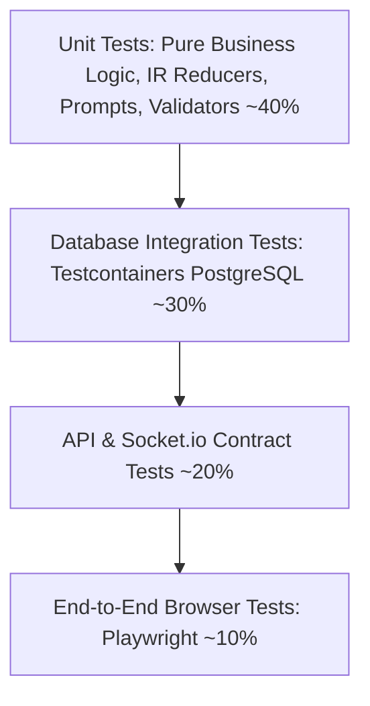

# Testing Strategy & Quality Assurance Architecture Plan

> **Domain**: Test Pyramid, Automated Testing, Integration, Contract & E2E Verification  
> **Target Stack**: Vitest, React Testing Library, Testcontainers, Playwright, Supertest  
> **Status**: Technical Specification & Remediation Blueprint  

---

## 1. Executive Summary & Quality Diagnostic

Code without tests is legacy code the moment it is written. In a system as interconnected as PAD—where an AI prompt change or schema migration can silently alter Mermaid diagrams, corrupt task dependency graphs, or break handoff ZIP compilations—automated verification is the only safeguard against regressions.

A diagnostic of the PAD repository found:
1. **0% Test Coverage**: There are currently **no automated tests** in either `server/` or `web/`. No test scripts exist in `package.json`, no test runner is installed, and changes can only be verified through manual browser testing.
2. **Missing Negative-Path Validation**: There are no tests verifying that expired tokens are rejected, unauthorized resource queries fail with HTTP 403, or invalid Mermaid syntax is safely contained.
3. **No Integration Testing for Data-Access**: Prisma repository queries have never been validated against real SQL databases in automated test environments.

---

## 2. The PAD Test Pyramid



---

## 3. Test Layers & Implementation Blueprints

### 3.1 Unit Testing: Pure Logic & ProjectIR State Machine
- **Framework**: Vitest (Fast execution, ESM native).
- **Target Areas**: `IterationIntentClassifier`, `ProjectIR` schema reconciler, prompt builders, Zod schemas, Zustand stores.

```typescript
// server/src/modules/iteration/__tests__/iteration-intent.test.ts
import { describe, it, expect } from "vitest";
import { classifyIntent } from "../iteration-intent.classifier";

describe("IterationIntentClassifier", () => {
    it("should classify requests to add database tables as 'ir_modification'", async () => {
        const feedback = "Please add a payments table with stripe_charge_id and amount columns.";
        const intent = await classifyIntent(feedback);
        expect(intent).toBe("ir_modification");
    });

    it("should classify general questions as 'discussion'", async () => {
        const feedback = "Can you explain why we chose PostgreSQL over MongoDB for this project?";
        const intent = await classifyIntent(feedback);
        expect(intent).toBe("discussion");
    });
});
```

---

### 3.2 Integration Testing: PostgreSQL Repositories with Testcontainers
- **Framework**: Vitest + Testcontainers (Spins up real, isolated ephemeral PostgreSQL Docker instances per test run).

```typescript
// server/src/modules/document/__tests__/document.repository.integration.test.ts
import { describe, it, expect, beforeAll, afterAll } from "vitest";
import { PostgreSqlContainer, StartedPostgreSqlContainer } from "@testcontainers/postgresql";
import { PrismaClient } from "@prisma/client";
import DocumentRepository from "../document.repository";

describe("DocumentRepository Integration Tests", () => {
    let container: StartedPostgreSqlContainer;
    let prisma: PrismaClient;
    let documentRepo: DocumentRepository;

    beforeAll(async () => {
        container = await new PostgreSqlContainer("postgres:16-alpine").start();
        process.env.DATABASE_URL = container.getConnectionUri();
        
        prisma = new PrismaClient({ datasources: { db: { url: container.getConnectionUri() } } });
        // Run Prisma migration against container
        await prisma.$executeRawUnsafe(`/* Create schema DDL */`);
        documentRepo = DocumentRepository.getInstance();
    });

    afterAll(async () => {
        await prisma.$disconnect();
        await container.stop();
    });

    it("should batch insert documents and versions atomically", async () => {
        // Test real DB query execution, foreign key constraints & indexing
    });
});
```

---

### 3.3 End-to-End (E2E) Browser Testing with Playwright
- **Framework**: Playwright (Cross-browser verification in Chromium, Firefox, WebKit).
- **Critical User Flows Tested**:
  1. **User Authentication Flow**: Signup $\rightarrow$ Email Verification $\rightarrow$ Login $\rightarrow$ Session Persistence.
  2. **Idea Intake & Discovery Journey**: Create Idea $\rightarrow$ Fill Questionnaire $\rightarrow$ Confirm Status.
  3. **Multi-Artifact Generation**: Generate PRD/BRD $\rightarrow$ Live Edit Mermaid Diagram $\rightarrow$ Verify Real-Time Preview.
  4. **AI IDE Handoff Export**: Trigger workflow compilation $\rightarrow$ Download ZIP package $\rightarrow$ Verify contents.

```typescript
// web/e2e/idea-creation.spec.ts
import { test, expect } from "@playwright/test";

test.describe("Idea Creation to Document Generation Flow", () => {
    test("should allow an authenticated user to submit a brief and generate a PRD", async ({ page }) => {
        await page.goto("/ideas");
        await page.click('button:has-text("New Project")');
        
        await page.fill('textarea[placeholder*="Describe your project"]', "Build a real-time multiplayer whiteboard application.");
        await page.click('button:has-text("Start Planning")');

        await expect(page.locator("text=Discovery Questionnaire")).toBeVisible({ timeout: 15000 });
        
        // Complete questionnaire and generate artifacts
        await page.click('button:has-text("Confirm & Proceed")');
        await expect(page.locator("text=Product Requirements Document (PRD)")).toBeVisible({ timeout: 30000 });
    });
});
```

---

## 4. CI Quality Gates & Coverage Thresholds

Set mandatory coverage gates in `server/vitest.config.ts` and `web/vitest.config.ts`:

```typescript
// vitest.config.ts
import { defineConfig } from "vitest/config";

export default defineConfig({
    test: {
        coverage: {
            provider: "v8",
            reporter: ["text", "json", "html"],
            lines: 80,
            functions: 80,
            branches: 75,
            statements: 80,
            exclude: ["**/node_modules/**", "**/dist/**", "**/*.d.ts"],
        },
    },
});
```
