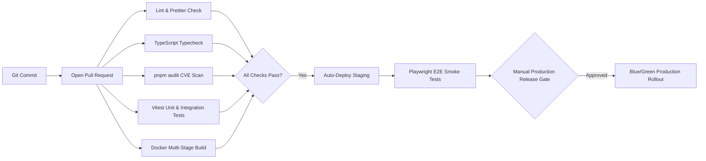
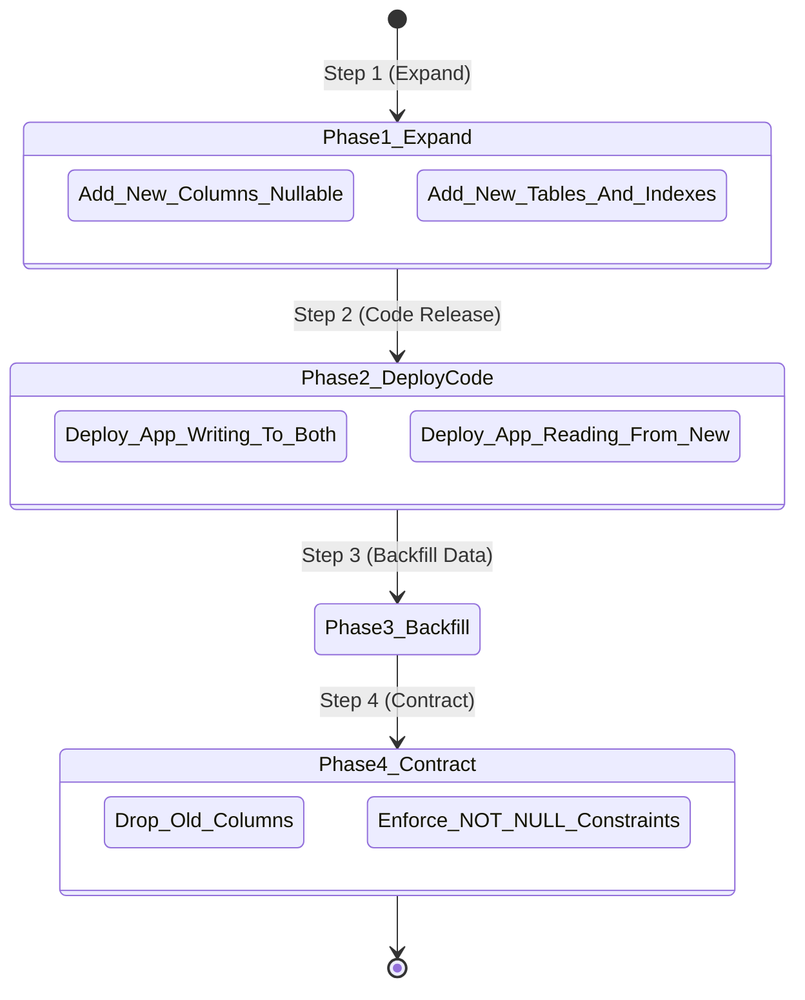

# DevOps, CI/CD & Deployment Architecture Plan

> **Domain**: CI/CD Automation, Containerization, Zero-Downtime Releases & Expand/Contract Migrations  
> **Target Stack**: GitHub Actions, Docker, Docker Compose, Kubernetes, AWS ECS, PgBouncer  
> **Status**: Technical Specification & Remediation Blueprint  

---

## 1. Executive Summary & Diagnostic

Deployments are the most vulnerable moments in software operations. A production outage is rarely caused by complex edge cases—it is typically triggered by:
- A migration that dropped a database column while older application pods were still reading it.
- A failed rolling update with no automated rollback mechanism.
- Unpinned or drifting dependencies in containers.
- Container termination signals (`SIGTERM`) terminating active client requests abruptly.

This document establishes the **DevOps and Zero-Downtime Deployment Architecture** for PAD.

---

## 2. GitHub Actions Automated CI/CD Pipeline

Implement a blocking quality pipeline running on every Pull Request and main branch merge:



### GitHub Actions Workflow Specification (`.github/workflows/ci.yml`):

```yaml
name: CI Pipeline

on:
  push:
    branches: [main]
  pull_request:
    branches: [main]

jobs:
  validate-backend:
    name: Backend Lint, Typecheck & Test
    runs-on: ubuntu-latest
    steps:
      - uses: actions/checkout@v4

      - name: Install pnpm
        uses: pnpm/action-setup@v4
        with:
          version: 9

      - name: Setup Node.js
        uses: actions/setup-node@v4
        with:
          node-version: 20
          cache: "pnpm"
          cache-dependency-path: "server/pnpm-lock.yaml"

      - name: Install Dependencies
        working-directory: ./server
        run: pnpm install --frozen-lockfile

      - name: Security Vulnerability Scan
        working-directory: ./server
        run: pnpm audit --audit-level=high

      - name: TypeScript Typecheck
        working-directory: ./server
        run: pnpm tsc --noEmit

      - name: Run Unit & Integration Tests
        working-directory: ./server
        run: pnpm test:coverage

  validate-frontend:
    name: Frontend Lint, Typecheck & Build
    runs-on: ubuntu-latest
    steps:
      - uses: actions/checkout@v4

      - name: Install pnpm
        uses: pnpm/action-setup@v4
        with:
          version: 9

      - name: Setup Node.js
        uses: actions/setup-node@v4
        with:
          node-version: 20
          cache: "pnpm"
          cache-dependency-path: "web/pnpm-lock.yaml"

      - name: Install Dependencies
        working-directory: ./web
        run: pnpm install --frozen-lockfile

      - name: TypeScript Typecheck
        working-directory: ./web
        run: pnpm tsc --noEmit

      - name: Build Next.js Production Bundle
        working-directory: ./web
        run: pnpm build
```

---

## 3. Production Multi-Stage Dockerfiles

### Backend Service Dockerfile (`server/Dockerfile`):

```dockerfile
# Stage 1: Build & Prune
FROM node:20-alpine AS builder
WORKDIR /app
RUN corepack enable && corepack prepare pnpm@latest --activate

COPY package.json pnpm-lock.yaml ./
COPY prisma ./prisma/
RUN pnpm install --frozen-lockfile

COPY tsconfig.json ./
COPY src ./src
RUN pnpm prisma:generate && pnpm build

# Stage 2: Production Minimal Runtime
FROM node:20-alpine AS runner
WORKDIR /app
ENV NODE_ENV=production
RUN corepack enable && corepack prepare pnpm@latest --activate

RUN addgroup --system --gid 1001 nodejs && \
    adduser --system --uid 1001 paduser

COPY package.json pnpm-lock.yaml ./
COPY prisma ./prisma/
RUN pnpm install --prod --frozen-lockfile && pnpm prisma:generate

COPY --from=builder /app/dist ./dist

USER paduser
EXPOSE 8080

CMD ["node", "dist/server.js"]
```

---

## 4. Zero-Downtime Database Migration: The Expand/Contract Pattern

Never apply breaking database schema migrations in the same atomic step as code deployments.



### Expand/Contract Rules for PAD:
1. **Never drop or rename a column in-place**: Create the new column as `NULLABLE`, deploy code that writes to both old and new columns, backfill historical rows, and drop the old column in a subsequent release.
2. **Always add indexes concurrently in PostgreSQL**:
   ```sql
   CREATE INDEX CONCURRENTLY IF NOT EXISTS idx_ideas_user_created ON ideas(user_id, created_at DESC);
   ```
3. **Run migrations before application rollouts**: Schema expansions must be backwards-compatible with running pods.

---

## 5. Automated Rollback Protocol

If error rates exceed 1% or latency percentiles ($p_{99}$) exceed 1,500ms following a deployment:

1. **Automated Health Probe Failure**: The load balancer immediately stops routing traffic to newly deployed pods.
2. **Image Tag Rollback**: Deploy previous immutable container image tag (`pad-server:v1.14.2` instead of rebuilding).
3. **Database Rollback Safety**: Because all migrations followed Expand/Contract, the previous code version remains 100% compatible with the expanded database schema.
