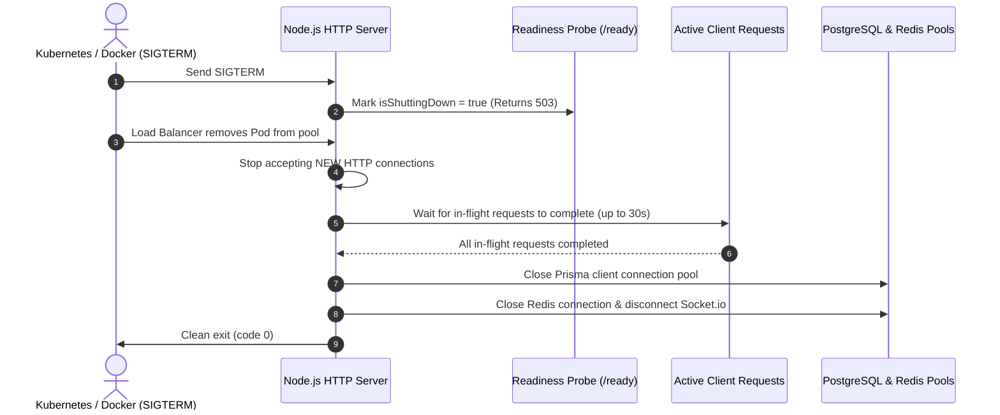

# Observability, Monitoring & System Resilience Plan

> **Domain**: Structured Logging, Distributed Tracing, Health Probes, Graceful Shutdown & Circuit Breakers  
> **Target Stack**: Pino, OpenTelemetry, Prometheus, Opossum, Redis  
> **Status**: Technical Specification & Remediation Blueprint  

---

## 1. Executive Summary & Diagnostic

In a production environment, a system cannot be maintained or debugged if its runtime behavior is opaque. When an AI generation job hangs, an N+1 query locks database connections, or a rolling deployment terminates active user sessions, observability is the only mechanism that enables rapid triage and resolution.

An inspection of PAD's server runtime (`server/src/server.ts`, `server/src/app.ts`) revealed:
1. **Flawed Graceful Shutdown Lifecycle**: In `server/src/server.ts#L28-L39`, `server.close()` is invoked asynchronously without waiting for in-flight requests to finish before immediately executing `prisma.$disconnect()` and `process.exit(0)`. In-flight generation requests and database connections are severed mid-response on every deploy.
2. **Unstructured String Logging**: The application relies on `morgan("dev")` and plain-text `console.log()` statements without log levels (debug, info, warn, error), JSON formatting, or contextual metadata.
3. **No Request Correlation Tracking**: Logs across different layers (HTTP $\rightarrow$ Service $\rightarrow$ AI Gateway $\rightarrow$ Database) share no common identifier, making it impossible to trace individual requests across concurrent traffic.
4. **Missing Liveness & Readiness Probes**: There are no `/healthz` or `/ready` endpoints, preventing Kubernetes, AWS ECS, and load balancers from detecting unhealthy replicas or waiting for database/cache warmup.
5. **No Circuit Breakers or Outbound Resilience**: Calls to external AI providers and search APIs lack circuit breakers, risking cascading service exhaustion if an upstream dependency experiences high latency.

---

## 2. True Graceful Shutdown Architecture

Implement a robust, bounded shutdown handler that mark readiness probes as false, stops accepting new connections, drains in-flight requests, flushes logs, disconnects pools cleanly, and exits:



### Production Graceful Shutdown Implementation (`server/src/server.ts`):

```typescript
import http from "http";
import app from "./app";
import config from "./config/config";
import PrismaClientSingleton from "./data-server-clients/prisma-client";
import SocketService from "./services/socket.service";
import { logger } from "./utils/logger";

const prisma = PrismaClientSingleton.getPrismaClient();
const server = http.createServer(app);

// State flag for readiness probe
export let isShuttingDown = false;

SocketService.getInstance().initialize(server);

const PORT = config.PORT;

server.listen(PORT, () => {
    logger.info({ port: PORT, env: config.NODE_ENV }, `PAD Server started successfully`);
});

const gracefulShutdown = async (signal: string) => {
    logger.warn({ signal }, `Received ${signal}. Initiating graceful shutdown...`);
    isShuttingDown = true;

    // 1. Give orchestrator 5 seconds to remove container from load balancer routing
    await new Promise((resolve) => setTimeout(resolve, 5000));

    // 2. Set hard bounded timeout (30 seconds)
    const forceShutdownTimeout = setTimeout(() => {
        logger.error("Graceful shutdown timeout exceeded (30s). Forcing process exit.");
        process.exit(1);
    }, 30000);

    // 3. Stop accepting new HTTP requests and drain connections
    server.close(async (err) => {
        if (err) {
            logger.error({ err }, "Error during HTTP server close");
            process.exit(1);
        }

        logger.info("HTTP connections drained. Disconnecting database and Redis pools...");

        try {
            await prisma.$disconnect();
            logger.info("Database connection closed cleanly.");

            clearTimeout(forceShutdownTimeout);
            logger.info("Graceful shutdown completed. Exiting process.");
            process.exit(0);
        } catch (error) {
            logger.error({ error }, "Error during database disconnect");
            process.exit(1);
        }
    });
};

process.on("SIGTERM", () => gracefulShutdown("SIGTERM"));
process.on("SIGINT", () => gracefulShutdown("SIGINT"));
```

---

## 3. Liveness & Readiness Probes Implementation

Expose dedicated health endpoints in `server/src/modules/health/health.route.ts`:

```typescript
import { Router, Request, Response } from "express";
import PrismaClientSingleton from "../../data-server-clients/prisma-client";
import { isShuttingDown } from "../../server";

const router = Router();

// 1. Liveness Probe: Cheap check verifying Node process is responsive
router.get("/healthz", (_req: Request, res: Response) => {
    if (isShuttingDown) {
        return res.status(503).json({ status: "shutting_down" });
    }
    return res.status(200).json({ status: "alive" });
});

// 2. Readiness Probe: Comprehensive check validating DB & Redis connectivity
router.get("/ready", async (_req: Request, res: Response) => {
    if (isShuttingDown) {
        return res.status(503).json({ status: "not_ready", reason: "server_terminating" });
    }

    try {
        const prisma = PrismaClientSingleton.getPrismaClient();
        // Ping database with 2-second timeout
        await prisma.$queryRaw`SELECT 1`;

        return res.status(200).json({
            status: "ready",
            services: {
                database: "healthy",
                redis: "healthy",
            },
            timestamp: new Date().toISOString(),
        });
    } catch (error: any) {
        return res.status(503).json({
            status: "unhealthy",
            error: error.message,
        });
    }
});

export default router;
```

---

## 4. Structured JSON Logging with Pino & Correlation IDs

Replace unstructured logs with structured JSON logging containing automatic `x-request-id` correlation:

```typescript
import pino from "pino";
import pinoHttp from "pino-http";
import crypto from "crypto";

export const logger = pino({
    level: process.env.LOG_LEVEL || "info",
    formatters: {
        level: (label) => ({ level: label }),
    },
    base: {
        service: "pad-server",
        env: process.env.NODE_ENV,
    },
});

export const httpLoggerMiddleware = pinoHttp({
    logger,
    genReqId: (req) => (req.headers["x-request-id"] as string) || crypto.randomUUID(),
    customLogLevel: (_req, res, err) => {
        if (res.statusCode >= 500 || err) return "error";
        if (res.statusCode >= 400) return "warn";
        return "info";
    },
});
```

---

## 5. Outbound Resilience: Circuit Breakers & Write Idempotency

Wrap all outbound AI and third-party API calls in an **Opossum Circuit Breaker**:

```typescript
import CircuitBreaker from "opossum";
import { logger } from "./logger";

const breakerOptions = {
    timeout: 60000, // 60s timeout
    errorThresholdPercentage: 50, // Open breaker if 50% of requests fail
    resetTimeout: 30000, // Wait 30s before half-open test probe
};

export function createResilientCaller<T extends (...args: any[]) => Promise<any>>(
    fn: T,
    actionName: string
) {
    const breaker = new CircuitBreaker(fn, breakerOptions);

    breaker.on("open", () => logger.warn(`[CircuitBreaker] Breaker OPEN for ${actionName}. Failing fast.`));
    breaker.on("halfOpen", () => logger.info(`[CircuitBreaker] Breaker HALF-OPEN for ${actionName}. Probing.`));
    breaker.on("close", () => logger.info(`[CircuitBreaker] Breaker CLOSED for ${actionName}. Restored.`));

    return breaker;
}
```

### Write Idempotency Keys on Retried Requests:
For state-changing generation requests (`POST /generate`, `POST /apply-plan`), require `x-idempotency-key` in request headers. Store generated result hashes in Redis for 24 hours to ensure network retries return identical cached results rather than executing duplicate costly LLM runs.
