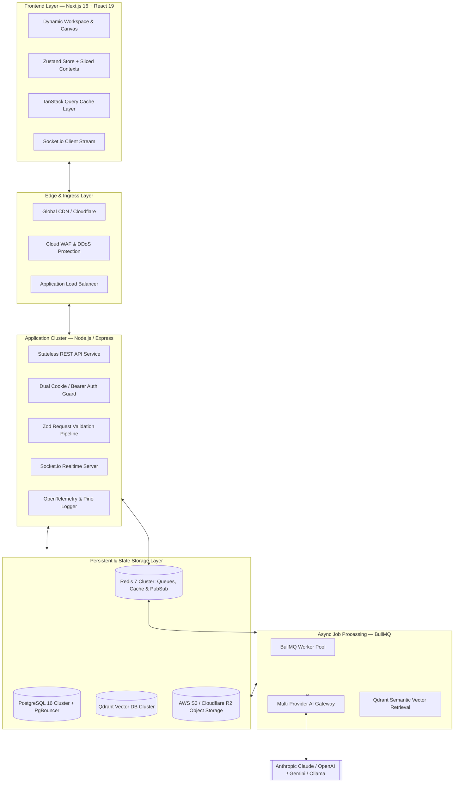
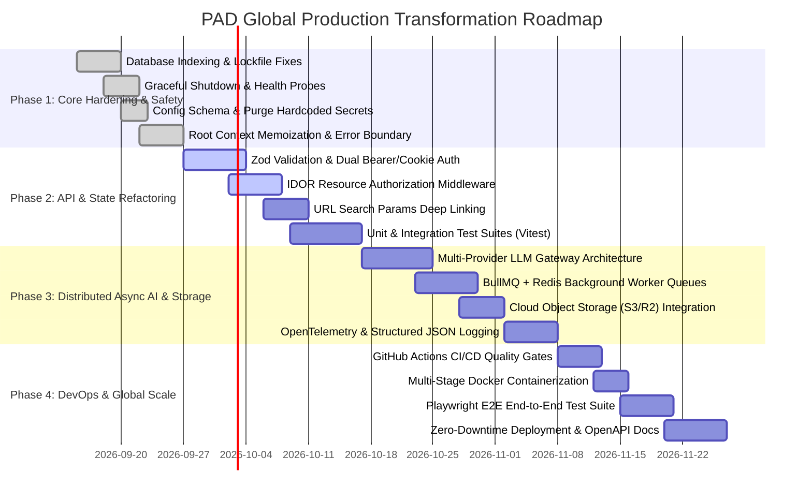

# PAD Production Readiness & Global SaaS Engineering Blueprint

> **System**: PAD (Product Architecture Designer)  
> **Status**: Comprehensive Architectural Audit & Remediation Roadmap  
> **Author**: Antigravity Principal Systems Architect & Senior Full-Stack Engineer  
> **Target Audience**: Core Engineering Team, DevOps, Security, and Product Architects  

---

## Executive Overview

**PAD (Product Architecture Designer)** bridges the gap between raw product requirements and execution-ready software engineering artifacts. It provides an automated, synchronized planning environment spanning:
- **Idea Intake & Pre-Validation** (Discovery Questionnaires & Market/Competitor Research)
- **SDLC Document Generation** (PRD, BRD, SRS, Architecture Specs)
- **Interactive Architecture Diagramming** (UML, Database ERDs, Sequence & Flowcharts via Mermaid)
- **Work Breakdown Structure & Task Management** (Features, Tasks, and Dependency Graphs)
- **Project Intermediate Representation (ProjectIR)** (Canonical multi-tier schema single source of truth)
- **AI IDE Workflow Packages** (Actionable coding instructions & exported handoff bundles)
- **Interactive Iterative Modification Engine** (Chat-based recursive plan refinement & rollback)

This improvement documentation suite provides a deep, production-grade master plan to upgrade PAD from its current advanced prototype state into a **globally scalable, resilient, multi-tenant enterprise SaaS platform**.

---

## Dedicated Architecture Improvement Specifications

Every architectural dimension of PAD has a dedicated technical blueprint in this directory:

| Document | Focus Area | Key Highlights & Deliverables |
|:---|:---|:---|
| [**01. Database & Data Layer**](./01_DATABASE_AND_DATA_LAYER.md) | PostgreSQL, Prisma ORM & Caching | Complete indexing DDL, soft deletes, multi-table transactions, N+1 query elimination, Redis cache-aside, PgBouncer pooling. |
| [**02. Backend API & Services**](./02_BACKEND_API_AND_SERVICES.md) | Express API, Transport & Middleware | Hybrid Cookie/Bearer auth, IDOR & tenant isolation, S3/R2 storage adapter, standardized API response envelopment. |
| [**03. AI Engine & Workflow Orchestration**](./03_AI_ENGINE_AND_WORKFLOW_ORCHESTRATION.md) | LLM Routing, Queues & RAG | Multi-Provider Gateway (Claude/OpenAI/Gemini/Ollama), BullMQ asynchronous job queue, WebSocket streaming, RAG vector optimization. |
| [**04. Frontend Architecture & State**](./04_FRONTEND_ARCHITECTURE_AND_STATE.md) | Next.js, React 19 & State | Root context slicing & memoization, TanStack Query key factory, deep-linking URL search params synchronization, list virtualization. |
| [**05. Frontend Production Readiness & UX**](./05_FRONTEND_PRODUCTION_READINESS_AND_UX.md) | Hardening, A11y & Web Vitals | React error boundaries, dynamic code-splitting for heavy engines (Mermaid/PDF), WCAG 2.1 AA accessibility, production metadata. |
| [**06. Security & Compliance**](./06_SECURITY_AND_COMPLIANCE.md) | AppSec, OWASP & Validation | Zod schema validation on all endpoints, Redis-backed rate limiting, file magic-byte inspection, XSS & prompt injection sanitization. |
| [**07. Config & Secrets Management**](./07_CONFIG_AND_SECRETS_MANAGEMENT.md) | Env Schemas & Credentials | Fail-fast type-safe environment validation, purging hardcoded fallback secrets & legacy keys, secret rotation SOP. |
| [**08. Dependency Hygiene & Supply Chain**](./08_DEPENDENCY_HYGIENE_AND_SUPPLY_CHAIN.md) | Packages, Lockfiles & CVEs | Restoring lockfile tracking (`pnpm-lock.yaml`), pruning abandoned packages (`pug`, duplicate types), automated CI vulnerability scans. |
| [**09. Testing Strategy & QA**](./09_TESTING_STRATEGY_AND_QA.md) | Test Pyramid & Quality Gates | Vitest unit tests, Testcontainers PostgreSQL integration tests, API contract testing, Playwright end-to-end browser suites. |
| [**10. DevOps, CI/CD & Deployment**](./10_DEVOPS_CICD_AND_DEPLOYMENT.md) | GitHub Actions, Docker & Infra | GitHub Actions CI/CD workflows, multi-stage production Dockerfiles, Expand/Contract database migration lifecycle, blue/green deploys. |
| [**11. Observability, Monitoring & Resilience**](./11_OBSERVABILITY_MONITORING_AND_RESILIENCE.md) | Telemetry, Probes & Stability | OpenTelemetry distributed tracing, Pino JSON logging with correlation IDs, health probes (`/healthz`, `/ready`), circuit breakers. |

---

## Phased Master Roadmap

### Phase Breakdown

1. **Phase 1 — Immediate Correctness & Safe Hardening (Week 1–2)**:
   - Apply Prisma schema indexing migration to eliminate table scan bottlenecks.
   - Restore `pnpm-lock.yaml` tracking and commit lockfiles to version control.
   - Refactor `server.ts` graceful shutdown with true HTTP connection draining.
   - Add `/healthz` and `/ready` probes.
   - Replace unmemoized root React contexts with memoized providers and wrap UI panels in Error Boundaries.
   - Replace insecure config fallbacks with strict Zod startup validation.

2. **Phase 2 — API, Security & State Consolidation (Week 3–4)**:
   - Deploy universal Zod validation middleware on all HTTP routes.
   - Implement dual Cookie/Bearer authentication and object-level IDOR authorization guards.
   - Replace manual component polling with TanStack Query hooks and URL search params state sync.
   - Implement Vitest unit and PostgreSQL repository integration tests with Testcontainers.

3. **Phase 3 — Scalable Async AI & Cloud Infrastructure (Week 5–6)**:
   - Implement the Multi-Provider AI Gateway (Claude 3.5 Sonnet, GPT-4o, Gemini 2.0 Pro, Ollama).
   - Migrate long-running generation tasks to BullMQ worker queues with Redis backend.
   - Replace local `/tmp` and `./uploads` storage with S3/R2 object storage and magic-byte validation.
   - Instrument OpenTelemetry distributed tracing and Pino structured JSON logging with correlation IDs.

4. **Phase 4 — DevOps, Multi-Tenancy & Global Deployment (Week 7–8)**:
   - Configure GitHub Actions automated PR checks and CD deployment pipelines.
   - Build hardened multi-stage Docker images for server and web services.
   - Implement Playwright E2E test suites for core user journeys.
   - Deploy zero-downtime blue/green deployment orchestration with Expand/Contract database migrations.
   - Generate OpenAPI 3.1 Swagger documentation and client SDKs.
