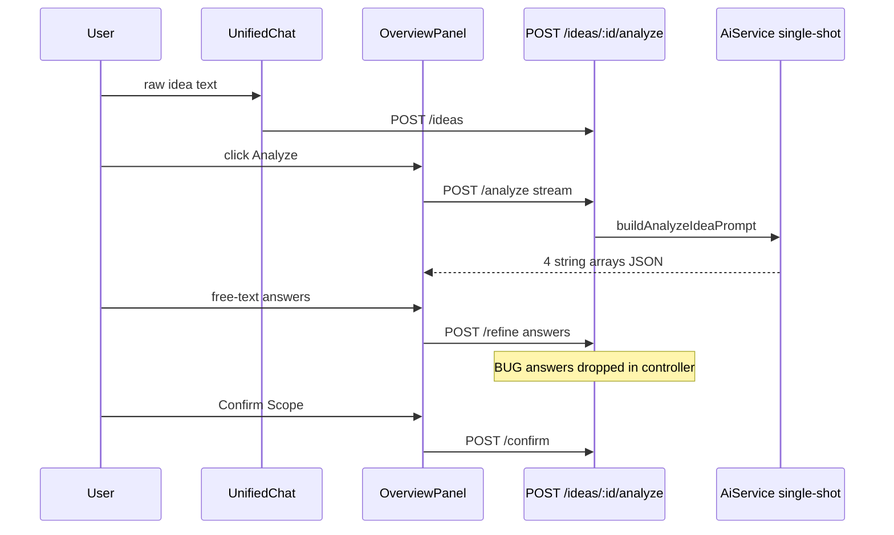
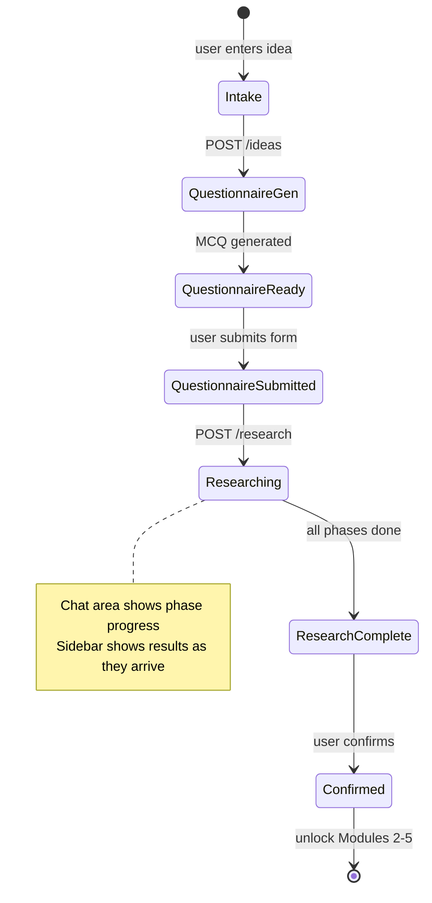
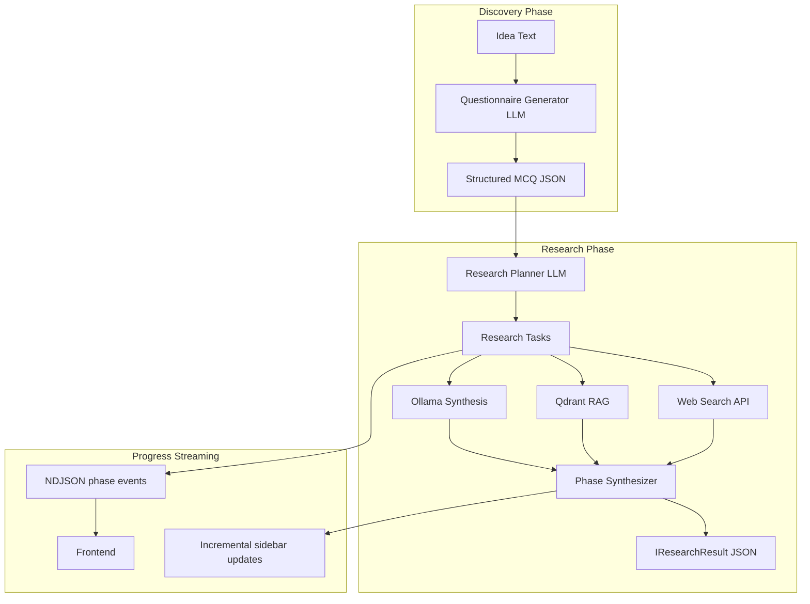

# Module 1 Redesign Planning Document

## Deliverable

Create [`docs/modules/module-1-redesign.md`](docs/modules/module-1-redesign.md) — standalone implementation spec (~800–1200 lines). Follow structure/style of existing [`docs/modules/module-06-remediation-plan.md`](docs/modules/module-06-remediation-plan.md). Target audience: engineer implementing Module 1 without prior PAD context.

---

## 1. Current State Analysis

**What exists today:**

Module 1 = chat intake → manual "Analyze Concept with AI" → free-text Q&A → confirm. Named "Idea Intake & Pre-Validation" in [`documents/modules/module_1_idea_intake_pre_validation.md`](documents/modules/module_1_idea_intake_pre_validation.md).



**Critical bugs found:**
- [`idea.controller.ts:107-109`](server/src/modules/idea/idea.controller.ts) — `refineIdea` forwards only `refinedText`, drops `answers` despite service support at [`idea.service.ts:154-182`](server/src/modules/idea/idea.service.ts)
- Frontend sends `{ answers }` from [`useOverviewPanel.ts:115-117`](web/src/features/ideas/hook/useOverviewPanel.ts) — clarification re-analysis silently broken
- Confirm requires `analysisResult` but no validation that Q&A answered or answers meaningful

**AI stack:** Ollama (`qwen3.5`) + optional Qdrant user-guideline RAG. No web search, no agents, no multi-step research.

**Output schema** ([`IIdeaAnalysisResult`](web/src/features/ideas/types/models/idea.ts)):
```typescript
{ missingDetails[], complementarySuggestions[], constraintsAndRisks[], clarifyingQuestions[] }
```
Low structure — not usable for downstream SDLC (Modules 2–5 consume `analysisResult` as opaque JSON in PRD/BRD prompts).

---

## 2. Existing File Mapping

### Frontend — Keep

| File | Reason |
|------|--------|
| [`web/src/features/ideas/components/WorkspaceLayout.tsx`](web/src/features/ideas/components/WorkspaceLayout.tsx) | Shell: sidebar + resizable chat/content split — layout stays |
| [`web/src/features/ideas/components/AppSidebar.tsx`](web/src/features/ideas/components/AppSidebar.tsx) | Idea list + section nav + confirm gating — update labels/gating rules |
| [`web/src/features/ideas/hook/useWorkspaceLayout.ts`](web/src/features/ideas/hook/useWorkspaceLayout.ts) | Workspace state, URL sync, idea loading |
| [`web/src/features/chat/components/UnifiedChat.tsx`](web/src/features/chat/components/UnifiedChat.tsx) | Step 1 intake — keep create-idea flow |
| [`web/src/features/ideas/api/ideas.api.ts`](web/src/features/ideas/api/ideas.api.ts) | Base CRUD + streaming infra — extend, don't replace |
| [`web/src/features/ideas/api/ideasQueries.ts`](web/src/features/ideas/api/ideasQueries.ts) | TanStack Query hooks — extend |
| [`web/src/app/ideas/*`](web/src/app/ideas/) | Routes — keep structure |
| [`web/src/components/providers/StreamingProvider.tsx`](web/src/components/providers/StreamingProvider.tsx) | Phase streaming badges — reuse for research phases |
| [`web/src/config/workspace.tsx`](web/src/config/workspace.tsx) | Section config — rename "Overview" → "Discovery" |

### Frontend — Refactor

| File | Change |
|------|--------|
| [`OverviewPanel.tsx`](web/src/features/ideas/components/OverviewPanel.tsx) | Replace entirely → `ResearchSidebarPanel` (6 research sections) |
| [`useOverviewPanel.ts`](web/src/features/ideas/hook/useOverviewPanel.ts) | Replace → `useDiscoveryFlow.ts` + `useResearchProgress.ts` |
| [`idea.ts` types](web/src/features/ideas/types/models/idea.ts) | Replace `IIdeaAnalysisResult` → `IDiscoveryQuestionnaire`, `IResearchResult`; add status enum |
| [`OverviewPanel.types.ts`](web/src/features/ideas/types/components/OverviewPanel.types.ts) | Rename/replace with ResearchSidebar types |

### Frontend — Delete

| File | Reason |
|------|--------|
| [`CollapsibleSection.tsx`](web/src/features/ideas/components/CollapsibleSection.tsx) | Unused; old analysis accordion pattern |
| [`WorkspaceSidebar.tsx`](web/src/features/ideas/components/WorkspaceSidebar.tsx) | Exported but never imported |
| [`web/src/components/layout/InputPanel.tsx`](web/src/components/layout/InputPanel.tsx) | Legacy pre-workspace UI, dead code |
| [`web/src/components/layout/OutputPanel.tsx`](web/src/components/layout/OutputPanel.tsx) | Legacy pre-workspace UI, dead code |

### Backend — Keep

| File | Reason |
|------|--------|
| [`idea.route.ts`](server/src/modules/idea/idea.route.ts) | Route mounting pattern |
| [`idea.repository.ts`](server/src/modules/idea/idea.repository.ts) | Prisma CRUD — extend |
| [`idea.service.ts`](server/src/modules/idea/idea.service.ts) | Core validation + lifecycle — refactor methods |
| [`ai.service.ts`](server/src/modules/ai/ai.service.ts) | LLM gateway, JSON parse, RAG — extend |
| [`ollama-client.ts`](server/src/modules/ai/ollama-client.ts) | Streaming infra for research progress |
| [`qdrant.ts`](server/src/data-server-clients/qdrant.ts) | Guideline RAG — reuse in research |

### Backend — Refactor

| File | Change |
|------|--------|
| [`idea.controller.ts`](server/src/modules/idea/idea.controller.ts) | New endpoints; fix answers bug; research streaming |
| [`IIdea.ts`](server/src/modules/idea/types/IIdea.ts) | New types + status enum |
| [`analyze-idea.prompt.ts`](server/src/modules/ai/prompts/analyze-idea.prompt.ts) | Replace with discovery + research prompt suite |

### Backend — Delete

| File | Reason |
|------|--------|
| `REANALYZE_WITH_ANSWERS_PROMPT` in analyze-idea.prompt.ts | Free-text Q&A flow removed |

### Backend — New Files

| Path | Purpose |
|------|---------|
| `server/src/modules/discovery/discovery.service.ts` | Questionnaire generation from idea text |
| `server/src/modules/discovery/discovery.prompt.ts` | Structured MCQ prompt templates |
| `server/src/modules/research/research.service.ts` | Multi-step research orchestrator |
| `server/src/modules/research/research-orchestrator.ts` | Agent workflow: plan → search → synthesize |
| `server/src/modules/research/research.prompt.ts` | Per-phase synthesis prompts |
| `server/src/modules/research/web-search.service.ts` | Web search adapter (Tavily/Serper) |
| `server/src/modules/research/types/IResearch.ts` | Research result schema |
| `server/src/modules/discovery/types/IDiscovery.ts` | Questionnaire schema |

---

## 3. Existing API Mapping

| Method | Endpoint | Current | New Module 1 |
|--------|----------|---------|--------------|
| POST | `/api/v1/ideas` | Create draft | Keep — triggers auto questionnaire gen (async) |
| GET | `/api/v1/ideas` | List | Keep |
| GET | `/api/v1/ideas/:id` | Get idea | Extend response with questionnaire + research |
| POST | `/api/v1/ideas/:id/analyze` | Single-shot analysis stream | **Deprecate** → replace with `/research` |
| POST | `/api/v1/ideas/:id/refine` | Free-text answers | **Deprecate** → replace with `/questionnaire/submit` |
| POST | `/api/v1/ideas/:id/confirm` | Confirm scope | Keep — require `researchResult` not `analysisResult` |
| — | `/api/v1/ideas/:id/questionnaire` | — | **New** GET generated questionnaire |
| — | `/api/v1/ideas/:id/questionnaire/submit` | — | **New** POST structured answers |
| — | `/api/v1/ideas/:id/research` | — | **New** POST start research (NDJSON progress stream) |
| — | `/api/v1/ideas/:id/research/status` | — | **New** GET poll research job status |

---

## 4. Existing Database Mapping

**Current `ideas` table** ([`schema.prisma:42-67`](server/prisma/schema.prisma)):
- `raw_text`, `refined_text`, `status` (`draft|confirmed`), `analysis_result` JSONB

**Downstream consumers of `analysisResult`:**
- [`generate-prd.prompt.ts`](server/src/modules/ai/prompts/generate-prd.prompt.ts) — stringifies entire JSON
- [`generate-brd.prompt.ts`](server/src/modules/ai/prompts/generate-brd.prompt.ts) — same
- [`iteration-context.builder.ts`](server/src/modules/iteration/iteration-context.builder.ts) — includes in chat context

Migration must provide adapter: map `researchResult` → legacy shape OR update downstream prompts to consume rich research output.

---

## 5. Gap Analysis

| Capability | Current | Required |
|------------|---------|----------|
| Structured questionnaire (MCQ/select/checkbox) | None | Core Step 2 |
| Answer validation (required fields, enum constraints) | None | Prevent garbage input |
| Deep research pipeline | Single LLM call | Multi-step agent workflow |
| Web search / competitor lookup | None | External research source |
| Research progress UI | Generic streaming text | Named phase indicators |
| Structured research sidebar | 4 generic string arrays | 6 rich sections |
| Downstream SDLC input quality | Low-value arrays | MVP scope, arch, risks |
| Idea lifecycle states | 2 states | 5+ states |

---

## 6. UX Problems (document section)

1. **Generic chatbot feel** — analyze button + free-text Q&A mimics ChatGPT, not product discovery tool
2. **Manual analyze trigger** — user must discover and click; should auto-flow after intake
3. **Low-value output** — "missing details" / "suggestions" cards not actionable for SDLC
4. **Broken clarification** — controller bug + no answer validation = random text accepted
5. **Inconsistent confirm gating** — readiness score cosmetic; confirm doesn't verify research complete
6. **Wrong panel placement** — analysis in main content area; research should be sidebar, questionnaire in chat
7. **No research experience** — no phase progress, no competitor names, no citations

---

## 7. Architecture Problems (document section)

1. **Monolithic AiService** — no separation between discovery, research, synthesis phases
2. **Single JSON blob** — `analysisResult` can't evolve without breaking downstream
3. **No job tracking** — long research runs can't resume or show progress after refresh
4. **No external data sources** — LLM hallucinates competitors instead of searching
5. **Tight coupling** — OverviewPanel owns analyze + Q&A + confirm in one 530-line component
6. **No validation layer** — questionnaire answers bypass schema validation

---

## 8. Desired User Flow



**Step-by-step:**
1. User enters idea in `UnifiedChat` (≥20 chars) → idea created
2. Backend auto-generates structured questionnaire (async or sync)
3. Chat area renders `DiscoveryQuestionnaireForm` — MCQ, selects, checkboxes, minimal free text
4. User submits → answers validated server-side
5. Research starts automatically (or explicit "Start Research" CTA)
6. Chat area shows `ResearchProgressPanel` with rotating phase messages
7. Right sidebar (`ResearchSidebarPanel`) populates sections as research completes
8. User reviews research → clicks "Confirm Project Scope"
9. Status → `confirmed`; Modules 2–5 unlock

---

## 9. Proposed Frontend Architecture

```
web/src/features/discovery/          (NEW feature module)
├── components/
│   ├── DiscoveryQuestionnaireForm.tsx   # Step 2-3: structured form in chat area
│   ├── ResearchProgressPanel.tsx          # Step 5: phase indicators in chat area
│   └── ResearchSidebarPanel.tsx           # Step 6: replaces OverviewPanel
│       ├── ProjectUnderstandingSection.tsx
│       ├── CompetitorAnalysisSection.tsx
│       ├── SuggestedScopeSection.tsx
│       ├── TechnicalInsightsSection.tsx
│       ├── RisksSection.tsx
│       └── ResearchSummarySection.tsx
├── hooks/
│   ├── useDiscoveryFlow.ts              # orchestrates intake → questionnaire → research → confirm
│   └── useResearchStream.ts             # NDJSON progress + partial results
├── api/
│   ├── discovery.api.ts
│   └── discoveryQueries.ts
└── types/
    ├── questionnaire.ts
    └── research.ts
```

**Layout change in `WorkspaceLayout`:**
- Chat panel (left): intake → questionnaire form → research progress (state-driven)
- Content panel (right): `ResearchSidebarPanel` instead of `OverviewPanel` when section = "overview"
- Rename section label: "Overview" → "Discovery"

---

## 10. Proposed Backend Architecture

```
server/src/modules/
├── idea/                    # Keep: CRUD, confirm, lifecycle
│   └── idea.service.ts      # Delegate to discovery + research modules
├── discovery/               # NEW
│   ├── discovery.route.ts
│   ├── discovery.controller.ts
│   ├── discovery.service.ts
│   ├── discovery.repository.ts
│   └── prompts/questionnaire.prompt.ts
└── research/                # NEW
    ├── research.route.ts
    ├── research.controller.ts
    ├── research.service.ts
    ├── research-orchestrator.ts
    ├── research.repository.ts
    ├── web-search.service.ts
    └── prompts/
        ├── competitor-research.prompt.ts
        ├── architecture-research.prompt.ts
        └── synthesis.prompt.ts
```

Pattern: Route → Controller → Service → Repository (matches [`implementation_rules.md`](documents/implementation_rules.md)).

---

## 11. Proposed AI Orchestrator Architecture



**Research phases (ordered):**
1. `understanding` — parse idea + questionnaire into problem/vision/audience
2. `competitors` — web search + synthesize competitor SWOT
3. `market` — industry standards, market observations
4. `architecture` — patterns, tech stack, complexity
5. `scope` — MVP / nice-to-have / future features
6. `risks` — business, technical, scaling
7. `summary` — executive summary synthesis

Each phase: emit progress event → run tools → emit partial result → persist.

---

## 12. Research Pipeline Design

**Orchestrator interface:**
```typescript
interface ResearchOrchestrator {
  runResearch(ideaId: string, context: ResearchContext): AsyncGenerator<ResearchEvent>;
}
type ResearchEvent =
  | { type: 'phase_start'; phase: ResearchPhase; message: string }
  | { type: 'phase_progress'; phase: ResearchPhase; detail: string }
  | { type: 'partial_result'; section: keyof IResearchResult; data: unknown }
  | { type: 'phase_complete'; phase: ResearchPhase }
  | { type: 'complete'; result: IResearchResult }
  | { type: 'error'; message: string };
```

**Web search:** Abstract behind `WebSearchProvider` interface. MVP: Tavily or Serper API. Fallback: LLM-only with disclaimer when search unavailable.

**Retrieval:** Reuse Qdrant guideline RAG for user-specific architecture preferences during architecture phase.

**Resumability:** Persist `research_jobs` row with current phase + partial results so refresh doesn't restart.

---

## 13. Data Models

**Idea status enum (extend):**
```typescript
type IdeaStatus =
  | 'draft'                    // idea created, questionnaire pending
  | 'questionnaire_ready'      // questionnaire generated
  | 'questionnaire_complete'   // answers submitted
  | 'researching'              // research in progress
  | 'research_complete'        // research done, awaiting confirm
  | 'confirmed';               // scope locked
```

**IDiscoveryQuestionnaire:**
```typescript
interface IDiscoveryQuestion {
  id: string;
  category: 'target_users' | 'project_type' | 'monetization' | 'platform' |
            'scale' | 'auth' | 'ai_features' | 'realtime' | 'integrations' | 'deployment' | 'other';
  type: 'single_select' | 'multi_select' | 'checkbox' | 'text';
  label: string;
  description?: string;
  required: boolean;
  options?: { value: string; label: string }[];
  validation?: { minLength?: number; maxLength?: number; pattern?: string };
}
interface IDiscoveryQuestionnaire {
  id: string;
  ideaId: string;
  questions: IDiscoveryQuestion[];
  generatedAt: string;
}
interface IQuestionnaireResponse {
  questionId: string;
  value: string | string[] | boolean;
}
```

**IResearchResult (replaces IIdeaAnalysisResult):**
```typescript
interface IResearchResult {
  projectUnderstanding: {
    problemStatement: string;
    productVision: string;
    targetAudience: string;
  };
  competitorAnalysis: {
    competitors: Array<{
      name: string;
      description: string;
      strengths: string[];
      weaknesses: string[];
      url?: string;
    }>;
    opportunities: string[];
  };
  suggestedScope: {
    mvpFeatures: string[];
    niceToHaveFeatures: string[];
    futureFeatures: string[];
  };
  technicalInsights: {
    recommendedArchitecture: string;
    recommendedTechStack: string[];
    complexityNotes: string;
  };
  risksAndConsiderations: {
    businessRisks: string[];
    technicalRisks: string[];
    scalingConcerns: string[];
  };
  researchSummary: string;
  metadata: {
    phasesCompleted: string[];
    sourcesConsulted: string[];
    completedAt: string;
  };
}
```

---

## 14. API Contracts

Document full request/response schemas for all 9 endpoints (existing + new). Include:
- NDJSON stream format for `/research` (mirror existing analyze stream pattern from [`ideas.api.ts:32-34`](web/src/features/ideas/api/ideas.api.ts))
- Validation rules per questionnaire field type
- Error codes: 400 (invalid answers), 409 (research already running), 422 (questionnaire incomplete)

**Example research stream chunk:**
```json
{"type":"phase_start","phase":"competitors","message":"Researching competitors..."}
{"type":"partial_result","section":"competitorAnalysis","data":{"competitors":[...]}}
{"type":"complete","result":{...full IResearchResult...}}
```

---

## 15. State Management Requirements

| State | Location | Persistence |
|-------|----------|-------------|
| Idea + status | TanStack Query `useIdea` | Server |
| Questionnaire | TanStack Query `useQuestionnaire` | Server |
| Form answers (draft) | Local `useState` in form | Client until submit |
| Research progress | `useResearchStream` hook | Server job + client stream |
| Partial research results | TanStack Query cache merge | Server |
| Confirm loading | Mutation state | — |

**Refresh resilience:** On mount, if `idea.status === 'researching'`, reconnect to research stream or poll `/research/status`.

---

## 16. Component Breakdown

Document each component with props, responsibilities, and which step it serves:

- `DiscoveryQuestionnaireForm` — renders dynamic form from questionnaire JSON; validates client-side before submit
- `QuestionField` — polymorphic renderer for single_select / multi_select / checkbox / text
- `ResearchProgressPanel` — animated phase list in chat area; subscribes to stream events
- `ResearchSidebarPanel` — container with 6 collapsible sections; skeleton loaders during research
- `CompetitorCard` — name, strengths/weaknesses, optional link
- `FeatureScopeList` — MVP / nice-to-have / future grouped lists
- `ConfirmScopeButton` — enabled only when `status === 'research_complete'`

---

## 17. Database Changes

**New tables:**

```prisma
model DiscoveryQuestionnaire {
  id        String   @id @default(uuid())
  ideaId    String   @unique @map("idea_id")
  questions Json     // IDiscoveryQuestion[]
  createdAt DateTime @default(now())
  idea      Idea     @relation(...)
}

model QuestionnaireResponse {
  id              String   @id @default(uuid())
  ideaId          String   @unique @map("idea_id")
  answers         Json     // IQuestionnaireResponse[]
  submittedAt     DateTime @default(now())
  idea            Idea     @relation(...)
}

model ResearchJob {
  id              String   @id @default(uuid())
  ideaId          String   @unique @map("idea_id")
  status          String   // pending|running|completed|failed
  currentPhase    String?  @map("current_phase")
  partialResults  Json?    @map("partial_results")
  startedAt       DateTime?
  completedAt     DateTime?
  errorMessage    String?
  idea            Idea     @relation(...)
}

// Extend Idea model:
// - status: expand enum values
// - researchResult Json? @map("research_result")
// - keep analysisResult temporarily for migration adapter
// - confirmedAt DateTime? @map("confirmed_at")
```

---

## 18. Migration Strategy

**Phase 0 — Adapter layer:**
- Add `getEffectiveAnalysisContext(idea)` helper that returns `researchResult` mapped to legacy shape for PRD/BRD prompts
- Keeps Modules 2–6 working during transition

**Phase 1 — Parallel endpoints:**
- Ship new discovery/research endpoints alongside deprecated `/analyze` and `/refine`
- Frontend switches to new flow; old endpoints marked deprecated

**Phase 2 — Data migration:**
- Script: existing `analysisResult` → minimal `researchResult` (best-effort mapping)
- Set status `research_complete` for ideas with analysis but not confirmed

**Phase 3 — Cleanup:**
- Remove `/analyze`, `/refine` endpoints
- Drop `analysisResult` column after downstream prompts updated
- Delete old prompts and OverviewPanel code

**Existing in-flight ideas:** Draft ideas with old analysis show banner "Re-run discovery" — reset to questionnaire flow.

---

## 19. Implementation Phases

| Phase | Scope | Est. |
|-------|-------|------|
| **P1 — Foundation** | DB migration, types, discovery questionnaire gen + submit API, basic form UI | 1 week |
| **P2 — Research Core** | Research orchestrator, web search integration, NDJSON streaming, progress UI | 1.5 weeks |
| **P3 — Research Sidebar** | 6 sidebar sections, partial result rendering, confirm flow update | 1 week |
| **P4 — Downstream Adapter** | Map researchResult for PRD/BRD/iteration context; update prompts | 0.5 week |
| **P5 — Migration & Cleanup** | Data migration, deprecate old endpoints, delete dead code | 0.5 week |
| **P6 — Polish** | Error states, refresh resilience, loading skeletons, empty states | 0.5 week |

---

## 20. Acceptance Criteria

- User submits idea → structured questionnaire appears automatically (no manual "Analyze" button)
- Questionnaire uses MCQ/select/checkbox for ≥80% of fields
- Invalid/incomplete questionnaire submission rejected server-side
- Research shows ≥5 named progress phases in chat area
- Sidebar displays all 6 research sections with structured content
- Competitor section includes ≥2 named products (from web search when available)
- Confirm blocked until `research_complete`
- Confirmed ideas unlock Modules 2–5 (existing gating preserved)
- Page refresh during research resumes from last phase
- Downstream PRD generation receives research context (via adapter or direct)
- Old `/analyze` flow removed; no references to `clarifyingQuestions` free-text UI

---

## Document Writing Notes

- Include mermaid diagrams for user flow, research pipeline, and frontend layout
- Cross-reference exact file paths with line citations where bugs exist
- Include full TypeScript interfaces in document (not pseudocode)
- Add env vars needed: `TAVILY_API_KEY` or `SERPER_API_KEY`
- Note: [`documents/modules/module_1_idea_intake_pre_validation.md`](documents/modules/module_1_idea_intake_pre_validation.md) becomes superseded — link but don't modify
- Match tone/structure of [`docs/modules/module-06-remediation-plan.md`](docs/modules/module-06-remediation-plan.md)
