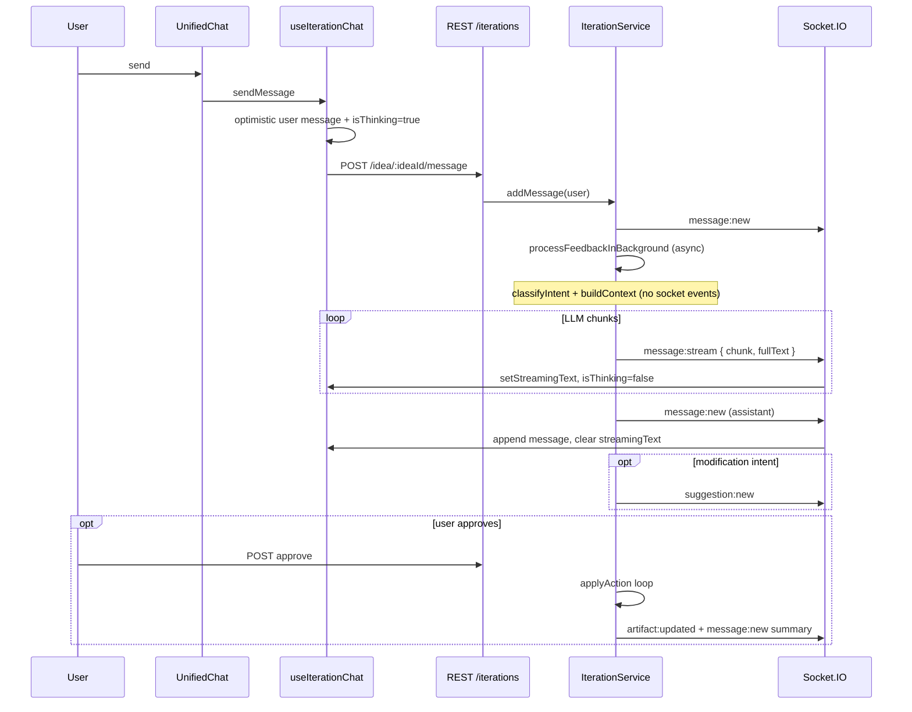
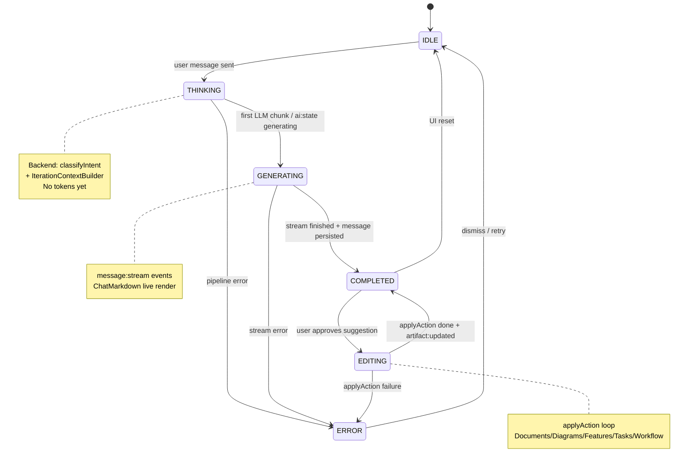

# Module 6 — Chat UI Polish Implementation Plan

**Status:** Analysis only — no implementation in this document  
**Date:** 2026-06-05  
**Scope:** PAD Assistant chat experience (`web/components/workspace/UnifiedChat.tsx`, iteration chat stack)  
**Goal:** Transform the chat into a cleaner, production-ready AI copilot experience comparable to modern AI products (ChatGPT, Claude, Cursor).

---

## Objective

Transform the current chat interface into a cleaner, more professional AI copilot experience. The current UI feels cluttered, visually noisy, and does not properly communicate AI state transitions. The goal is a modern, polished, production-ready chat that relies on alignment and typography rather than avatars and heavy bubble chrome.

---

# Current UI Architecture

## Component Map

| File | Role |
|------|------|
| [web/components/workspace/UnifiedChat.tsx](../../web/components/workspace/UnifiedChat.tsx) | Primary chat shell: message list, empty states, input, thinking/streaming placeholders |
| [web/components/features/iteration/ChatMessage.tsx](../../web/components/features/iteration/ChatMessage.tsx) | Per-message rendering: avatars, bubbles, timestamps, suggestion attachment |
| [web/components/features/iteration/ChatMarkdown.tsx](../../web/components/features/iteration/ChatMarkdown.tsx) | Assistant markdown: GFM, sanitize, code blocks, mermaid |
| [web/components/features/iteration/SuggestionCard.tsx](../../web/components/features/iteration/SuggestionCard.tsx) | Modification proposal card with approve/reject |
| [web/hooks/use-iteration-chat.ts](../../web/hooks/use-iteration-chat.ts) | Session load, socket listeners, optimistic send, polling fallback, state booleans |
| [web/lib/socket.ts](../../web/lib/socket.ts) | Singleton Socket.IO client (`autoConnect: false`) |
| [web/components/workspace/WorkspaceLayout.tsx](../../web/components/workspace/WorkspaceLayout.tsx) | Embeds `UnifiedChat` in resizable panel; `onArtifactUpdated` → panel refresh |
| [web/components/streaming-provider.tsx](../../web/components/streaming-provider.tsx) | Workspace-wide streaming status — **not wired to chat** |
| [web/app/globals.css](../../web/app/globals.css) | Design tokens (oklch), `.workspace-panel` scrollbar, no chat-specific styles |
| [web/components/ui/avatar.tsx](../../web/components/ui/avatar.tsx) | Radix Avatar primitive — **not used by chat** (chat uses inline Lucide circles) |

**Deprecated / removed from active path:**
- [web/app/ideas/[id]/iterate/page.tsx](../../web/app/ideas/[id]/iterate/page.tsx) — redirects to workspace
- `IterationChat.tsx` — deleted; unified into workspace split pane

## Data & Event Flow



## Styling Approach

- **Framework:** Tailwind CSS v4 with oklch CSS variables in `:root` / `.dark`
- **Typography:** Geist sans/mono via `@theme inline`
- **Chat styling:** Inline Tailwind utility classes — no shared chat design tokens or component layer
- **Markdown:** `prose prose-sm dark:prose-invert` on wrapper + per-element overrides in `ChatMarkdown`
- **Accent color:** Hard-coded violet (`violet-100`, `violet-500`, `violet-600`) throughout chat, separate from `--accent` token
- **Layout:** Flex rows with `gap-3`, `max-w-[80%]` on message column, `space-y-4` between messages

## Message Rendering Flow

1. **Persisted messages:** `messages.map()` → `ChatMessage` → role branch:
   - User: plain `<p>` in primary-colored bubble
   - Assistant: `ChatMarkdown` in muted bubble + optional `SuggestionCard`
2. **In-flight assistant (pre-stream):** `UnifiedChat` renders separate row when `isThinking && !streamingText` — Bot avatar + muted bubble + bouncing dots
3. **Streaming assistant:** Separate row when `streamingText` — RefreshCw avatar + muted bubble + `ChatMarkdown` + "PAD is typing..." caption
4. **Completion:** `message:new` (assistant) clears `streamingText`; message appears in list via `ChatMessage`

**Problem:** Thinking, streaming, and completed assistant messages use three different UI patterns instead of one unified assistant message slot.

## AI State Management (Current)

| State variable | Set true | Set false | Backend signal |
|----------------|----------|-----------|----------------|
| `isSending` | `sendMessage` start | REST returns | None |
| `isThinking` | `sendMessage` start | First `message:stream`, `message:new` (assistant), error, poll timeout | **None** — purely client-inferred |
| `streamingText` | `message:stream` | `message:new` (assistant), error | `message:stream.fullText` |
| `isLoading` | Session fetch | Session loaded | REST only |

There is **no** `EDITING` state in chat. Approve flow uses local `isApproving` inside `SuggestionCard` only.

## Socket Events (Implemented)

| Event | Direction | Payload | Chat handler |
|-------|-----------|---------|--------------|
| `join-room` | client → server | `ideaId` | On connect + idea change |
| `session:created` | server → room | session | **Not listened** |
| `message:new` | server → room | `IterationMessage` | Merge/replace optimistic; clear stream on assistant |
| `message:stream` | server → room | `{ sessionId, chunk, fullText }` | Set `streamingText`, stop poll |
| `message:error` | server → room | `{ sessionId, error }` | Clear states, show error |
| `suggestion:new` | server → room | `IterationSuggestion` | Attach to assistant message by `messageId` |
| `suggestion:status` | server → room | `{ id, status }` | Update nested suggestion |
| `artifact:updated` | server → room | `{ ideaId, suggestionId, modulesAffected }` | Callback to refresh panels |

## SVG Assets (Project Root)

Three standalone HTML preview files with copy-paste-ready animated SVG + CSS:

| File | CSS class | Animation | Intended label |
|------|-----------|-----------|----------------|
| [geist_pixel_ai_thinking_icon.html](../../geist_pixel_ai_thinking_icon.html) | `.geist-thinking-icon` | Particle explode (`geist-explode`) | Analyzing / gathering context |
| [geist_pixel_ai_generating_icon.html](../../geist_pixel_ai_generating_icon.html) | `.geist-generating-icon` | Clockwise spin highlight (`geist-generate-spin`) | Streaming tokens |
| [geist_pixel_ai_editing_icon.html](../../geist_pixel_ai_editing_icon.html) | `.geist-editing-icon` | Star → three dots bounce (`geist-typing-*`) | Modifying artifacts |

All use `fill="currentColor"`, `viewBox="0 0 17 17"`, recommended display size 28×28px, `shape-rendering: crispEdges`.

---

# Existing Problems

## Visual / UX

1. **Avatar clutter** — User and assistant messages each show 32px circular avatars (`User` / `Bot` Lucide icons). Thinking and streaming rows duplicate this pattern with `Bot` / `RefreshCw`.
2. **Bubble overload** — Both roles use heavy `rounded-2xl` bubbles. Assistant content feels boxed in rather than embedded in the conversation.
3. **User bubble too strong** — `bg-primary text-primary-foreground` creates high-contrast blocks unlike modern copilot UIs (subtle user pills).
4. **Triple assistant UI** — Thinking placeholder, streaming row, and persisted `ChatMessage` are structurally inconsistent (avatars + bubbles vs final message).
5. **Redundant status text** — "PAD is thinking...", "PAD is typing...", bouncing dots, and spinning `RefreshCw` compete for attention.
6. **Timestamps on every message** — `text-[10px]` under each bubble adds noise without clear value in a copilot context.
7. **Violet overload** — Empty state icon, suggestion cards, links, inline code, and avatars all use violet, fighting the neutral theme.
8. **Header status misleading** — Workspace chat header shows static green pulse dot regardless of AI activity.
9. **Suggestion cards visually heavy** — Violet bordered cards break the minimal assistant aesthetic (acceptable as action UI, but needs spacing harmony post-redesign).

## State / Streaming

10. **No backend state signals** — THINKING phase (intent classification + context building, often several seconds) has zero server feedback; user only sees client `isThinking`.
11. **No EDITING state in chat** — During `approveSuggestion` → `applyAction`, chat shows button spinner in card but no copilot-level "PAD is editing..." indicator.
12. **State conflation** — `isThinking` covers both pre-stream waiting and is cleared abruptly on first token with no transition animation.
13. **Streaming re-parses full markdown** — Each `message:stream` replaces entire `fullText`; `ChatMarkdown` re-renders from scratch → potential flicker on long responses, mermaid re-init risk.
14. **Streaming assistant uses bubble** — Contradicts target design (assistant should stream inline without container).
15. **No stream lifecycle events** — Missing `stream:start`, `stream:end`, `stream:done` — frontend cannot distinguish first chunk vs mid-stream vs completion cleanly.

## Technical

16. **`prose` without typography plugin** — `@tailwindcss/typography` is not in [web/package.json](../../web/package.json); `prose` classes may be inert or partially styled.
17. **Mermaid theme hardcoded dark** — [ChatMarkdown.tsx](../../web/components/features/iteration/ChatMarkdown.tsx) `mermaid.initialize({ theme: "dark" })` ignores light mode.
18. **Polling fallback is slow** — 3s interval, up to 40 polls; no UI indication that fallback is active.
19. **`StreamingProvider` disconnected** — Chat does not integrate with workspace streaming context used elsewhere (e.g. overview analysis).
20. **Layout coupled to avatar width** — `gap-3` + 32px avatar + `max-w-[80%]` will leave awkward left gutter or misalignment after avatar removal unless refactored.

---

# Avatar Removal Plan

## Locations to Change

| Location | Current | Action |
|----------|---------|--------|
| [ChatMessage.tsx:24-33](../../web/components/features/iteration/ChatMessage.tsx) | 32px circle + `User`/`Bot` icon | **Remove entirely** |
| [UnifiedChat.tsx:282-285](../../web/components/workspace/UnifiedChat.tsx) | Thinking row Bot avatar | **Remove** — replace with state indicator component |
| [UnifiedChat.tsx:303-306](../../web/components/workspace/UnifiedChat.tsx) | Streaming row RefreshCw avatar | **Remove** — use generating icon or no icon in message body |
| [UnifiedChat.tsx:239-241](../../web/components/workspace/UnifiedChat.tsx) | Empty state `MessageSquare` in violet square | **Optional:** replace with text-only or subtle PAD wordmark — not an avatar but similar visual weight |
| [UnifiedChat.tsx:4](../../web/components/workspace/UnifiedChat.tsx) | Imports `Bot`, `RefreshCw` | Remove unused imports after refactor |

## Not in Scope (Keep)

- [web/components/ui/avatar.tsx](../../web/components/ui/avatar.tsx) — generic UI primitive; unused by chat
- `Bot` icons in sidebar, workflow panels, overview — navigation/feature icons, not chat avatars

## Layout Adjustments After Removal

1. **ChatMessage root:** Change from `flex gap-3 flex-row[-reverse]` to column layout:
   - User: `flex flex-col items-end`
   - Assistant: `flex flex-col items-start w-full` (assistant can use full content width)
2. **Remove `max-w-[80%]` constraint** on assistant messages; keep ~85% max-width on user pills only for readability.
3. **Replace `gap-3`** with `space-y-1` within message groups; use `space-y-6` or `space-y-8` between message groups for breathing room.
4. **Thinking/streaming rows:** Align to assistant column (full width, left-aligned content) — no offset for removed avatar.
5. **Verify responsive behavior** at min chat panel width (25% of workspace per `ResizablePanel minSize`).

## Dependencies on Avatar Spacing

- Timestamp `px-1` offset was visually aligned under bubble, not avatar — retain under user pill only or remove timestamps (see acceptance criteria).
- SuggestionCard attaches below assistant bubble — stays below markdown content block, full width of assistant column.

---

# Message Styling Plan

## Design Tokens to Add

Add chat-specific semantic tokens to [globals.css](../../web/app/globals.css) (or a dedicated `chat.css` imported once):

```css
:root {
  --chat-user-bg: oklch(0.94 0 0);           /* slightly darker than background (1.0) */
  --chat-user-fg: oklch(0.145 0 0);
  --chat-assistant-fg: oklch(0.145 0 0);
  --chat-code-bg: oklch(0.96 0 0);
  --chat-status-fg: oklch(0.556 0 0);
}

.dark {
  --chat-user-bg: oklch(0.14 0 0);           /* slightly brighter than background (0.08) */
  --chat-user-fg: oklch(0.95 0 0);
  --chat-assistant-fg: oklch(0.95 0 0);
  --chat-code-bg: oklch(0.16 0 0);
  --chat-status-fg: oklch(0.65 0 0);
}
```

Wire into `@theme inline` as `--color-chat-user-bg`, etc., for Tailwind utilities: `bg-chat-user-bg`, `text-chat-assistant-fg`.

## Assistant Messages (Persisted + Streaming)

| Property | Current | Target |
|----------|---------|--------|
| Background | `bg-muted rounded-2xl` | **None** — transparent |
| Border | None | None |
| Padding | `px-4 py-2.5` | `py-1` minimal vertical rhythm only |
| Width | `max-w-[80%]` | `w-full` (within chat content column) |
| Typography | `text-sm` in bubble | `text-sm leading-relaxed` on markdown root |

## User Messages

| Property | Current | Target |
|----------|---------|--------|
| Background | `bg-primary` (high contrast) | `bg-chat-user-bg` subtle contrast |
| Text | `text-primary-foreground` | `text-chat-user-fg` |
| Shape | `rounded-2xl rounded-tr-sm` | `rounded-2xl` (uniform) or `rounded-xl` |
| Alignment | Right via `flex-row-reverse` | `self-end` pill, `max-w-[85%]` |
| Padding | `px-4 py-2.5` | `px-3.5 py-2` — slightly tighter |

## ChatMarkdown Adjustments

1. Add `.chat-markdown` rules in `@layer components` for element defaults (reduce duplicate props in component overrides).
2. **Code blocks:** Use `bg-chat-code-bg` instead of `bg-secondary/20`; ensure contrast in both themes.
3. **Inline code:** Replace hard-coded `text-violet-400` with `text-foreground/80` + subtle bg.
4. **Links:** Use `text-accent` or neutral underline — drop violet-specific colors.
5. **Mermaid:** Initialize with theme based on `useTheme().isDark` — re-init on theme toggle.
6. **Install `@tailwindcss/typography`** OR remove `prose` dependency and rely fully on `.chat-markdown` custom styles (prefer explicit `.chat-markdown` for control and bundle size).

## Component Changes

| Component | Changes |
|-----------|---------|
| `ChatMessage.tsx` | Remove avatar; apply role-specific layout classes; optional timestamp toggle |
| `UnifiedChat.tsx` | Unify streaming/thinking into `AssistantStatusRow` + `StreamingMessage` components; remove bubble wrappers |
| New: `ChatUserBubble.tsx` | Thin wrapper for user text styling |
| New: `ChatAssistantContent.tsx` | Wrapper for markdown + suggestions without container chrome |
| `SuggestionCard.tsx` | Tone down violet — use `border-border bg-muted/30` to match copilot aesthetic; keep actionable emphasis |

## Tailwind Utility Patterns

```tsx
// User message
<div className="self-end max-w-[85%] rounded-2xl bg-chat-user-bg px-3.5 py-2 text-sm text-chat-user-fg">

// Assistant message (persisted)
<div className="w-full text-sm text-chat-assistant-fg">
  <ChatMarkdown content={...} />
</div>
```

---

# AI State System Design

## Semantic States

| State | Meaning | Current detection | Target detection |
|-------|---------|-------------------|------------------|
| **IDLE** | No AI activity | Default | Default; all flags false |
| **THINKING** | Classifying intent, building context, awaiting first token | `isThinking && !streamingText` | Backend `ai:state` + client fallback |
| **GENERATING** | LLM streaming tokens | `streamingText !== null` | `ai:state` + `message:stream` |
| **EDITING** | Applying artifact mutations | SuggestionCard `isApproving` only | `ai:state: editing` during `applyAction` |
| **COMPLETED** | Response finalized | Implicit after `message:new` | Explicit `stream:done` or `ai:state: idle` |
| **ERROR** | Pipeline failure | `error` string | `message:error` + `ai:state: error` |

## State Machine (Based on Existing Architecture)

### Path A — Discussion / Q&A

```
IDLE
  │ user sends message (POST /message)
  ▼
THINKING  ← emit on processFeedbackInBackground start
  │ intent=discussion, context built, LLM call begins
  ▼
GENERATING  ← emit on first stream chunk
  │ message:stream chunks
  ▼
COMPLETED  ← emit on assistant message:new saved
  │
  ▼
IDLE
```

### Path B — Modification (Suggestion)

```
IDLE → THINKING → GENERATING → COMPLETED (assistant message + suggestion:new)
  │
  │ user clicks "Approve & Apply"
  ▼
EDITING  ← emit at approveSuggestion start
  │ applyAction per module
  ▼
COMPLETED  ← artifact:updated + summary message:new
  │
  ▼
IDLE
```

### Path C — Error

```
THINKING or GENERATING
  │ exception in processFeedbackInBackground
  ▼
ERROR  ← message:error
  │
  ▼
IDLE  (user dismisses or sends again)
```

## State Machine Diagram



## UI Behavior per State

| State | Icon | Label (subtle, optional) | Message area |
|-------|------|--------------------------|--------------|
| IDLE | — | — | Normal history + input enabled |
| THINKING | `GeistThinkingIcon` | "Analyzing your project…" | Status row at bottom of transcript; input disabled or enabled per product choice (recommend: enabled) |
| GENERATING | `GeistGeneratingIcon` | None (icon adjacent to stream) | Streaming markdown inline, no bubble; icon fixed at start of stream block |
| EDITING | `GeistEditingIcon` | "Updating project…" | Status row OR overlay on suggestion card; input disabled during apply |
| COMPLETED | — | — | Final message in history; suggestion card if present |
| ERROR | — | Error banner (existing) | Restore input; clear partial stream |

---

# SVG Integration Plan

## Step 1 — Extract Components

Create [web/components/features/iteration/icons/](../../web/components/features/iteration/icons/):

| Component | Source | Notes |
|-----------|--------|-------|
| `GeistThinkingIcon.tsx` | `geist_pixel_ai_thinking_icon.html` | Inline SVG + `className` prop |
| `GeistGeneratingIcon.tsx` | `geist_pixel_ai_generating_icon.html` | Same |
| `GeistEditingIcon.tsx` | `geist_pixel_ai_editing_icon.html` | Same |

Each component:
- Accepts `className`, `size` (default 28)
- Uses `currentColor` for theme compatibility
- Includes `aria-hidden="true"` when decorative; pair with visible status text for a11y

## Step 2 — Extract CSS Animations

Add to [globals.css](../../web/app/globals.css) under `@layer components`:

- `@keyframes geist-explode`, `geist-generate-spin`, `geist-generate-core`, `geist-typing-left/center/right`
- Particle class rules scoped under `.geist-thinking-icon`, `.geist-generating-icon`, `.geist-editing-icon`

**Do not** import HTML files at runtime — copy SVG paths and CSS verbatim into the codebase.

## Step 3 — Status Row Component

Create `AiStatusIndicator.tsx`:

```tsx
type AiPhase = "thinking" | "generating" | "editing";

interface AiStatusIndicatorProps {
  phase: AiPhase;
  label?: string;
  className?: string;
}
```

Renders icon + optional muted label in a single horizontal row matching the HTML preview layout (`flex items-center gap-3`).

## Step 4 — Wire to State Hook

Replace boolean `isThinking` with `aiPhase: AiPhase | null` in `useIterationChat` (or parallel enum alongside existing booleans during migration).

Mapping:
- `thinking` → THINKING
- `generating` → GENERATING (also when `streamingText` active)
- `editing` → EDITING

## Step 5 — Theme Verification

- Icons use `text-muted-foreground` or `text-foreground/70` wrapper — `currentColor` inherits correctly
- Test contrast on `--background` light (`oklch(1 0 0)`) and dark (`oklch(0.08 0 0)`)
- Pixel animations use transforms only — no perf issues

## Step 6 — Cleanup

Remove from project root after extraction (optional, separate commit):
- `geist_pixel_ai_thinking_icon.html`
- `geist_pixel_ai_generating_icon.html`
- `geist_pixel_ai_editing_icon.html`

---

# Streaming Improvements

## Why Streaming Feels Weak

1. **Invisible THINKING phase** — Multi-second gap between send and first chunk with only generic dots.
2. **Visual discontinuity** — Thinking row (avatar + bubble + dots) jumps to streaming row (different avatar + bubble) then jumps again to persisted `ChatMessage` (third layout).
3. **Full-document markdown re-render** — Every chunk triggers complete `ReactMarkdown` parse; no memoization of stable prefix.
4. **No cursor / tail indicator** — Overview panel uses pulsing cursor; chat streaming does not.
5. **"PAD is typing..." caption** — Adds clutter below bubble; modern UIs omit or use icon only.
6. **JSON stripping artifact** — `extractDisplayText` strips JSON during stream; text can jump when JSON block appears/disappears from buffer.
7. **Socket-only with slow poll fallback** — If socket misses events, 3s poll feels broken.

## Recommended Improvements

### Frontend

1. **Single assistant slot** — Maintain one "pending assistant message" ref updated through THINKING → GENERATING → COMPLETED without unmounting layout.
2. **Incremental rendering** — Continue using `fullText` from server (already cumulative) but wrap `ChatMarkdown` in `memo` with content-based key; consider throttling updates to `requestAnimationFrame` (max ~30fps) to reduce flicker.
3. **Streaming cursor** — Append blinking `|` span after markdown during GENERATING (mirror OverviewPanel pattern).
4. **Remove streaming bubble** — Render markdown directly in assistant column per message styling plan.
5. **Unify status indicator** — Swap icon THINKING → GENERATING in place; no row unmount.
6. **Faster fallback** — Reduce poll to 1s for first 10 attempts, then 3s; surface "Reconnecting…" if socket disconnected.

### Backend

1. **Emit lifecycle events** (see Backend Changes).
2. **Emit THINKING before LLM call** — After context built, before first chunk:
   ```ts
   socket.emitToRoom(ideaId, "ai:state", { sessionId, phase: "thinking" });
   ```
3. **Emit GENERATING on first chunk** — Include `phase: "generating"` in first `message:stream` or separate event.
4. **Emit stream end** — After save:
   ```ts
   socket.emitToRoom(ideaId, "message:stream", { sessionId, type: "done", fullText });
   ```
5. **EDITING during approve** — Wrap `applyAction` loop:
   ```ts
   socket.emitToRoom(ideaId, "ai:state", { sessionId, phase: "editing", modules: [...] });
   ```

### Socket

1. Add typed event constants shared between server/client (optional `web/lib/socket-events.ts` + server mirror).
2. Include `sessionId` in all chat events for multi-tab safety.
3. On `join-room`, server could replay current phase if processing in-flight (advanced — Phase 4).

---

# Backend Changes Required

| Change | File | Detail |
|--------|------|--------|
| Emit `ai:state` | [iteration.service.ts](../../server/src/modules/iteration/iteration.service.ts) | `thinking` at start of `processFeedbackInBackground`; `generating` before/at first chunk; `idle` on complete/error |
| Emit `ai:state: editing` | [iteration.service.ts](../../server/src/modules/iteration/iteration.service.ts) | Start/end of `approveSuggestion` apply loop |
| Stream lifecycle | [iteration.service.ts](../../server/src/modules/iteration/iteration.service.ts) | Add `type: "chunk" \| "done"` to `message:stream` payload |
| Optional metadata | [iteration.service.ts](../../server/src/modules/iteration/iteration.service.ts) | Include `intent` in thinking event for UI label ("Analyzing…" vs "Planning changes…") |
| In-flight session state | New: optional `SessionProcessingTracker` | Map `sessionId → phase` for reconnect replay (Phase 4) |

### Proposed `ai:state` Payload

```ts
interface AiStateEvent {
  sessionId: string;
  phase: "idle" | "thinking" | "generating" | "editing" | "error";
  intent?: "discussion" | "modification";
  modules?: string[];  // during editing
  message?: string;    // error detail
}
```

### Proposed `message:stream` Payload (Extended)

```ts
interface MessageStreamEvent {
  sessionId: string;
  type: "chunk" | "done";
  chunk?: string;
  fullText: string;
}
```

---

# Frontend Changes Required

| Change | File | Priority |
|--------|------|----------|
| Remove avatars | `ChatMessage.tsx`, `UnifiedChat.tsx` | P0 |
| User/assistant styling | `ChatMessage.tsx`, `globals.css` | P0 |
| Extract SVG icon components | New `icons/*.tsx`, `globals.css` | P0 |
| `AiStatusIndicator` component | New component | P0 |
| Replace `isThinking` with `aiPhase` | `use-iteration-chat.ts` | P0 |
| Listen for `ai:state` | `use-iteration-chat.ts` | P0 |
| Unified assistant pending slot | `UnifiedChat.tsx` | P1 |
| Streaming cursor + rAF throttle | `UnifiedChat.tsx` / `ChatMarkdown.tsx` | P1 |
| Mermaid theme sync | `ChatMarkdown.tsx` | P1 |
| Typography plugin or custom `.chat-markdown` | `globals.css`, `package.json` | P1 |
| Tone down `SuggestionCard` | `SuggestionCard.tsx` | P2 |
| Dynamic header status dot | `WorkspaceLayout.tsx` | P2 |
| Remove timestamps or show on hover | `ChatMessage.tsx` | P2 |
| Socket event type definitions | `web/lib/types/idea.ts` or `socket-events.ts` | P1 |

### Hook API (Target)

```ts
interface UseIterationChatReturn {
  // ...existing
  aiPhase: "idle" | "thinking" | "generating" | "editing" | "error";
  streamingText: string | null;
}
```

Deprecate standalone `isThinking` — derive `aiPhase !== "idle" && aiPhase !== "error" && !streamingText` for backward compat during migration.

---

# Socket Changes Required

| Event | Status | Action |
|-------|--------|--------|
| `join-room` | Exists | No change |
| `message:new` | Exists | Optionally include `suggestion` nested on assistant create to avoid race |
| `message:stream` | Exists | Extend payload with `type: "chunk" \| "done"` |
| `message:error` | Exists | Also emit `ai:state { phase: "error" }` |
| `ai:state` | **New** | Primary state channel for chat UI |
| `suggestion:new` | Exists | No change |
| `suggestion:status` | Exists | No change |
| `artifact:updated` | Exists | Hook to set brief COMPLETED feedback before IDLE |
| `session:created` | Exists | Optional: handle in hook for session id sync |

### Client Handler Additions (`use-iteration-chat.ts`)

```ts
socket.on("ai:state", (data: AiStateEvent) => {
  if (data.phase === "idle") { setAiPhase("idle"); setStreamingText(null); }
  else setAiPhase(data.phase);
});
```

Guard: ignore events where `data.sessionId !== session?.id` when session known.

---

# Theme Compatibility Review

## Dark Mode (`oklch(0.08 0 0)` background)

| Element | Current | Issue | Fix |
|---------|---------|-------|-----|
| User bubble | White primary bg | Too harsh | `--chat-user-bg: oklch(0.14 0 0)` |
| Assistant bubble | `bg-muted` gray box | Too card-like | Remove background |
| Code blocks | `bg-secondary/20` | Acceptable | Tune to `--chat-code-bg: oklch(0.16 0 0)` |
| Inline code | `text-violet-400` | Off-brand | Neutral foreground |
| Markdown links | `text-violet-500` | Heavy accent | `text-accent` or underlined foreground |
| SVG icons | `#ededed` in HTML preview | Matches dark fg | Use `currentColor` → inherits `text-muted-foreground` |
| Mermaid | Hardcoded dark | Wrong if user toggles | Dynamic theme |
| Suggestion card | Violet border/bg | Noisy | Neutral border |

## Light Mode (`oklch(1 0 0)` background)

| Element | Current | Issue | Fix |
|---------|---------|-------|-----|
| User bubble | Dark primary | Too harsh | `--chat-user-bg: oklch(0.94 0 0)` |
| Assistant bubble | Light gray muted | Boxed look | Remove background |
| Code blocks | Pale secondary | Low contrast | Slightly darker `--chat-code-bg` |
| SVG icons | Dark pixels on white | Good with `currentColor` | Test at `text-foreground/60` |
| Status labels | `text-muted-foreground` | OK | Keep |

## Markdown / Code Readability Checklist

- [ ] Body text ≥ 4.5:1 contrast against background in both themes
- [ ] Code block bg visibly distinct from page bg but subtler than old bubbles
- [ ] Tables: border visible in light mode (`border-border/40` OK)
- [ ] Blockquotes: reduce violet border to `border-border`
- [ ] Streaming cursor visible in both themes

---

# Acceptance Criteria

## Avatar Removal
- [ ] No circular avatars, user icons, bot icons, or placeholder circles in chat message list
- [ ] No layout shift or orphaned left gutter when panel resized to minimum width
- [ ] User/assistant distinction clear via alignment and styling alone

## Message Appearance
- [ ] Assistant messages (persisted + streaming) have no visible bubble, card, or container background
- [ ] User messages use subtle contrast vs chat background in both light and dark mode
- [ ] Markdown renders correctly: headings, lists, tables, blockquotes, links
- [ ] Code blocks (fenced and inline) readable in both themes
- [ ] Mermaid diagrams render with theme-appropriate colors

## AI State System
- [ ] THINKING state visible within 200ms of send (client optimistic + server confirm)
- [ ] THINKING → GENERATING transition uses generating SVG without layout jump
- [ ] EDITING state visible during suggestion approve/apply
- [ ] All three Geist pixel SVG animations present and smooth at 28px
- [ ] States accurate when socket connected; graceful degradation when not

## Streaming
- [ ] Tokens appear incrementally without full UI flash on each chunk
- [ ] Stream completion merges seamlessly into message history (no triple-layout flicker)
- [ ] Error state clears streaming partial content and shows recoverable message

## Theme
- [ ] Verified in light, dark, and system preference modes
- [ ] SVG icons visible (not washed out or too bold) in all modes

## Regression
- [ ] Optimistic user message still appears immediately on send
- [ ] Suggestion approve/reject still works; `artifact:updated` refreshes panels
- [ ] Empty state, loading state, and new-idea mode unaffected
- [ ] Enter to send / Shift+Enter newline preserved

---

# Implementation Phases

## Phase 1 — Foundation (Visual, No Backend)

**Goal:** Immediate visual upgrade without socket protocol changes.

1. Add chat CSS tokens to `globals.css`
2. Remove avatars from `ChatMessage` and `UnifiedChat`
3. Restyle user pills and assistant content (no bubbles)
4. Extract three SVG components + CSS animations
5. Create `AiStatusIndicator`; wire to existing `isThinking` / `streamingText` heuristics
6. Remove bouncing dots, Bot/RefreshCw icons, "PAD is typing..." caption
7. Fix or replace `prose` styling with `.chat-markdown`

**Deliverable:** Cleaner chat that *approximates* state UX using client-only detection.

---

## Phase 2 — Unified Assistant Slot + Streaming Polish

**Goal:** Eliminate triple-layout flicker; improve stream feel.

1. Refactor `UnifiedChat` to single pending-assistant message slot
2. Add streaming cursor; optional rAF throttle on `streamingText` updates
3. Mermaid theme from `useTheme()`
4. Tone down `SuggestionCard` styling
5. Optional: hide timestamps or show on hover
6. Improve poll fallback timing + socket disconnect indicator

**Deliverable:** Streaming feels continuous and professional.

---

## Phase 3 — Backend State Events

**Goal:** Accurate THINKING / GENERATING / EDITING from server.

1. Server emits `ai:state` at phase boundaries in `processFeedbackInBackground`
2. Server emits `ai:state: editing` in `approveSuggestion`
3. Extend `message:stream` with `type: "chunk" | "done"`
4. Client listens to `ai:state`; replace heuristic `isThinking`
5. Share event types between server and client

**Deliverable:** State machine fully aligned with backend lifecycle.

---

## Phase 4 — Polish & Edge Cases

**Goal:** Production hardening.

1. Header status dot reflects `aiPhase`
2. Reconnect replay of in-flight phase (optional server tracker)
3. Nested `suggestion` on assistant `message:new` to eliminate ordering race
4. Delete root HTML icon files after extraction
5. Manual QA matrix: discussion, modification, approve, reject, socket disconnect, theme toggle, narrow panel

**Deliverable:** Premium copilot experience ready for user testing.

---

## File Change Summary

| File | Phase | Action |
|------|-------|--------|
| `web/app/globals.css` | 1 | Chat tokens + SVG keyframes + `.chat-markdown` |
| `web/components/features/iteration/ChatMessage.tsx` | 1 | Avatar removal, new layout |
| `web/components/workspace/UnifiedChat.tsx` | 1–2 | Status indicator, unified slot |
| `web/components/features/iteration/icons/*.tsx` | 1 | New SVG components |
| `web/components/features/iteration/AiStatusIndicator.tsx` | 1 | New |
| `web/components/features/iteration/ChatMarkdown.tsx` | 1–2 | Theme-aware mermaid, code styles |
| `web/components/features/iteration/SuggestionCard.tsx` | 2 | Visual tone-down |
| `web/hooks/use-iteration-chat.ts` | 2–3 | `aiPhase`, `ai:state` listener |
| `web/lib/types/idea.ts` | 3 | Event type interfaces |
| `server/src/modules/iteration/iteration.service.ts` | 3 | Emit `ai:state`, stream `type` |
| `web/components/workspace/WorkspaceLayout.tsx` | 4 | Dynamic header status |

---

## References

- Existing functional remediation: [module-06-remediation-plan.md](./module-06-remediation-plan.md) (copilot behavior, applyAction, context — complementary to this UI plan)
- Module spec: [documents/modules/updated_module_6.md](../../documents/modules/updated_module_6.md)
- SVG sources: `geist_pixel_ai_{thinking,generating,editing}_icon.html` (project root)

---

*This document is intended for execution by Antigravity or subsequent implementation agents. Do not treat styling changes as sufficient without the state system and streaming unification work in Phases 2–3.*
