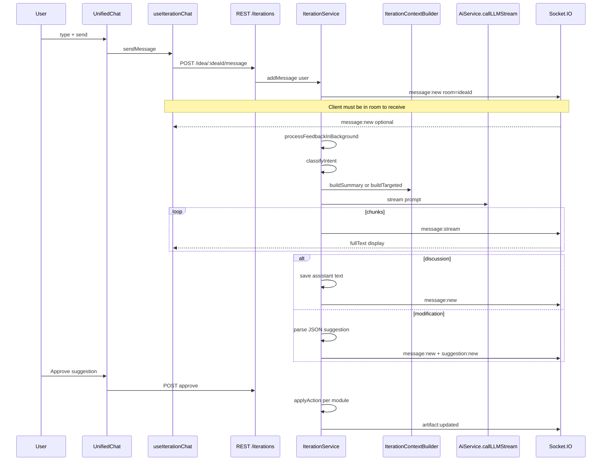
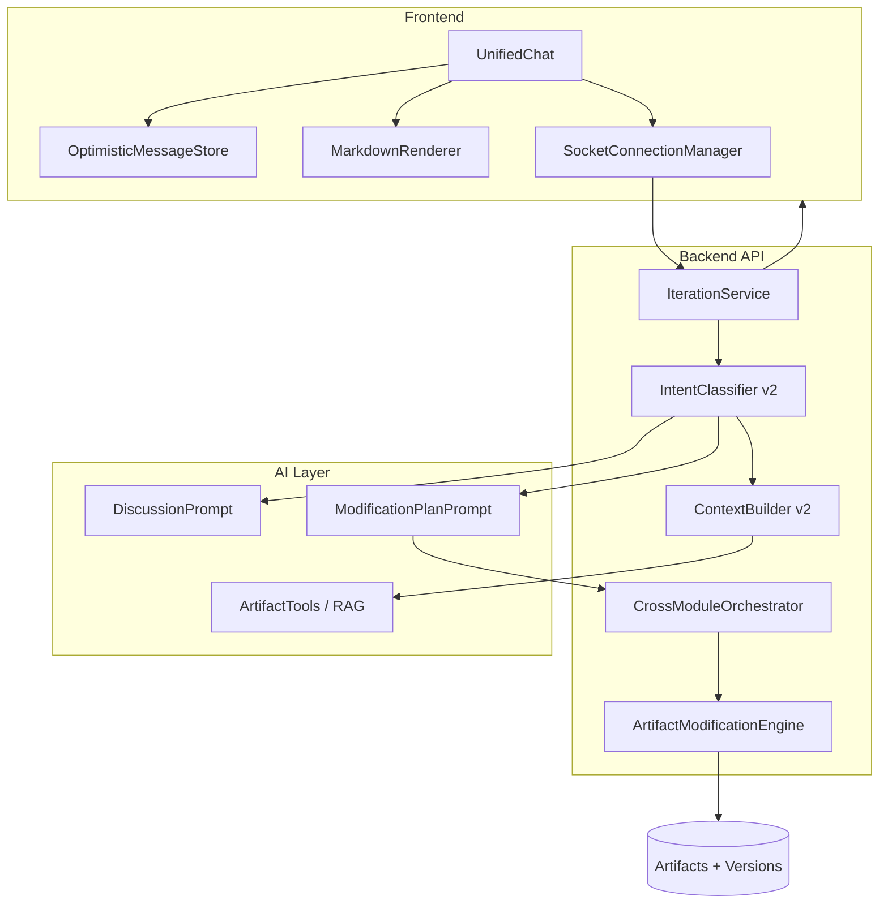

# Module 6 Remediation Plan — AI Project Copilot

**Status:** Analysis only — no implementation in this document  
**Date:** 2026-05-30  
**Scope:** Iterative refinement / PAD Assistant (`server/src/modules/iteration/`, workspace chat)

---

## Executive Summary

Module 6 received a partial refactor (socket hook, intent classifier, context builder, dual prompts, `applyAction` stubs filled). It still behaves like a **fragile chat UI** rather than a **project copilot** because:

1. Real-time UX depends on Socket.IO without optimistic UI or reliable connection lifecycle — users see missing messages until refresh.
2. Assistant output is rendered as **plain text** even though prompts request markdown.
3. Discussion context is **truncated** (300-char previews) and `analysisResult` is omitted in discussion mode — answers feel generic.
4. Modifications require **manual approval** of a JSON suggestion card; many modification requests never produce valid suggestions, and there is **no auto-apply** or cross-artifact orchestration.

This document explains current architecture, root causes, target architecture, and phased remediation tasks.

---

## Current Architecture

### High-Level Flow



### Frontend

| File | Role |
|------|------|
| [web/components/workspace/UnifiedChat.tsx](../../web/components/workspace/UnifiedChat.tsx) | Primary chat UI; uses `useIterationChat` |
| [web/hooks/use-iteration-chat.ts](../../web/hooks/use-iteration-chat.ts) | Session load, socket listeners, send |
| [web/components/features/iteration/ChatMessage.tsx](../../web/components/features/iteration/ChatMessage.tsx) | Message bubble — **plain `<p>` only** |
| [web/components/features/iteration/SuggestionCard.tsx](../../web/components/features/iteration/SuggestionCard.tsx) | Approve / reject suggestion |
| [web/lib/socket.ts](../../web/lib/socket.ts) | Singleton `socket.io-client` |
| [web/components/workspace/WorkspaceLayout.tsx](../../web/components/workspace/WorkspaceLayout.tsx) | `onArtifactUpdated` → panel `refreshKey` |

`/ideas/[id]/iterate` now redirects to workspace ([web/app/ideas/[id]/iterate/page.tsx](../../web/app/ideas/[id]/iterate/page.tsx)).

**Removed:** 3s polling in `UnifiedChat` (replaced by sockets).

**Not removed:** dependency on socket delivery for user messages (no optimistic append).

### Backend

| File | Role |
|------|------|
| [server/src/modules/iteration/iteration.route.ts](../../server/src/modules/iteration/iteration.route.ts) | GET session, POST message, approve, reject |
| [server/src/modules/iteration/iteration.controller.ts](../../server/src/modules/iteration/iteration.controller.ts) | Uses `req.params.ideaId` (fixed) |
| [server/src/modules/iteration/iteration.service.ts](../../server/src/modules/iteration/iteration.service.ts) | Session, AI pipeline, `applyAction` |
| [server/src/modules/iteration/iteration-context.builder.ts](../../server/src/modules/iteration/iteration-context.builder.ts) | Summary vs targeted context |
| [server/src/modules/iteration/iteration-intent.classifier.ts](../../server/src/modules/iteration/iteration-intent.classifier.ts) | Heuristic discussion vs modification |
| [server/src/modules/ai/prompts/iteration-discussion.prompt.ts](../../server/src/modules/ai/prompts/iteration-discussion.prompt.ts) | Q&A prompt |
| [server/src/modules/ai/prompts/iteration-modification.prompt.ts](../../server/src/modules/ai/prompts/iteration-modification.prompt.ts) | JSON suggestion prompt |
| [server/src/services/socket.service.ts](../../server/src/services/socket.service.ts) | `join-room`, `emitToRoom` |

### AI Layer

1. **Intent:** `classifyIntent(message)` — regex heuristics; default `discussion`.
2. **Context:** `IterationContextBuilder` — parallel DB load; truncate content.
3. **Prompt:** discussion OR modification template.
4. **Stream:** `AiService.callLLMStream` → Ollama; chunks forwarded via `message:stream` with `extractDisplayText` (strips JSON fences).
5. **Post-process:** discussion → save text; modification → parse ```json block → `createSuggestion`.

### Database

| Table | Purpose |
|-------|---------|
| `iteration_sessions` | 1:1 with idea |
| `iteration_messages` | `user` / `assistant` |
| `iteration_suggestions` | pending / approved / rejected / applied |
| `iteration_suggestion_actions` | module, targetId, actionType, newContent |

Artifact versioning uses per-module tables (`document_versions`, `diagram_versions`, etc.) — updated when module services create versions on MODIFY, not via iteration-specific audit rows.

### Socket Events (Implemented)

| Event | Direction | Payload |
|-------|-----------|---------|
| `join-room` | client → server | `ideaId` |
| `session:created` | server → room | session |
| `message:new` | server → room | `IterationMessage` (no nested suggestion on create) |
| `message:stream` | server → room | `{ sessionId, chunk, fullText }` |
| `message:error` | server → room | `{ sessionId, error }` |
| `suggestion:new` | server → room | full suggestion |
| `suggestion:status` | server → room | `{ id, status }` |
| `artifact:updated` | server → room | `{ ideaId, suggestionId, modulesAffected }` |

---

## Root Cause Analysis

### Problem 1: Broken Real-Time Experience

**Symptoms:** User message not instant; AI reply needs refresh; streaming absent or unreliable.

| Root cause | Evidence | Effect |
|------------|----------|--------|
| **No optimistic UI** | [use-iteration-chat.ts:150-151](../../web/hooks/use-iteration-chat.ts) — comment says rely on `message:new` | User sees nothing until socket fires |
| **Socket connect race** | `socket.connect()` then immediate `emit("join-room")` without `connect` callback | Events emitted before join may be lost |
| **Fragile socket URL** | [socket.ts:3](../../web/lib/socket.ts) fallback `ws://localhost:8080` | Socket.IO expects `http(s)://`; wrong scheme → no connection |
| **Env / port mismatch** | API default `8080` in `api.ts`; README may use `5000` | Client never connects; REST may work while sockets fail |
| **Hook cleanup drops listeners only** | `useEffect` return removes listeners; no `disconnect` on idea change | Usually OK, but rapid idea switches can miss re-join |
| **`message:new` payload minimal** | [iteration.repository.ts:66-72](../../server/src/modules/iteration/iteration.repository.ts) `addMessage` returns message without `suggestion` | UI depends on second `suggestion:new` event |
| **No fallback if socket down** | No REST poll or retry after `sendMessage` 201 | 201 returns user message but hook ignores it — only socket adds to state |
| **Streaming UI gated** | [UnifiedChat.tsx:234](../../web/components/workspace/UnifiedChat.tsx) empty state when `messages.length === 0 && !streamingText` | First message: if stream fails, blank UI |
| **User message + stream ordering** | User `message:new` and `message:stream` concurrent | Works if connected; otherwise silent failure → **refresh shows DB data** |

**Why refresh “fixes” it:** `loadSession` uses REST `GET /iterations/idea/:ideaId` which returns full history from DB regardless of sockets.

### Problem 2: Markdown Rendering

**Symptoms:** Headings, lists, code, tables render as raw characters.

| Root cause | Evidence |
|------------|----------|
| **Chat uses plain text only** | [ChatMessage.tsx:43](../../web/components/features/iteration/ChatMessage.tsx) `<p className="whitespace-pre-wrap">{message.content}</p>` |
| **Streaming bubble also plain** | [UnifiedChat.tsx:285-286](../../web/components/workspace/UnifiedChat.tsx) `{streamingText}` in `<div>` |
| **Markdown exists elsewhere** | [editable-content.tsx](../../web/components/editable-content.tsx) uses `ReactMarkdown` for documents — not reused in chat |
| **No GFM / sanitize / mermaid in chat** | `package.json` has `react-markdown` but not `remark-gfm`, `rehype-sanitize`; mermaid only in diagram panels |
| **Prompt asks for markdown** | [iteration-discussion.prompt.ts:32](../../server/src/modules/ai/prompts/iteration-discussion.prompt.ts) — model outputs `##` etc.; UI ignores |

### Problem 3: AI Does Not Understand Generated Artifacts

**Symptoms:** Generic answers to “Explain the architecture”, “Explain this diagram”, “Why was this feature created?”

#### Exactly what context is sent today

**Discussion mode** (`buildSummaryContext`):

| Field | Included | Limit / gap |
|-------|----------|-------------|
| Idea `rawText` / `refinedText` | Yes | Full |
| Idea `status` | Yes | |
| Idea `analysisResult` | **No** | Only in targeted mode ([context.builder.ts:160](../../server/src/modules/iteration/iteration-context.builder.ts)) |
| Documents | id, type, title, `contentPreview` | **300 chars** each |
| Diagrams | id, type, title, `mermaidPreview` | **300 chars** — often mid-diagram |
| Features + tasks | titles, truncated descriptions | **300 chars** |
| Workflow steps | title, truncated description | **300 chars** |
| Recent applied suggestions | Last 5 titles/summaries | From session messages only |
| **Not included** | Diagram full mermaid for “explain this diagram”; document full PRD/BRD; task acceptance criteria; workflow instructions; Module 1–5 generation rationale metadata | |

**Modification mode** (`buildTargetedContext`):

- Same structure but **3000 char** limits per field.
- Still no semantic retrieval — entire project serialized linearly.
- No “focus artifact” from user message (e.g. “this diagram” does not load that diagram in full).

#### Why answers feel generic

1. **Truncation** removes the actual technical detail the user asks about.
2. **Wrong mode:** Questions match `discussion` (correct) but discussion context is the **smallest** payload.
3. **No RAG / ID resolution:** “Explain this diagram” has no UI pointer to which diagram; classifier does not extract `targetId`.
4. **LLM not grounded:** Prompt says “reference by name” but previews may not contain architecture decisions (e.g. PostgreSQL vs MongoDB) if buried past 300 chars.
5. **History is full text** of prior messages — good for memory, bad if prior answers were also generic.

### Problem 4: Chat Cannot Modify Artifacts

**Symptoms:** “Add role-based authentication” → explanation only; nothing changes until user approves a suggestion that may never appear.

| Layer | Current behavior | Gap |
|-------|------------------|-----|
| **Intent** | Heuristic regex; default discussion | “Add RBAC” may hit imperative `^add` → modification, but “Add authentication” without noun from list may stay discussion |
| **Modification output** | Requires valid ```json with `suggestion.actions` | LLM often returns prose only → [handleModificationResponse](../../server/src/modules/iteration/iteration.service.ts) saves text, **no suggestion** |
| **User workflow** | Approve button on `SuggestionCard` | No auto-apply; user must find card |
| **applyAction** | Implemented for CREATE/MODIFY/DELETE/REGENERATE | `REGENERATE` = same as MODIFY (no AI regen); `targetId: "new"` may break MODIFY paths; invalid IDs fail at approve time |
| **Cross-artifact** | Prompt says “consider cross-module” | No orchestrator — single-pass actions; no “Replace MongoDB → update all artifacts” transaction |
| **User expectation** | “Done. Updated: …” summary | Actual: optional card + manual approve + silent failures |

**Why user sees explanation only:**

```
modification intent → LLM streams explanation
                  → JSON parse fails or actions empty
                  → no suggestion:new
                  → user reads assistant message (discussion-like)
                  → no DB artifact changes
```

Even with a valid suggestion, **nothing changes until Approve** — by design, but contradicts copilot expectation of direct execution.

---

## Gap Analysis

| Area | Current state | Desired state |
|------|---------------|---------------|
| **Message UX** | Socket-dependent; no optimistic user msg; refresh loads REST | Instant user msg; assistant placeholder; token stream; final replace; zero refresh |
| **Rendering** | Plain text | Markdown + code + tables + mermaid in chat |
| **Grounding** | 300-char previews; no analysis in discussion | Full artifact retrieval on demand; cite real content |
| **Modification** | Suggestion card + approve; brittle JSON | Detect intent → plan impacted artifacts → apply (with optional confirm tier) → change summary |
| **Realtime** | Socket.IO partial | Reliable connection, reconnect, fallback |
| **Copilot modes** | Binary heuristic | Discussion / Modification / (optional) Auto-apply policy |
| **Versioning** | Module services on apply | Iteration audit trail + changelog message in chat |
| **Panel sync** | `artifact:updated` → refreshKey | Targeted invalidation per module |

---

## Target Architecture



### Design principles

1. **Never block UI on socket** — optimistic + REST reconciliation.
2. **Ground before generate** — fetch full content for referenced artifacts.
3. **Separate “plan” from “apply”** — show plan; auto-apply per user/policy setting.
4. **One chat component** — workspace only; shared markdown pipeline.
5. **Observable failures** — `message:error`, toast, failed suggestion state.

---

## Backend Refactor Plan

### P0 — Reliability

- [ ] Return user message in `POST /message` response; document client should merge optimistically **and** accept socket duplicate.
- [ ] Emit `message:stream` with `type: "token" | "done"` and final `messageId` on completion.
- [ ] Ensure `message:new` for assistant includes nested `suggestion` when created in same transaction (or guarantee `suggestion:new` ordering).
- [ ] Add structured logging: intent, context size, parse success, action count.

### P1 — Context v2

- [ ] `resolveArtifactReferences(message, ideaId)` — parse “this diagram”, “the ERD”, “PRD” → IDs.
- [ ] `buildDiscussionContext` — include `analysisResult`; load **full** content for referenced artifacts; keep 300-char summary for others.
- [ ] `buildModificationContext` — full content for all artifacts in modification plan scope (token budget manager).
- [ ] Add `GET /iterations/idea/:ideaId/context?mode=preview` for debugging.

### P2 — Modification engine

- [ ] New `ArtifactModificationEngine` class:
  - `planChanges(intent, context, message)` → structured plan (impacted modules, actions).
  - `validatePlan(plan)` → schema check, real IDs, dependency warnings.
  - `executePlan(plan, options)` → transactional best-effort with rollback log.
- [ ] `REGENERATE` → call existing `AiService` generate methods (document/diagram/feature/workflow), not raw `newContent` only.
- [ ] `CrossModuleOrchestrator` for multi-artifact requests (e.g. DB swap → document + diagram + tasks + workflow).
- [ ] Post-apply: emit per-artifact `artifact:updated` with `{ module, targetId }`.

### P3 — Copilot policies

- [ ] Session or user setting: `applyMode: "suggest" | "auto"`.
- [ ] Auto mode: execute valid plans immediately; post assistant summary message listing changes.
- [ ] Suggest mode: current card UX, improved.

### P4 — API

- [ ] `POST /iterations/idea/:ideaId/message` → optional `mode` override.
- [ ] `GET /iterations/suggestion/:id` — plan preview.
- [ ] `POST /iterations/suggestion/:id/apply` (rename from approve for clarity).

---

## Frontend Refactor Plan

### P0 — Real-time UX

- [ ] **Optimistic user message** — temp id, append on send, reconcile on 201/socket.
- [ ] **Assistant placeholder** — show “PAD is thinking…” row on send (before stream).
- [ ] **SocketConnectionManager** — connect on workspace mount; `join-room` on `connect`; re-join on reconnect; fix URL to `http://` not `ws://`.
- [ ] **Fallback:** if no `message:stream` within N seconds, poll session once; show error with retry.
- [ ] Fix [socket.ts](../../web/lib/socket.ts) default URL to match `NEXT_PUBLIC_API_URL` host.

### P1 — Markdown

- [ ] Create `ChatMarkdown.tsx` — reuse patterns from [editable-content.tsx](../../web/components/editable-content.tsx).
- [ ] Add `remark-gfm` (tables), `rehype-sanitize` (XSS).
- [ ] Code blocks: syntax class; copy button optional.
- [ ] Mermaid fenced blocks → lazy `MermaidPreview` (same as diagram panels).
- [ ] Use in `ChatMessage` + streaming bubble (stream markdown incrementally or plain until done).

### P2 — Modification UX

- [ ] **Change plan card** — list impacted artifacts before apply.
- [ ] **Apply progress** — per-action status on card.
- [ ] **Completion message** — inline summary matching user expectation (“Done. Updated: …”).
- [ ] Settings toggle: “Ask before applying changes” (default on).

### P3 — Panel integration

- [ ] `artifact:updated` — pass `module` + `targetId` to refresh only affected panel.
- [ ] Toast: “Diagram updated by PAD”.

---

## AI Refactor Plan

### Discussion

- [ ] System prompt: must quote from provided artifact excerpts; say “not in project” when missing.
- [ ] Inject `ARTIFACT_EXCERPTS` block with full text for resolved references.
- [ ] Include `analysisResult` always for “why” questions.

### Modification

- [ ] Two-step LLM (recommended):
  1. **Planner** — JSON only: `{ impactedModules, actions[], summary }`.
  2. **Executor** — generate `newContent` per action using module-specific prompts (reuse Module 2–5 generators).
- [ ] Or: tool-calling interface (`get_document`, `update_diagram`, …) with strict schemas.
- [ ] Validate JSON with Zod before DB write.
- [ ] Few-shot examples in prompt for “Add RBAC”, “Replace MongoDB with PostgreSQL”.

### Intent classifier v2

- [ ] Replace pure regex with:
  - Phase 1: expanded patterns + keyword lists (`authentication`, `RBAC`, `PostgreSQL`).
  - Phase 2: small LLM classifier `discussion | modification | clarification`.
- [ ] Detect `explicitChangeRequest` vs `explainHowTo` (“how could we add” → discussion).

### Conversation memory

- [ ] Summarize sessions > 20 messages for prompt (keep last 6 verbatim).
- [ ] Store `appliedChanges` in context from DB, not only from loaded session graph.

---

## Database Changes

### Phase 1 (optional, recommended)

```prisma
model IterationMessage {
  mode String? // "discussion" | "modification"
}

model IterationSuggestionAction {
  appliedAt       DateTime?
  resultVersionId String?
  errorMessage    String?
}

model IterationAppliedChange {
  id           String   @id @default(uuid())
  suggestionId String
  actionId     String
  module       String
  targetId     String
  versionId    String?
  appliedAt    DateTime @default(now())
}
```

### Phase 2

- `iteration_sessions.apply_mode` — `suggest` | `auto`
- Index on `iteration_messages.session_id, created_at`

---

## Streaming and Realtime Plan

| Step | Action |
|------|--------|
| 1 | Fix socket URL + connection lifecycle |
| 2 | Optimistic UI + placeholder |
| 3 | Stream tokens to dedicated assistant bubble; `done` event clears stream, adds final message |
| 4 | Idempotent `message:new` handler (merge by id) |
| 5 | Reconnect: `join-room` + `loadSession` sync |
| 6 | Remove any remaining polling code paths |
| 7 | Load test: 10 rapid messages, tab switch, idea switch |

**Event contract (target):**

```typescript
// message:stream
{ sessionId, messageId?, delta: string, fullText: string, phase: "streaming" | "done" }

// message:new
{ ...IterationMessage, suggestion?: IterationSuggestion }
```

---

## Artifact Modification Engine Design

### Components

```
ArtifactModificationEngine
├── PlanValidator        # IDs, modules, action types
├── ActionExecutor       # delegates to *Service per module
├── VersionRecorder      # changelog + optional IterationAppliedChange
├── CrossModuleOrchestrator
│   ├── DependencyGraph  # feature → tasks, diagram → workflow
│   └── ExecutionOrder   # documents first, diagrams, features, tasks, workflow
└── SummaryBuilder       # human-readable change list for chat
```

### Action execution (per module)

| Module | CREATE | MODIFY | DELETE | REGENERATE |
|--------|--------|--------|--------|------------|
| DOCUMENT | `DocumentRepository.create` | `DocumentService.updateDocument` + version | delete or archive | `AiService` PRD/BRD regenerate |
| DIAGRAM | `DiagramRepository.create` | `DiagramService.updateDiagram` + version | delete | `AiService` diagram generate |
| FEATURE | `FeatureService.createFeature` | `updateFeature` + version | delete | AI feature breakdown |
| TASK | `TaskService.createTask` | `updateTask` + version | delete | AI task detail |
| WORKFLOW | step create | `WorkflowService.updateWorkflowStep` | step delete | AI workflow step |

### Cross-artifact example: “Replace MongoDB with PostgreSQL”

1. Planner lists: TECH doc section, ERD diagram, relevant features/tasks, workflow DB steps.
2. Executor runs ordered updates; each creates version with changelog `"Iteration: DB migration"`.
3. SummaryBuilder returns bullet list for assistant message.
4. Socket: multiple `artifact:updated` or one batch event.

### Failure handling

- Partial apply: mark suggestion `partially_applied`, list failed actions on card.
- Do not set `applied` if any critical action fails (configurable).

---

## Acceptance Criteria

### Problem 1 — Real-time

- [ ] User message visible < 100ms after send (optimistic).
- [ ] Assistant placeholder visible immediately after send.
- [ ] Tokens appear incrementally without refresh.
- [ ] Final assistant message replaces stream bubble.
- [ ] Works with socket disconnected → fallback sync within 5s.

### Problem 2 — Markdown

- [ ] `## Heading` renders as heading in chat.
- [ ] Bulleted and numbered lists render correctly.
- [ ] Fenced code blocks render monospace.
- [ ] GFM tables render (with remark-gfm).
- [ ] ` ```mermaid ` blocks render diagram preview.

### Problem 3 — Grounding

- [ ] “Explain the architecture” references actual diagram titles and feature names from project.
- [ ] “Explain this diagram” with diagram selected in UI uses full mermaid source.
- [ ] “Why was this feature created?” cites feature description from DB.
- [ ] Answer states when detail not present in artifacts.

### Problem 4 — Modification

- [ ] “Add role-based authentication” produces plan affecting ≥1 artifact OR asks one clarifying question.
- [ ] After apply (manual or auto): PRD/features/diagrams reflect change in panels without manual refresh.
- [ ] “Replace MongoDB with PostgreSQL” updates multiple artifact types when they exist.
- [ ] Assistant posts summary: “Done. Updated: …” listing modules.

### Copilot (holistic)

- [ ] No page refresh required for any chat interaction.
- [ ] Session persists across reload with full history.
- [ ] Reject suggestion works; no artifact changes.

---

## Risk Assessment

| Risk | Likelihood | Impact | Mitigation |
|------|------------|--------|------------|
| Socket still flaky in production | Medium | High | Optimistic UI + REST fallback; health indicator in chat header |
| Token overflow with full artifacts | High | Medium | Tiered context; RAG summaries; cap with “ask to open X” |
| LLM invalid JSON for modifications | High | High | Two-step planner; Zod validation; retry with repair prompt |
| Auto-apply destructive changes | Medium | Critical | Default `suggest` mode; confirm for DELETE; dry-run preview |
| `applyAction` partial failures | Medium | Medium | Transaction log; `partially_applied` status |
| XSS via markdown | Low | High | `rehype-sanitize`; disallow raw HTML |
| Cross-module orchestration complexity | High | Medium | Phase rollout; start with single-module actions |
| Ollama latency / timeout | Medium | Medium | Timeout + `message:error`; queue concurrent requests per session |
| Intent misclassification | Medium | Medium | LLM classifier; user “Apply changes” button override |

---

## Implementation Phases (Recommended Order)

| Phase | Focus | Est. effort |
|-------|--------|-------------|
| **1** | Socket URL, optimistic UI, placeholder, REST fallback | 1–2 days |
| **2** | ChatMarkdown + streaming render | 1 day |
| **3** | Context v2 + artifact reference resolution | 2–3 days |
| **4** | Modification planner + validation + better suggestions | 3–4 days |
| **5** | Cross-module orchestrator + REGENERATE | 3–5 days |
| **6** | Auto-apply policy + audit tables + tests | 2–3 days |

---

## File Inventory (Module 6)

### Backend

- `server/src/modules/iteration/*`
- `server/src/modules/ai/prompts/iteration-*.prompt.ts`
- `server/src/services/socket.service.ts`

### Frontend

- `web/hooks/use-iteration-chat.ts`
- `web/components/workspace/UnifiedChat.tsx`
- `web/components/features/iteration/*`
- `web/lib/socket.ts`, `web/lib/api.ts` (`iterationApi`)

### Related (artifact consumers)

- `web/components/workspace/panels/*.tsx`
- `server/src/modules/{document,diagram,feature,task,workflow}/*.service.ts`

---

## Related Documents

- Product spec: [documents/modules/module_6_iterative_feedback_chat_based_updates.md](../../documents/modules/module_6_iterative_feedback_chat_based_updates.md)
- Prior refactor outline (if created): `docs/modules/module-06-ai-project-copilot.md`

---

*End of remediation plan — implementation to follow in separate PRs per phase.*
