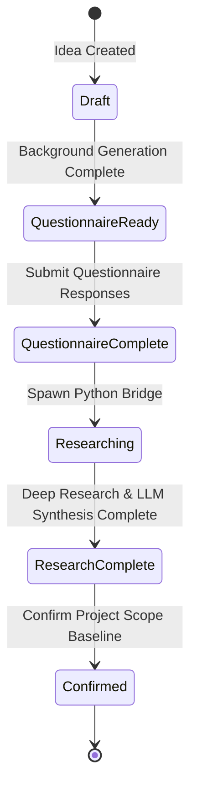

# Module 1 Redesign — Discovery & Deep Research

This document outlines the final architecture, schemas, and API specifications for the redesigned Module 1 (Discovery & Deep Research).

---

## 1. Database Schema Specifications

We introduced three new tables linked to the `ideas` table:

```prisma
model DiscoveryQuestionnaire {
    id          String   @id @default(uuid())
    ideaId      String   @unique @map("idea_id")
    questions   Json     // Array of IDiscoveryQuestion
    generatedAt DateTime @default(now()) @map("generated_at")
    idea        Idea     @relation(fields: [ideaId], references: [id], onDelete: Cascade)
}

model QuestionnaireResponse {
    id          String   @id @default(uuid())
    ideaId      String   @unique @map("idea_id")
    responses   Json     // Array of response values { questionId, label, value }
    submittedAt DateTime @default(now()) @map("submitted_at")
    idea        Idea     @relation(fields: [ideaId], references: [id], onDelete: Cascade)
}

model ResearchJob {
    id           String   @id @default(uuid())
    ideaId       String   @unique @map("idea_id")
    status       String   @default("pending") // pending | running | completed | failed
    currentPhase String?  @map("current_phase")
    progress     Int      @default(0)
    logs         Json?    // Array of log entries { timestamp, message }
    error        String?  @db.Text
    createdAt    DateTime @default(now()) @map("created_at")
    updatedAt    DateTime @updatedAt @map("updated_at")
    idea         Idea     @relation(fields: [ideaId], references: [id], onDelete: Cascade)
}
```

We also added new columns to the `ideas` table:
- `researchResult`: JSON object storing the synthesized 7-phase blueprint.
- `confirmedAt`: DateTime set when the scope is confirmed.
- Modified `status` state machine lifecycle: `draft` -> `questionnaire_ready` -> `questionnaire_complete` -> `researching` -> `research_complete` -> `confirmed`.

---

## 2. API Endpoints

### Discovery Router (`/api/v1/ideas`)
- `GET /:id/questionnaire` — Retrieve the generated discovery questionnaire.
- `POST /:id/questionnaire/submit` — Submit responses to the questionnaire questions.
- `POST /:id/questionnaire/regenerate` — Trigger background questionnaire regeneration.

### Research Router (`/api/v1/ideas`)
- `POST /:id/research` — Spawns the python bridge subprocess and streams NDJSON progress updates via SSE.
- `GET /:id/research/status` — Returns the current `ResearchJob` status, progress log, and final blueprint if completed.

---

## 3. Execution Pipeline & State Machine



1. **Subprocess Spawning**: `ResearchOrchestrator` uses `child_process.spawn` to execute `deep_research_bridge.py` inside the Python virtual environment (`local_deep_research/.venv`).
2. **Stream Integration**: Stdout lines from the python subprocess are read in real-time. Lines starting with `{"type": "progress", ...}` update the database `ResearchJob` and emit progress events to SSE listeners and SocketIO rooms.
3. **Synthesis**: Once the python bridge completes search retrieval, the orchestrator triggers an LLM synthesis step to structure findings into a 7-phase blueprint.
4. **Resiliency**: If a user refreshes the page during research, the frontend fetches the current job status. Since the status is `running`, the frontend enters status polling mode, checking `/research/status` periodically until execution finishes, ensuring a seamless user experience.
