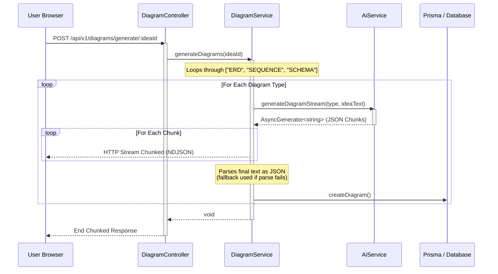
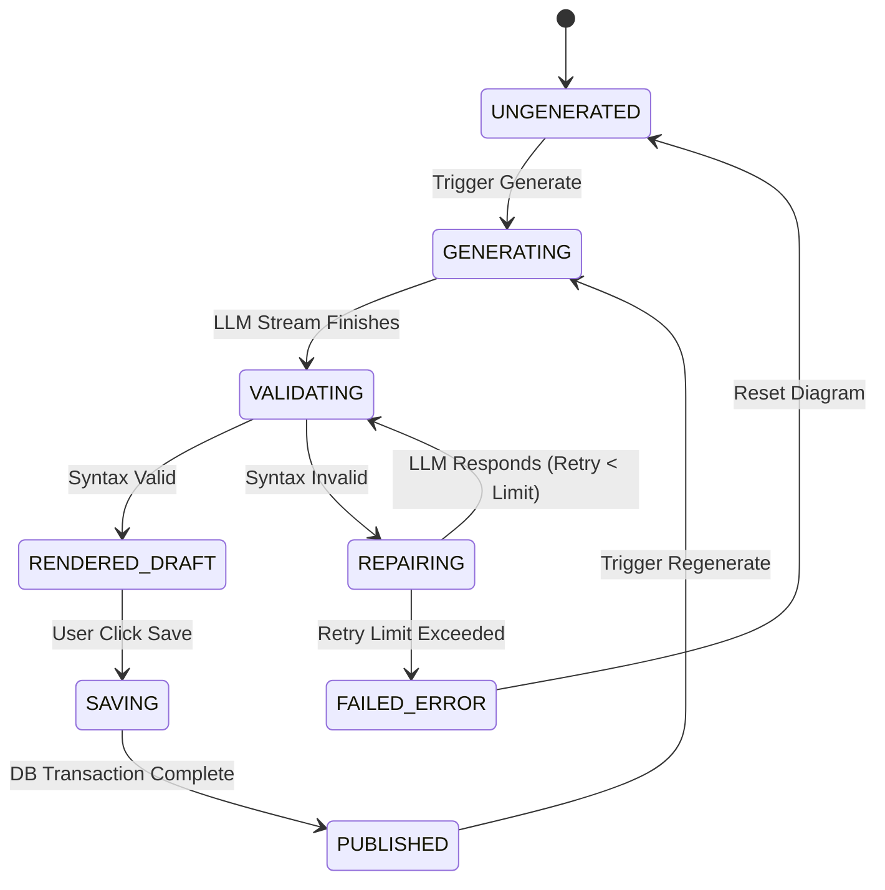
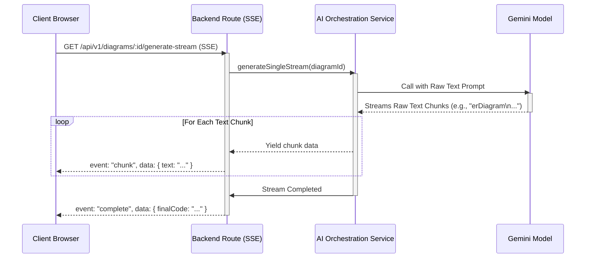
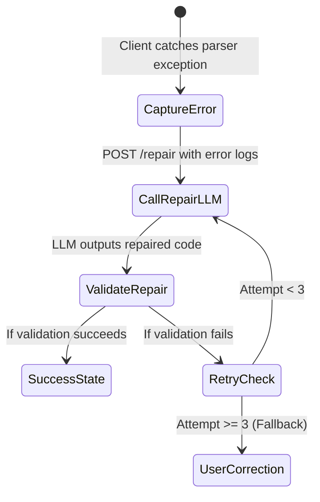

# Module 3 Redesign Specification — Diagram Workspace

**Status:** Proposed Redesign Spec  
**Author:** Lead Architect / Senior Software Engineer  
**Scope:** Diagram Generation Module (Module 3) Redesign  

---

## Executive Summary

The current implementation of the Diagram Generation Module (Module 3) in PAD is constrained by several user experience (UX) and architectural limitations. It forces a rigid, synchronous "Generate All Diagrams" workflow for a fixed set of diagrams (`ERD`, `SEQUENCE`, `SCHEMA`), lacks granular user control over the diagram lifecycle, and uses an inconsistent streaming mechanism (HTTP NDJSON chunking for initial generation vs Socket.IO for regeneration). Furthermore, the module overloads the database `mermaid_code` column, storing either a raw Mermaid string or a stringified JSON representation of a three-tier model, which causes rendering failures and syntax errors.

This document outlines the architecture, schemas, and design patterns required to evolve the Diagram Module into a professional, collaborative **Diagram Workspace**. 

The redesign will introduce:
1. **Multi-Diagram Selection**: Dynamic selection from 10 standard architectural diagram types.
2. **Independent Lifecycles**: A per-diagram generation, regeneration, editing, and versioning state machine.
3. **True SSE Streaming**: Direct streaming of raw Mermaid code (rather than escaped JSON strings) to enable progressive rendering.
4. **Client-Assisted Auto-Repair**: Headless, client-captured Mermaid parse errors sent to a backend LLM repair pipeline to automatically fix syntax issues.
5. **Import/Export**: Full import (`.mmd`, text) and export (`PNG`, `SVG`, `PDF`, `.mmd`) support.
6. **Unified Layout**: A multi-pane Workspace Layout (Catalog, Canvas, Code Editor, Activity Feed).

---

## 1. Current State Analysis

The current Diagram Module generates a hardcoded set of three diagrams (`ERD`, `SEQUENCE`, `SCHEMA`) sequentially using the following pattern:



### Critical Architectural Mismatches:
1. **Double Streaming Standard**: Initial generation uses standard HTTP chunked transfer containing line-delimited JSON chunks. Regeneration, however, triggers a background process in `DiagramService.regenerateDiagram` and broadcasts progress via Socket.IO events (`diagram:stream`, `diagram:updated`). This double implementation increases complexity and makes error handling fragile.
2. **Overloaded Schema**: During regular generation, the `mermaidCode` database column stores raw Mermaid strings. During IR (Intermediate Representation) compilation (`IRService.ts`), the compiler requests a three-tier diagram (`tier1`, `tier2`, `tier3`) from the LLM, serializes it to JSON using `JSON.stringify(diagResult)`, and stores this JSON string directly into the database `mermaid_code` column. Since the frontend has no tier parsing or toggle UI, the browser attempts to pass this serialized JSON string directly to the Mermaid renderer, leading to parsing errors.

---

## 2. Existing File Mapping

To implement this redesign, the codebase will be refactored to align with a modular structure. No existing features outside of Module 3 will be altered.

### Files to Keep (Unmodified)
* **[`web/src/components/providers/StreamingProvider.tsx`](file:///home/mohamed/PAD/web/src/components/providers/StreamingProvider.tsx)**: Keep global streaming context for phase states.
* **[`server/src/data-server-clients/prisma-client.ts`](file:///home/mohamed/PAD/server/src/data-server-clients/prisma-client.ts)**: Base Prisma singleton.

### Files to Refactor

| File Path | Description of Change | Rationale |
| :--- | :--- | :--- |
| **[`server/prisma/schema.prisma`](file:///home/mohamed/PAD/server/prisma/schema.prisma)** | Add columns `tier1Code`, `tier2Code`, `tier3Code`, and `activeTier` (Int) to `Diagram` model. Map diagram types cleanly. | Separates raw editable Mermaid code from multi-tier IR compilation data, solving the overloaded column issue. |
| **[`server/src/modules/diagram/diagram.controller.ts`](file:///home/mohamed/PAD/server/src/modules/diagram/diagram.controller.ts)** | Add endpoints for single diagram generation streaming, auto-repair, and imports. Refactor stream response to SSE. | Supports independent diagram generation and robust streaming. |
| **[`server/src/modules/diagram/diagram.service.ts`](file:///home/mohamed/PAD/server/src/modules/diagram/diagram.service.ts)** | Standardize LLM orchestration. Standardize stream endpoints on SSE. Implement repair and tier selection logic. | Removes socket-based regeneration. Decouples creation logic from hardcoded templates. |
| **[`server/src/modules/diagram/diagram.repository.ts`](file:///home/mohamed/PAD/server/src/modules/diagram/diagram.repository.ts)** | Support database query updates for new multi-tier columns and new schema structures. | Aligns repository methods with schema updates. |
| **[`server/src/modules/diagram/types/IDiagram.ts`](file:///home/mohamed/PAD/server/src/modules/diagram/types/IDiagram.ts)** | Update interfaces to contain `DiagramType` enum and multi-tier fields. | Establishes TypeScript compile-time safety for new shapes. |
| **[`server/src/modules/ai/prompts/generate-diagram.prompt.ts`](file:///home/mohamed/PAD/server/src/modules/ai/prompts/generate-diagram.prompt.ts)** | Redefine prompts to output raw Mermaid code directly, using a standardized comment format (`%% title: ...`) for metadata. | Eliminates JSON serialization inside the LLM stream, enabling clean, progressive text streaming. |
| **[`server/src/modules/ir/ir.service.ts`](file:///home/mohamed/PAD/server/src/modules/ir/ir.service.ts)** | Update compilation compiler logic to write to the new `tier1Code`, `tier2Code`, and `tier3Code` DB fields. | Solves the JSON-injection data corruption in the `mermaid_code` column. |
| **[`web/src/features/diagrams/api/diagrams.api.ts`](file:///home/mohamed/PAD/web/src/features/diagrams/api/diagrams.api.ts)** | Update Axios client interfaces to invoke SSE single-diagram generation, import, export, and auto-repair routes. | Connects frontend workspace components to updated backend logic. |
| **[`web/src/features/diagrams/api/diagramsQueries.ts`](file:///home/mohamed/PAD/web/src/features/diagrams/api/diagramsQueries.ts)** | Standardize mutation query hooks (invalidate cache keys on per-diagram changes instead of clearing all diagrams). | Prevents UI flashes and preserves workspace state across edits. |
| **[`web/src/features/diagrams/components/DiagramsPanel.tsx`](file:///home/mohamed/PAD/web/src/features/diagrams/components/DiagramsPanel.tsx)** | Deprecate in favor of the new multi-pane `DiagramWorkspace` component. | Replaces the simple tabs-based UI with a full-fledged workspace. |
| **[`web/src/features/diagrams/hook/useDiagramsPage.ts`](file:///home/mohamed/PAD/web/src/features/diagrams/hook/useDiagramsPage.ts)** | Refactor state orchestration to handle multiple active streams, local modifications, and validation updates. | Serves as the central state engine for the workspace panels. |

### Files to Delete (Dead Code)
* **[`web/src/components/layout/tabs/diagrams.tsx`](file:///home/mohamed/PAD/web/src/components/layout/tabs/diagrams.tsx)**: Delete completely. This is a duplicate layout file that is not imported.

### New Files to Create

| File Path | Description of Component/Module | Rationale |
| :--- | :--- | :--- |
| **[`server/src/modules/diagram/diagram-validator.service.ts`](file:///home/mohamed/PAD/server/src/modules/diagram/diagram-validator.service.ts)** | Backend service orchestrating the LLM-driven Mermaid auto-repair pipeline. | Centralizes repair logic, managing prompts and retry caps. |
| **[`web/src/features/diagrams/components/DiagramWorkspace.tsx`](file:///home/mohamed/PAD/web/src/features/diagrams/components/DiagramWorkspace.tsx)** | Core UI orchestrator. Divides workspace using a three-column CSS grid layout. | Provides the core visual frame for the new user workflow. |
| **[`web/src/features/diagrams/components/DiagramCatalog.tsx`](file:///home/mohamed/PAD/web/src/features/diagrams/components/DiagramCatalog.tsx)** | Left pane displaying diagram checkboxes, selection states, generation triggers, and lifecycles. | Empowers users to configure, generate, and track diagram types. |
| **[`web/src/features/diagrams/components/DiagramEditorPanel.tsx`](file:///home/mohamed/PAD/web/src/features/diagrams/components/DiagramEditorPanel.tsx)** | Right collapsible pane showing the live-updating Mermaid editor, validation states, and history logs. | Gives immediate, distraction-free access to raw text controls. |
| **[`web/src/features/diagrams/components/ActivityFeed.tsx`](file:///home/mohamed/PAD/web/src/features/diagrams/components/ActivityFeed.tsx)** | Bottom-docked dashboard displaying streaming parser reports, repair cycles, and rendering logs. | Improves transparency by explaining what the AI is doing. |
| **[`web/src/features/diagrams/components/ImportExportDialog.tsx`](file:///home/mohamed/PAD/web/src/features/diagrams/components/ImportExportDialog.tsx)** | Modal dialog allowing users to upload `.mmd` files or export renderings to `PNG`, `SVG`, `PDF`, or code. | Fulfills Requirement 4 for integration with external developer tools. |

---

## 3. Existing API Mapping

### Active Endpoints (To Be Upgraded/Deprecated)

* **`POST /api/v1/diagrams/generate/:ideaId` (Legacy)**
  * *Method:* `POST`
  * *Request Params:* `ideaId: string`
  * *Current Action:* Iterates through `["ERD", "SEQUENCE", "SCHEMA"]`, streams NDJSON chunks containing full-text strings.
  * *Status:* **To Be Deprecated** in favor of per-diagram generation endpoints.

* **`GET /api/v1/diagrams/idea/:ideaId`**
  * *Method:* `GET`
  * *Request Params:* `ideaId: string`
  * *Current Action:* Fetches all diagrams generated for a project.
  * *Status:* **To Be Kept and Upgraded** to return new schema fields (`activeTier`, `tier1Code`, etc.).

* **`PUT /api/v1/diagrams/:id`**
  * *Method:* `PUT`
  * *Request Params:* `id: string`
  * *Body:* `IUpdateDiagramData` (`title`, `mermaidCode`, `status`, `changelog`)
  * *Current Action:* Creates a snapshot in `DiagramVersion` and updates `Diagram`.
  * *Status:* **To Be Kept and Upgraded** to reset `activeTier = null` when user edits manually.

* **`POST /api/v1/diagrams/:id/regenerate` (Legacy)**
  * *Method:* `POST`
  * *Request Params:* `id: string`
  * *Current Action:* Saves snapshot, starts background generation, and broadcasts chunks over Socket.IO room.
  * *Status:* **To Be Deprecated** in favor of SSE-based targeted regeneration routes.

---

## 4. Existing Data Flow

The following diagram highlights the data loop of the current system, showing the JSON encapsulation inside the LLM stream, and the Socket.IO loop during regeneration:

```
[User Browser]
   | (Triggers Generate All)
   v
[Express Route handler] ---> [DiagramService.generateDiagrams]
                                   |
                                   v
                             [AiService.generateDiagramStream]
                                   |
                                   v
                             (Queries LLM)
                                   |
                                   v
                             (LLM generates escaped JSON text)
                                   |
                                   v
                             [Service writes chunk-by-chunk HTTP]
                                   |
                                   v
[User Browser (NDJSON Buffer)] ---> [parsePartialMermaid()] ---> [MermaidPreview Rendering]
```

For regeneration, the flow bypasses HTTP response writing:

```
[User Browser] ---> POST /regenerate ---> [Service.regenerateDiagram]
                                                 |
                                                 v
                                        (Spawns LLM stream)
                                                 |
                                                 v
                                  [SocketService.emitToRoom] ---> Socket.IO Frame ---> [Browser socket hook]
```

---

## 5. Current UX Problems

1. **Monolithic Generation**: Users are forced to generate the entire catalog at once. Generating multiple diagrams consumes unnecessary LLM tokens and introduces massive latency.
2. **Brittle Streaming Preview**: Because the LLM outputs a stringified JSON object, the frontend must intercept the stream and run a regex parser (`parsePartialMermaid`) to clean escaping characters. The browser is unable to render the preview progressively until the title and JSON keys are fully generated.
3. **Unvalidated Mermaid Syntax**: AI-generated diagrams frequently contain minor Mermaid syntax errors (e.g. unclosed parentheses, duplicate node declarations, or unsupported arrows). Currently, these result in a broken red error box, forcing the user to manually debug and repair the code.
4. **Coarse-Grained Regeneration**: The user cannot regenerate a single diagram without either using Socket.IO (which suffers from reconnection drops) or restarting the whole project scope.
5. **No Workspace Layout**: The current UI uses simple tabs. It lacks a side-by-side view where a developer can compare the live preview, edit the code, watch generation activity, and browse the catalog at the same time.
6. **No Portability**: Users cannot import their existing `.mmd` diagrams or export the generated SVGs/PNGs to share with teammates.

---

## 6. Current Architecture Problems

1. **Schema Overloading**: Storing two entirely different data shapes (a raw string vs a JSON-serialized 3-tier structure) inside the text-based `mermaidCode` database column causes rendering errors in downstream features.
2. **Inconsistent Transport Layers**: Mixing SSE-like NDJSON chunk writing for creation and Socket.IO for regeneration leads to duplicate, fragile codebase branches.
3. **No Backend Validation**: The backend assumes that whatever the LLM returns is valid. It has no syntax validation, no parsing framework, and no self-correction loop.
4. **LLM Output Constraints**: Prompts require the LLM to output valid JSON. Escaping newlines and quotes within a JSON string causes high LLM failure rates and prevents clean text streaming.

---

## 7. Desired User Experience

The redesigned **Diagram Workspace** will behave like a modern collaborative canvas:

* **Dynamic Catalog**: The user enters the section and is presented with a listing of 10 structural and behavioral diagram types, each displaying a status indicator (`Draft`, `Ungenerated`, `Generating`, `Published`).
* **Granular Controls**: Each diagram has a dedicated `[Generate]` or `[Regenerate]` button next to it.
* **Responsive Layout**: As a diagram streams, the code displays live in a collapsible side pane, and the canvas incrementally attempts to compile the output. If a section of the diagram compiles, the canvas updates.
* **Auto-Recovery Logs**: If a syntax error is detected, a toast informs the user that a correction is underway. The bottom Activity Feed displays:
  ```
  [09:27:02] [Validation] Error found on line 8: "relation '||--o{' invalid syntax for flowchart"
  [09:27:03] [Auto-Repair] Sending repair request to LLM (Attempt 1 of 3)...
  [09:27:05] [Validation] Re-validating repaired code... Valid!
  [09:27:06] [Canvas] Successfully rendered "System Architecture Diagram".
  ```
* **Seamless Exporting**: With one click, the user can download a polished `PNG` (with high-resolution DPI), an inline `SVG` string, a structured `PDF`, or a `.mmd` text file.

---

## 8. Diagram Workspace Design

The layout uses a three-column responsive viewport structure:

```
+---------------------------------------------------------------------------------------------------+
|  [Header] Project Diagrams - My Software Idea                         [Import] [Export] [Save]   |
+------------------------------------+----------------------------------+---------------------------+
|                                    |                                  |                           |
|  LEFT PANEL: CATALOG               |  CENTER PANEL: CANVAS PREVIEW    |  RIGHT PANEL: CODE        |
|                                    |                                  |                           |
|  [ ] System Architecture [Gen]     |  +----------------------------+  |  +---------------------+  |
|  [x] Database ERD        [Regen]   |  |                            |  |  | erDiagram           |  |
|  [x] Sequence Diagram    [Regen]   |  |       [Mermaid Preview]    |  |  |   USER ||--o{ POST  |  |
|  [ ] Component Diagram   [Gen]     |  |                            |  |  |   USER {            |  |
|  [ ] Deployment Diagram  [Gen]     |  |                            |  |  |     string email    |  |
|  [ ] User Flow Diagram   [Gen]     |  |                            |  |  |   }                 |  |
|                                    |  +----------------------------+  |  +---------------------+  |
|                                    |  [+] [-] [Reset] [100%]          |  [x] Sync Preview         |  |
|                                    |                                  |                           |
+------------------------------------+----------------------------------+---------------------------+
|  BOTTOM PANEL: ACTIVITY FEED                                                                      |
|  [09:27:02] Streaming "Database ERD"... [====================> 80%]                               |
+---------------------------------------------------------------------------------------------------+
```

* **Left Panel (Catalog)**: Lists diagram types. Provides bulk selection actions and individual trigger buttons. Displays execution badges.
* **Center Panel (Canvas)**: Holds the zoomable and pannable SVG diagram. Contains controls for mouse-wheel zooming, click-and-drag panning, and a canvas reset.
* **Right Panel (Code Editor)**: Collapsible sidebar. Features a syntax-highlighted code editor (e.g. Monaco or a styled textarea) with a "Sync Preview" toggle.
* **Bottom Panel (Activity Feed)**: Displays detailed system logs, LLM response tracking, validation flags, and auto-repair retry states.

---

## 9. Diagram Lifecycle Design

A per-diagram state machine ensures independent lifecycle execution:



---

## 10. Diagram Selection Flow

1. The user navigates to the **Diagrams** section.
2. The UI checks the database for existing diagrams for the `ideaId`.
3. If no diagrams are found, the user sees the Catalog showing all 10 diagram types as ungenerated.
4. The user selects the checkbox next to the desired diagrams (e.g., `Database ERD` and `Sequence Diagram`) and clicks a master `[Initialize Workspace]` button.
5. The frontend creates empty placeholder database records (with status `draft` and empty code) for the selected diagram types.
6. The Workspace displays these diagrams as tabs or tiles. Each selected diagram has a separate `[Generate]` button.

---

## 11. Diagram Generation Flow

Instead of returning structured JSON, the LLM will stream raw Mermaid syntax directly. The title of the diagram will be declared on the first line using a Mermaid comment: `%% title: <Title Name>`.



---

## 12. Diagram Regeneration Flow

1. The user selects a specific diagram in the workspace and clicks `[Regenerate]`.
2. The frontend client sends a `GET` request to the Server-Sent Event (SSE) route: `/api/v1/diagrams/:id/regenerate-stream`.
3. The server immediately clones the existing `mermaidCode` into the `DiagramVersion` table with a changelog of "Before regeneration".
4. The server begins streaming the fresh LLM generation over the SSE channel.
5. **Critically**, no other diagrams are updated or touched. The state of the other generated diagrams in the database and user workspace remains intact.

---

## 13. Mermaid Validation Pipeline

Mermaid syntax validation is split between client-side validation (which runs the code through the browser rendering engine) and backend verification (which enforces safety and formatting constraints).

```
+------------------+     Render Success     +----------------------+
| Raw LLM Content  | ---------------------> | Render Canvas Preview|
+------------------+                        +----------------------+
         |
         | Syntax Error Detected
         v
+-----------------------------+
| Capture Error Message & Line|
+-----------------------------+
         |
         v
+------------------------------------+
| POST /api/v1/diagrams/:id/repair   |
| Body: { code, errorMessage }       |
+------------------------------------+
```

---

## 14. Mermaid Auto-Repair Pipeline

When a rendering error is caught by the client, the backend orchestrates a repair loop:



### Auto-Repair Prompt Template

```typescript
export const BUILD_REPAIR_PROMPT = (badCode: string, error: string): string => `
You are an expert Mermaid diagram validation engine. 
The following Mermaid diagram code contains a compilation error.

### Error Message:
${error}

### Invalid Mermaid Code:
\`\`\`mermaid
${badCode}
\`\`\`

### Instructions:
1. Fix the syntax error. Do not change the layout or semantic meaning of the diagram unless necessary to resolve the error.
2. Ensure you adhere strictly to Mermaid syntax rules.
   - Do not use invalid operators (e.g. do not mix flowchart arrows in an ERD).
   - Ensure all open brackets/parentheses are properly closed.
   - Avoid special characters in node IDs; use double quotes for labels instead.
3. Return ONLY the valid repaired Mermaid code block. Do not wrap the response in markdown blocks or JSON structure.
`;
```

---

## 15. Streaming Architecture

### SSE vs WebSockets Analysis

For unidirectional AI text streaming, Server-Sent Events (SSE) are superior to WebSockets:

| Comparison Metric | Server-Sent Events (SSE) | WebSockets |
| :--- | :--- | :--- |
| **Protocol** | Standard HTTP/1.1 or HTTP/2. | Independent TCP connection upgrade. |
| **Simplicity** | Native browser API (`EventSource`). | Requires client libraries and custom ping-pong connection handling. |
| **Reconnection** | Built-in automatic retry and backoff. | Requires manual client-side coding. |
| **Security** | Inherits HTTP headers, cookies, and CORS. | Requires independent socket authentication strategies. |
| **Proxy Friendly** | Works seamlessly with standard load balancers. | Often blocked by enterprise proxies or firewall rules. |

### Incremental Rendering Strategy
* **Debouncing**: To prevent browser freezing due to repeated rendering attempts on half-complete code, the canvas rendering runs on a **300ms debounce**.
* **Stream Cleaning**: The frontend filters out incomplete lines at the end of the stream buffer during generation (e.g., if a line is halfway through writing `participant Frontend`, the renderer ignores that line until the next chunk completes it).

### Cancellation Support
If the user clicks `[Cancel]` during generation:
1. The frontend closes the SSE connection (`eventSource.close()`).
2. The server detects the client abort, stops the LLM generation loop, and saves the partially generated code as a `draft` in the database.

---

## 16. Import/Export Architecture

### User Flows
```
Import:
  [Upload .mmd or text] ---> [Frontend parses metadata] ---> [POST /api/v1/diagrams/:id/import] ---> [Save to DB]

Export:
  [Render SVG on Client Canvas] ---> [Fetch SVG XML markup]
                                            |
                                            +---> Download as SVG file (.svg)
                                            |
                                            +---> Render to HTML5 Canvas ---> Download as PNG (.png)
                                            |
                                            +---> Print to PDF container ---> Download as PDF (.pdf)
```

### Responsibility Matrix

* **Frontend**:
  * Read uploaded `.mmd` or text files and populate the Code Editor.
  * Extract the SVG markup from the DOM of the active rendering.
  * Convert the SVG to a data URI, draw it on an HTML5 canvas element, and trigger a client-side download for `PNG`.
  * Compile the SVG into `PDF` format using a lightweight browser utility (such as `canvas2pdf` or `jsPDF`).
* **Backend**:
  * Store the imported code in the database and create a version history entry.
  * Provide a fallback export route (using Puppeteer or a headless canvas generator) for instances where the user's browser lacks the resources to render high-resolution assets locally.

---

## 17. Frontend Architecture

The diagram workspace components will be structured within the existing frontend module boundaries:

```
web/src/features/diagrams/
├── api/
│   ├── diagrams.api.ts         # Updated endpoints for SSE and Import/Export
│   └── diagramsQueries.ts      # Refactored TanStack Query hooks
├── components/
│   ├── DiagramWorkspace.tsx    # Parent Layout Manager
│   ├── DiagramCatalog.tsx      # Left panel: selections, badges, triggers
│   ├── DiagramCanvas.tsx       # Center panel: pan, zoom, reset, SVG wrapper
│   ├── DiagramEditorPanel.tsx  # Right panel: editor block, validation box
│   ├── ActivityFeed.tsx        # Bottom panel: logs, repair loops, status
│   └── ImportExportDialog.tsx  # Modal: import and export configurations
├── hook/
│   └── useDiagramsPage.ts      # Core Workspace Page State Manager
└── types/
    └── models/
        └── diagrams.ts         # Updated interfaces and types
```

### React Query Integration
Cache invalidation will be scoped strictly to individual diagram keys (`["diagrams", "detail", id]`) to prevent layout updates from causing other diagrams in the workspace to flicker.

---

## 18. Backend Architecture

Backend updates will be isolated within the diagram module structure:

```
server/src/modules/diagram/
├── diagram.route.ts            # Route registrations (SSE & REST)
├── diagram.controller.ts       # SSE wrappers and request parsing
├── diagram.service.ts          # Core orchestrations and SSE handlers
├── diagram-validator.service.ts # Syntax validation and LLM repair loops
├── diagram.repository.ts       # Database CRUD operations (Prisma interface)
└── types/
    └── IDiagram.ts             # TypeScript definitions
```

---

## 19. AI Orchestration Architecture

To support structured validation, code generation, and auto-repair, the generation pipeline will execute the following stages:

```
+-------------------------+
| Stage 1: Collect Context|  <-- Collects Idea Text and Document Context (PRD/BRD)
+-------------------------+
             |
             v
+-------------------------+
| Stage 2: Selection Check|  <-- Determines configuration constraints per diagram type
+-------------------------+
             |
             v
+-------------------------+
| Stage 3: Generate Raw   |  <-- LLM streams raw Mermaid code with %% title comment
+-------------------------+
             |
             v
+-------------------------+
| Stage 4: Parse Metadata |  <-- Backend extracts title comment and persists base draft
+-------------------------+
             |
             v
+-------------------------+
| Stage 5: Client Render  |  <-- Client compiles stream and runs validation check
+-------------------------+
             |
      +------+------+
      |             |
      | Pass        | Fail (Catch parse exceptions)
      v             v
+-----------+   +---------------------------------------+
|  PERSIST  |   | Stage 6: Call Auto-Repair Pipeline    |
+-----------+   +---------------------------------------+
                        |
                        +---> Auto-repaired code re-validated on client
```

---

## 20. Database Changes

### Prisma Migration Schema

We will run a Prisma migration to add the multi-tier fields to the `Diagram` model. This allows us to keep the `mermaidCode` field clean (holding only valid Mermaid syntax) while preserving the 3-tier compilations of the IR Engine.

```prisma
// server/prisma/schema.prisma

model Diagram {
    id          String   @id @default(uuid())
    ideaId      String   @map("idea_id")
    type        String   // Matches DiagramType enum e.g. "DATABASE_ERD"
    title       String
    mermaidCode String   @map("mermaid_code") @db.Text  // Always valid, active Mermaid syntax
    status      String   @default("draft")              // draft | published
    
    // Multi-Tier Fields for IR Compiler integration
    tier1Code   String?  @map("tier1_code") @db.Text    // Core IR compilation
    tier2Code   String?  @map("tier2_code") @db.Text    // Enriched compilation
    tier3Code   String?  @map("tier3_code") @db.Text    // AI Suggested compilation
    activeTier  Int?     @map("active_tier")            // Null if custom manual edits are active

    createdAt   DateTime @default(now()) @map("created_at")
    updatedAt   DateTime @updatedAt @map("updated_at")

    // Relations
    idea         Idea                 @relation(fields: [ideaId], references: [id], onDelete: Cascade)
    versions     DiagramVersion[]
    featureLinks FeatureDiagramLink[]

    @@map("diagrams")
}
```

---

## 21. State Management Requirements

The frontend Workspace state will be managed using a clean reactive architecture inside `useDiagramsPage.ts`:

```typescript
interface IDiagramWorkspaceState {
  activeDiagramId: string | null;
  diagramsList: IDiagram[];
  
  // Track streams for multiple concurrent generators
  streamingStates: Record<string, {
    code: string;
    progress: number;
    isActive: boolean;
  }>;
  
  // Track syntax validation reports
  validationReports: Record<string, {
    isValid: boolean;
    error: string | null;
    line: number | null;
  }>;
  
  // Editor and Canvas View States
  localCodeEdits: Record<string, string>; // Unsaved text adjustments
  zoomScales: Record<string, number>;     // Pan/Zoom memory per diagram
  canvasPositions: Record<string, { x: number; y: number }>;
}
```

---

## 22. API Contracts

### 1. GET /api/v1/diagrams/:id/generate-stream (SSE)
* **Request Params**: `id: string`
* **Response Content-Type**: `text/event-stream`
* **Streams Events**:
  * `event: "chunk"`: `{ text: string }`
  * `event: "complete"`: `{ finalCode: string, title: string }`
  * `event: "error"`: `{ message: string }`

### 2. GET /api/v1/diagrams/:id/regenerate-stream (SSE)
* **Request Params**: `id: string`
* **Response Content-Type**: `text/event-stream`
* **Action**: Backs up current code to `DiagramVersion` table, then streams new version.
* **Streams Events**: Same as `generate-stream`.

### 3. POST /api/v1/diagrams/:id/repair
* **Request Body**:
  ```typescript
  interface IRepairRequestBody {
    code: string;         // Invalid Mermaid string
    errorMessage: string; // Browser-extracted parser exception
  }
  ```
* **Response**:
  ```typescript
  interface IRepairResponse {
    status: "success" | "failed";
    repairedCode: string;
    attempts: number;
  }
  ```

### 4. POST /api/v1/diagrams/:id/import
* **Request Body**:
  ```typescript
  interface IImportRequestBody {
    sourceCode: string;
    title?: string;
  }
  ```
* **Response**:
  ```typescript
  interface IImportResponse {
    status: "success";
    diagram: IDiagram;
  }
  ```

---

## 23. Component Breakdown

### 1. `DiagramWorkspace` (Parent Frame Component)
```typescript
interface DiagramWorkspaceProps {
  ideaId: string;
}
```
*Manages panels, synchronizes routing params, and holds workspace layout wrappers.*

### 2. `DiagramCatalog` (Left-hand Selection Pane)
```typescript
interface DiagramCatalogProps {
  diagrams: IDiagram[];
  activeId: string | null;
  onSelect: (id: string) => void;
  onGenerate: (id: string) => void;
  onRegenerate: (id: string) => void;
  streamingStates: Record<string, boolean>;
}
```
*Lists all 10 architectural categories, monitors generation status badges, and triggers individual execution lines.*

### 3. `DiagramCanvas` (Center Canvas Viewport)
```typescript
interface DiagramCanvasProps {
  code: string;
  diagramId: string;
  isValid: boolean;
  onScaleChange: (scale: number) => void;
}
```
*Visualizes SVG outputs. Processes pan, scroll-zoom, and scale resets. Captures rendering exceptions.*

### 4. `DiagramEditorPanel` (Right Collapsible Pane)
```typescript
interface DiagramEditorPanelProps {
  diagramId: string;
  code: string;
  onChange: (newCode: string) => void;
  onSave: () => void;
  validationError: string | null;
}
```
*Contains the code text box, visual save overrides, and sync controls.*

### 5. `ActivityFeed` (Bottom Log Panel)
```typescript
interface ActivityFeedProps {
  logs: Array<{ timestamp: string; type: "info" | "warn" | "error"; message: string }>;
  isStreaming: boolean;
}
```
*Renders live validation updates, compiler reports, and LLM retry details.*

---

## 24. Migration Strategy

To transition the database schema safely without disrupting active development:

1. **Schema Deployment**: Execute the Prisma schema expansion (`prisma migrate dev`). Existing rows in `diagrams` will retain their current `mermaidCode` content, with `tier1Code`, `tier2Code`, `tier3Code` and `activeTier` initialized to `null`.
2. **Data Clean-up Script**: Propose a backend migration script `/server/prisma/migrations/clean_diagrams.ts` that detects stringified JSON objects inside `mermaidCode`. It will parse these JSON strings and extract the `tier1`, `tier2`, and `tier3` values, writing them into the appropriate new columns, and saving the default active tier string (typically `tier2`) to `mermaidCode`. This cleans up existing database entries and prevents rendering errors.
3. **Endpoint Swapping**: Deprecate the monolithic `/generate/:ideaId` route and route requests to the new single-diagram SSE endpoints.

---

## 25. Implementation Phases

* **Phase 1: DB Schema Migration & Prompt Adjustments**
  * Execute Prisma migration and run clean-up scripts.
  * Adjust `generate-diagram.prompt.ts` to output raw code with the `%% title` comment.
* **Phase 2: Backend REST & SSE Refactoring**
  * Implement the single-diagram SSE streaming routers `/api/v1/diagrams/:id/generate-stream` and `/api/v1/diagrams/:id/regenerate-stream`.
  * Establish the validation and `/repair` API contracts.
* **Phase 3: Unified Workspace Interface**
  * Build the three-column `DiagramWorkspace`, `DiagramCatalog`, `DiagramEditorPanel`, and `ActivityFeed` layouts.
  * Integrate mouse pan-and-zoom controls inside `DiagramCanvas`.
* **Phase 4: Client-Assisted Validation & Repair Pipeline**
  * Intercept browser parser exceptions inside the `MermaidPreview` rendering wrapper.
  * Connect exceptions to the backend `/repair` LLM pipeline. Integrate logging logs into `ActivityFeed`.
* **Phase 5: Portability & Final Polish**
  * Code client-side PDF, PNG, SVG download exporters.
  * Support file upload imports inside `ImportExportDialog`.
  * Verify responsive column snapping on smaller display sizes.

---

## 26. Acceptance Criteria

### Workflow & Workspace Layout
* [ ] Navigating to the Diagrams tab shows the 10 catalog categories.
* [ ] Clicking checkboxes and initializing the workspace creates corresponding records in the database with status `draft`.
* [ ] The workspace layout split is resizable, allowing the left pane, center canvas, and right editor panel to resize cleanly.

### Generation & Streaming (SSE)
* [ ] Clicking `[Generate]` for a selected diagram triggers SSE streaming. The code streams into the editor and renders progressively on the canvas.
* [ ] Clicking `[Cancel]` immediately stops the stream, stops the LLM generation call, and saves the current draft.
* [ ] Triggering regeneration on a diagram updates only that target diagram. All other diagrams remain unchanged.

### Validation & Auto-Repair
* [ ] If the LLM generates syntax errors (e.g. unclosed parentheses), the client catches the error and POSTs to `/repair` automatically.
* [ ] The auto-repair pipeline successfully heals the code within 3 attempts.
* [ ] In case of a hard syntax failure (after 3 attempts), the editor prompts the user to edit the code manually, and the Activity Feed logs the failure details.

### Database Integrity
* [ ] The `mermaidCode` database column stores only valid Mermaid syntax. Multi-tier representations generated by the IR compiler are saved to the dedicated `tier1Code`, `tier2Code`, and `tier3Code` columns.

### Import/Export
* [ ] Users can import valid Mermaid source code via `.mmd` upload.
* [ ] Exporting to `PNG`, `SVG`, `PDF`, and raw source code files works correctly across both dark and light modes.
