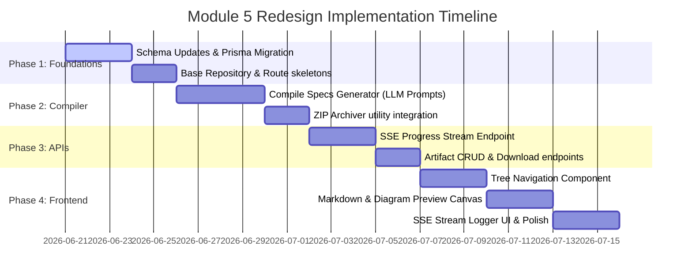

# Module 5 Redesign Specification — AI IDE Handoff Package

**Status:** Proposed Redesign Spec  
**Author:** Lead Architect / Senior Software Engineer  
**Scope:** Workflow Generation Module (Module 5) Redesign  

---

## Executive Summary

The current Workflow Generation module in PAD generates basic development prompts derived from task descriptions, feature breakdowns, and project descriptions. While these prompts provide basic guidance, they fall short of the technical depth required by modern AI-assisted engineering tools (such as Cursor, Windsurf, Claude Code, Antigravity, or GitHub Copilot Workspace). Modern AI systems do not need arbitrary prompts; they need complete, structured project context, precise architectural boundaries, database schemas, API contracts, coding style guides, and unambiguous implementation roadmaps.

This specification details the architecture, design patterns, schema structures, and front-end interface needed to transform the Workflow Tab into a comprehensive **AI IDE Handoff Package**. This package compiles research notes, PRD/BRD requirements, structural diagrams, features, tasks, and machine-readable instructions into a single, downloadable, and copyable implementation bundle.

---

## 1. Current State Analysis

The existing implementation generates a linear sequence of development steps inside a `Workflow` model linked 1-to-1 with an `Idea`. Each step (represented as a `WorkflowStep` in the database) contains instructions generated by an LLM prompt (`generate-workflow.prompt.ts`). 

```mermaid
sequenceDiagram
    participant User as User Browser
    participant Controller as WorkflowController
    participant Service as WorkflowService
    participant AI as AiService
    participant DB as Prisma / Database

    User->>Controller: POST /api/v1/workflows/generate/:ideaId
    activate Controller
    Controller->>Service: generateWorkflow(ideaId)
    activate Service
    Service->>DB: Fetch Idea, Features, Tasks, and Dependencies
    Service->>AI: generateWorkflowStream(ideaText, features, deps)
    activate AI
    AI-->>Service: AsyncGenerator<string> (JSON Chunks)
    deactivate AI
    loop Streaming JSON
        Service-->>User: HTTP JSON Lines (NDJSON Chunked)
    </td>
    Note over Service: Parses final JSON response & extracts steps
    Service->>DB: createWorkflow() & createWorkflowSteps()
    Service->>DB: createStepDependencies()
    Service-->>Controller: Stream completed
    deactivate Service
    Controller-->>User: End HTTP Connection
    deactivate Controller
```

### Limitations of Current State:
1. **Context Fragmentation**: The generated output is isolated. It doesn't incorporate research material from Module 1, generated BRD/PRD documents from Module 2, or architecture diagrams from Module 3.
2. **Brittle Parsing**: It forces the LLM to output a complex JSON structure (`{ "steps": [...] }`) over a stream, which is prone to truncation and syntax errors, breaking the parsing mechanism.
3. **No File System Concept**: Developers use files, directories, and schemas. Prompt generation outputs a text list of tasks instead of a project structure layout.
4. **Basic Exporting**: The export action copies a markdown list to the clipboard. There is no ZIP export, file-tree navigation, or offline portability.

---

## 2. Existing File Mapping

The following table lists files in the workspace related to the workflow module and how they will be impacted by the redesign:

| File Path | Status | Planned Refactoring or Replacement |
| :--- | :--- | :--- |
| [`server/prisma/schema.prisma`](file:///home/mohamed/PAD/server/prisma/schema.prisma) | **Refactor** | Deprecate old `WorkflowStep` models and add the new `HandoffPackage`, `HandoffArtifact`, and versioning models. |
| [`server/src/modules/workflow/workflow.route.ts`](file:///home/mohamed/PAD/server/src/modules/workflow/workflow.route.ts) | **Refactor** | Redirect endpoints to `handoff.route.ts` or rename/upgrade parameters. Add artifact preview/edit routes. |
| [`server/src/modules/workflow/workflow.controller.ts`](file:///home/mohamed/PAD/server/src/modules/workflow/workflow.controller.ts) | **Refactor** | Port controller logic to SSE (Server-Sent Events) and compile-time stream handlers. |
| [`server/src/modules/workflow/workflow.service.ts`](file:///home/mohamed/PAD/server/src/modules/workflow/workflow.service.ts) | **Refactor** | Rewrite service logic to gather inputs, invoke the specification generator, write artifact records, and compile the ZIP file. |
| [`server/src/modules/workflow/workflow.repository.ts`](file:///home/mohamed/PAD/server/src/modules/workflow/workflow.repository.ts) | **Refactor** | Support operations for Handoff Packages and Artifacts. |
| [`server/src/modules/workflow/types/IWorkflow.ts`](file:///home/mohamed/PAD/server/src/modules/workflow/types/IWorkflow.ts) | **Refactor** | Replace interfaces with new `IHandoffPackage` and `IHandoffArtifact` DTOs. |
| [`server/src/modules/ai/prompts/generate-workflow.prompt.ts`](file:///home/mohamed/PAD/server/src/modules/ai/prompts/generate-workflow.prompt.ts) | **Delete** | Replace with modular specification prompt files under a new folder `/prompts/handoff/`. |
| [`web/src/features/workflow/page/WorkflowPage.tsx`](file:///home/mohamed/PAD/web/src/features/workflow/page/WorkflowPage.tsx) | **Refactor** | Evolve from a simple task list page into the multi-pane "AI Handoff Workspace". |
| [`web/src/features/workflow/components/WorkflowPanel.tsx`](file:///home/mohamed/PAD/web/src/features/workflow/components/WorkflowPanel.tsx) | **Delete** | Deprecate in favor of layout-specific components (e.g., `ArtifactTree`, `ArtifactPreview`, `HandoffOverview`). |
| [`web/src/features/workflow/hook/useWorkflowPage.ts`](file:///home/mohamed/PAD/web/src/features/workflow/hook/useWorkflowPage.ts) | **Refactor** | Refactor state orchestration to handle SSE stream compilation events and file-tree selection states. |
| [`web/src/features/workflow/api/workflow.api.ts`](file:///home/mohamed/PAD/web/src/features/workflow/api/workflow.api.ts) | **Refactor** | Adapt methods to interface with the new handoff compilation API contracts. |
| [`web/src/features/workflow/api/workflowQueries.ts`](file:///home/mohamed/PAD/web/src/features/workflow/api/workflowQueries.ts) | **Refactor** | Align TanStack query keys and invalidation parameters. |

---

## 3. Existing Workflow Analysis

The current data-flow inside the Workflow Tab follows a basic intake pipeline:

```
[Confirmed Idea]
     │
     ▼
[Fetch Features (Module 4)] ────► [Fetch Tasks & Dependencies]
                                              │
                                              ▼
[Generate HTTP Stream] ◄──────────────── [Compile LLM JSON Prompt]
  - NDJSON lines containing incremental chunk strings
                                              │
                                              ▼
[Parser: robustJSONParse] ──────────────► [Prisma: Save steps/dependencies]
                                              │
                                              ▼
                                 [Clipboard Copy Markdown]
```

This sequence generates a flat list of tasks with custom descriptions. It misses architectural dependencies and fails to provide contextual blueprints that are easily digested by AI systems.

---

## 4. Problems With Current Prompt Generation

The prompts generated by `generate-workflow.prompt.ts` are unstructured markdown task blocks. In modern AI development, this pattern exhibits several failures:

1. **Lack of File Boundary Context**: AI IDEs need to know which files to modify. Simple prompts say "Implement API Controller for Users", but do not specify file names (`controllers/user.controller.ts`), parameters, or route paths.
2. **Missing Schema Specs**: Generating database-oriented features without providing the ERD or DB schema (from Module 3) forces the AI system to guess column names and relations, causing database type issues.
3. **No Coding Guidelines**: The AI writes code based on its pre-trained defaults instead of matching the project's design conventions (e.g., error handling middleware patterns, authentication models, folder structure).
4. **Undefined Execution Rules**: There is no guide instructing the AI agent on how to run tests, validate imports, or report status updates during the development loop.

---

## 5. AI IDE Requirements Analysis

To implement software projects successfully with minimal human developer intervention, an AI coding assistant requires a structured package containing:

* **High-Level Blueprint**: A starting point explaining the project scope, language stack, directory structure, and files included.
* **Architecture Declarations**: Complete definitions of systems, folder layouts, and boundaries.
* **Contracts**: Precise JSON/REST/gRPC schema specifications and database schemas (SQL DDL or Prisma files).
* **Coding Standards**: Rules on naming, style, hooks, linting, testing, and formatting.
* **Implementation Roadmap**: An ordered, dependency-aware list of steps that outlines the implementation path.

---

## 6. Recommended Handoff Architecture

We propose the **Handoff Compiler Pipeline**. It coordinates artifacts from all previous PAD modules and runs them through a compiler service to build the handoff directory, file systems, and a master prompt file.

```
       [Module 1: Discovery & Research]
                     │
       [Module 2: Business & Product Docs (BRD/PRD)]
                     │
       [Module 3: Diagrams & Architecture (Mermaid/ERD)]
                     │
       [Module 4: Feature Breakdown & Tasks]
                     │
                     ▼
       ┌─────────────────────────────┐
       │   HandoffCompilerService    │
       └──────────────┬──────────────┘
                      │ (Processes text summaries, schemas, and diagrams)
                      ▼
       ┌─────────────────────────────┐
       │     Specification LLM       │
       └──────────────┬──────────────┘
                      │ (Generates database, API, and technical specs)
                      ▼
       ┌─────────────────────────────┐
       │      Artifact Compiler      │
       └──────────────┬──────────────┘
                      │ (Creates virtual file tree structure)
                      ▼
       ┌─────────────────────────────┐
       │      ZIP Archiver Utility   │
       └──────────────┬──────────────┘
                      │
                      ▼
        [Output: ZIP / Clipboard Copy]
```

---

## 7. Artifact Package Structure

The handoff compiler outputs a structured directory inside a downloadable ZIP package matching the layout below:

```
/handoff-package/
├── AI_IDE_START_HERE.md               # Master AI prompt and navigation index
├── .cursorrules                       # Cursor-specific configuration rules
├── /research/
│   ├── discovery-questionnaire.json    # Questionnaire input
│   ├── discovery-responses.json        # User response data
│   └── research-summary.md             # Market and competitor research notes
├── /documents/
│   ├── business-requirements-document.md
│   └── product-requirements-document.md
├── /diagrams/
│   ├── architecture-diagram.mmd
│   ├── sequence-diagram.mmd
│   ├── database-erd.mmd
│   └── component-diagram.mmd
├── /specifications/
│   ├── technical-specification.md
│   ├── database-specification.md
│   ├── api-specification.md
│   └── coding-standards.md
├── /features/
│   ├── feature-requirements.json       # Structural features metadata
│   └── feature-details.md              # Long-form feature descriptions
├── /tasks/
│   ├── task-backlog.json               # Full task hierarchy
│   └── dependency-matrix.json          # DAG mapping dependencies
└── /implementation/
    └── implementation-roadmap.md       # Executable roadmap steps
```

---

## 8. Required Specification Files

The specifications folder (`/specifications`) must include detailed design documents. PAD will generate these specifications through LLM calls:

### 1. `technical-specification.md`
Declares technical stack parameters, libraries, and frameworks:
* **Languages & Runtime**: Node.js/TypeScript, Python, etc.
* **Core Libraries**: Express, React, Tailwind, Prisma.
* **Environment Variables**: A template listing all required variables (`.env.example`).
* **Constraints**: Specific version requirements or forbidden dependencies.

### 2. `database-specification.md`
Defines data persistence layers:
* **Schema Definition**: Prisma Schema format or SQL DDL.
* **Entity Relationships**: Description of tables, columns, indexes, types, and constraints.
* **Seeding & Migrations**: Instructions on seeding the database.

### 3. `api-specification.md`
Defines backend contracts:
* **Routes & Endpoints**: Full URI paths, HTTP methods, and query parameters.
* **Payload Examples**: JSON schemas for request bodies and response types.
* **Authentication**: Authorization requirements (JWT headers, Bearer tokens).
* **Error Handling**: Custom error models and response structure.

### 4. `coding-standards.md`
Styles user constraints for the AI engine:
* **Directory Division**: Modular vs layer structures (e.g. controllers, services, repositories).
* **Naming Conventions**: camelCase, snake_case, PascalCase boundaries.
* **Pattern Requirements**: Singleton patterns, dependency injection rules.
* **Testing Requirements**: Directory layout for unit, integration, and e2e tests.

---

## 9. Diagram Packaging Strategy

To make diagrams portable and editable for AI systems:

1. **Storage Format**: Stored as raw text strings containing Mermaid code in the database.
2. **Export Format**: Written as `.mmd` (Mermaid Markdown) files in the ZIP package.
3. **Packaging Strategy**: Saved directly under `/diagrams/*.mmd`. 
4. **Rendering Strategy**: The Master prompt will tell the AI engine how to read these files. Additionally, the web interface will display these files using a local Mermaid rendering component.

---

## 10. Document Packaging Strategy

Documents from Module 2 (PRD, BRD) are written to the `/documents` folder:
* **Format**: Standard Markdown files.
* **Naming Convention**: `business-requirements-document.md` and `product-requirements-document.md`.
* **Organization Strategy**: Links between files use relative markdown references (e.g., `See specifications in [Database Specs](../specifications/database-specification.md)`). This allows Cursor or windsurf to parse links and navigate the package directories.

---

## 11. Master Prompt Strategy

The root file `AI_IDE_START_HERE.md` functions as the system entry point for the AI IDE. It initializes the workspace constraints:

```markdown
# AI IDE Implementation Instructions - Start Here

You are an expert AI software engineer. You are tasked with implementing the software system defined in this handoff package.

## 1. Project Context
* **Project Name**: [Project Name]
* **Idea Description**: [Short Description]

## 2. Directory Map & Reading Order
Please read the files in the following sequence before writing any code:
1. `AI_IDE_START_HERE.md` (This file) - Understand the goal and instructions.
2. `specifications/technical-specification.md` - Technical stack parameters.
3. `specifications/coding-standards.md` - Style guidelines.
4. `specifications/database-specification.md` - Schema and database constraints.
5. `specifications/api-specification.md` - Route and API contracts.
6. `implementation/implementation-roadmap.md` - Task dependencies and phases.

## 3. Strict Execution Rules
1. **Zero-Guessing Contracts**: You must strictly implement APIs and schemas exactly as defined in `specifications/`.
2. **Compile-Check Cycle**: You must compile and run tests at the end of each task before moving on.
3. **No Orphan Code**: Do not create placeholder files or comment out existing files.
4. **Dependency Enforcement**: Do not start a task unless its dependencies (declared in `implementation-roadmap.md`) are complete.

## 4. Status Tracking
Create an `IMPLEMENTATION_STATUS.md` file in the root of the project to track your progress.
```

---

## 12. ZIP Structure & Export Logic

The compiler generates a ZIP archive dynamically using the Node.js `archiver` library.

### File Metadata (`metadata.json`):
```json
{
  "ideaId": "uuid-string",
  "version": 2,
  "generatedAt": "2026-06-20T11:20:00.000Z",
  "fingerprint": "sha256-hash-value"
}
```

### Versioning Strategy:
Each generation increments the handoff package version. If features, tasks, or diagrams are updated, the user can trigger a regeneration. This keeps versions aligned with the database states, preventing workspace out-of-sync errors.

---

## 13. Workflow Tab UX Redesign

The new page layout replaces the old task list with a comprehensive workspace interface:

```
+---------------------------------------------------------------------------------------------------+
│  [Back] Handoff Workspace: Real Estate App                              v2.0 [Regenerate] [Zip]   │
+------------------------------------+----------------------------------+---------------------------│
│                                    │                                  │                           │
│  LEFT PANEL: ARTIFACT TREE         │  CENTER PANEL: PREVIEW WINDOW    │  RIGHT PANEL: METADATA    │
│                                    │                                  │                           │
│  ▼ 📂 handoff-package              │  # Database Specification        │  [ Package Overview ]     │
│    📄 AI_IDE_START_HERE.md         │                                  │                           │
│    📁 research                     │  This document outlines database │  * Version: 2             │
│      📄 research-summary.md        │  schemas.                        │  * Size: 1.2 MB           │
│    📁 documents                    │                                  │  * Status: Ready          │
│      📄 PRD.md                     │  ```prisma                       │                           │
│    📁 diagrams                     │  model User {                    │  [Download ZIP Bundle]    │
│      📄 database-erd.mmd           │    id   String @id               │  (Exports full structure) │
│    ▼ 📁 specifications             │    name String                   │                           │
│      📄 technical-spec.md          │  }                               │  [Copy Master Prompt]     │
│      📄 database-spec.md           │  ```                             │  (Copies markdown text)   │
│      📄 api-spec.md                │                                  │                           │
│      📄 coding-standards.md        │                                  │  [Edit Selected File]     │
│                                    │                                  │  (Opens code editor)      │
│                                    │                                  │                           │
+------------------------------------+----------------------------------+---------------------------+
│  BOTTOM STREAMING LOGGER: [Compiling API Specs (100%)] | [Compiling Database (100%)]              │
+---------------------------------------------------------------------------------------------------+
```

### User Journey Flow:
1. **Intake state**: If no package exists, show a summary page detailing what will be compiled.
2. **SSE Streaming State**: When the user clicks "Compile Handoff Package", the compiler triggers background tasks. A progress log prints files dynamically as they compile.
3. **Workspace View**: 
   * **Artifact Tree**: Interactive file browser. Users can click any file node to view its contents in the center panel.
   * **Preview Window**: Interactive Markdown renderer. Markdown formatting is rendered using custom layouts. If the active file is a Mermaid diagram, the workspace renders the chart visually instead of displaying plain text.
   * **Metadata Sidebar**: Displays build stats, a clipboard copy shortcut, and the primary ZIP download trigger.

---

## 14. Frontend Architecture

The frontend components will reside under `web/src/features/workflow/`:

* **`HandoffWorkspace.tsx`**: Layout container displaying the file tree and preview pane.
* **`HandoffFileTree.tsx`**: Renders hierarchical tree nodes. Keeps local state for expanded/collapsed folders.
* **`HandoffPreviewCanvas.tsx`**: Contextual renderer. Chooses between `MarkdownPreview` or `MermaidPreview` depending on the file extension (`.md` vs `.mmd`).
* **`HandoffProgressLog.tsx`**: Renders streaming compiler stdout logs.
* **`useHandoffStream.ts`**: Active hook connecting to Server-Sent Events endpoint to stream and parse compiler status updates.

---

## 15. Backend Architecture

A new controller layer handles compilation tasks:

* **`HandoffService.ts`**: Gathers databases models and passes them to AI compilers.
* **`SpecificationGenerator.ts`**: Sub-service responsible for orchestrating individual LLM prompt calls (`database-spec.prompt.ts`, `api-spec.prompt.ts`, etc.) and returning raw markdown code.
* **`PackageCompiler.ts`**: Virtual file compiler. Orchestrates file structures in-memory, writes contents to database logs, and compiles them into a ZIP package.

```typescript
// Flow orchestration inside HandoffService
export async function compilePackage(ideaId: string, eventStream: SSEStreamWriter) {
  eventStream.write({ event: "status", data: "Gathering workspace variables..." });
  const variables = await gatherInputData(ideaId);

  eventStream.write({ event: "status", data: "Generating Database Specifications..." });
  const dbSpec = await generateDbSpec(variables);
  
  eventStream.write({ event: "status", data: "Generating API Specifications..." });
  const apiSpec = await generateApiSpec(variables);

  eventStream.write({ event: "status", data: "Creating ZIP structures..." });
  const zipPath = await packageToZip(ideaId, [dbSpec, apiSpec]);

  eventStream.write({ event: "complete", data: { zipPath } });
}
```

---

## 16. Storage Architecture

We must store generated handoff structures in the PostgreSQL database to support browser edits and rendering without running LLM generation calls repeatedly.

```prisma
// Prisma Schema updates:

model HandoffPackage {
    id        String            @id @default(uuid())
    ideaId    String            @map("idea_id")
    version   Int               @default(1)
    status    String            @default("draft") // generating | ready | failed
    zipPath   String?           @map("zip_path")
    createdAt DateTime          @default(now()) @map("created_at")
    updatedAt DateTime          @updatedAt @map("updated_at")

    // Relations
    idea      Idea              @relation(fields: [ideaId], references: [id], onDelete: Cascade)
    artifacts HandoffArtifact[]

    @@unique([ideaId, version])
    @@map("handoff_packages")
}

model HandoffArtifact {
    id         String         @id @default(uuid())
    packageId  String         @map("package_id")
    filePath   String         @map("file_path") // e.g., "specifications/api-specification.md"
    title      String
    content    String         @db.Text
    fileType   String         // markdown | mermaid | json
    createdAt  DateTime       @default(now()) @map("created_at")
    updatedAt  DateTime       @updatedAt @map("updated_at")

    // Relations
    package    HandoffPackage @relation(fields: [packageId], references: [id], onDelete: Cascade)
    versions   HandoffArtifactVersion[]

    @@unique([packageId, filePath])
    @@map("handoff_artifacts")
}

model HandoffArtifactVersion {
    id          String          @id @default(uuid())
    artifactId  String          @map("artifact_id")
    version     Int
    content     String          @db.Text
    changelog   String?         @db.Text
    createdAt   DateTime        @default(now()) @map("created_at")

    // Relations
    artifact    HandoffArtifact @relation(fields: [artifactId], references: [id], onDelete: Cascade)

    @@unique([artifactId, version])
    @@map("handoff_artifact_versions")
}
```

---

## 17. Export Architecture

### ZIP Streaming:
The backend does not block memory when generating the ZIP. It streams the archive directly to disk:
1. Write zip file temporarily inside the `/tmp/handoffs` directory or in-app workspace uploads path.
2. Stream bytes using `fs.createReadStream` to the client response with headers:
   * `Content-Type: application/zip`
   * `Content-Disposition: attachment; filename=handoff-[ideaId]-v[version].zip`

### Copy Master Prompt Logic:
The backend exposes a route `/api/v1/handoff/:packageId/copy-prompt` that compiles all specification markdown files, diagrams, and task lists into a single consolidated string optimized for direct clipboard pasting.

---

## 18. State Management Requirements

State management on the React client coordinates tree exploration, active editors, and streaming operations:

```typescript
interface HandoffState {
  activeFileId: string | null;           // Path of the file currently showing in the previewer
  expandedNodes: Record<string, boolean>; // Maps paths to expanded status
  compileProgress: number;               // 0 to 100 representing compilation progress
  compileLogs: string[];                 // Array of compiler output strings
  isCompiling: boolean;
  isEditing: boolean;                    // True if user is manually editing an artifact
  localFileContent: string;              // Local modifications to active file
}
```

* **Query Mutations**: Triggering compilation invalidates query key `["handoff", "idea", ideaId]`.
* **Auto-Save**: Updates to `localFileContent` are debounced and sent via PUT mutations.

---

## 19. API Contracts

### 1. Generate Package
* **URL**: `POST /api/v1/handoff/generate/:ideaId`
* **Method**: `POST`
* **Response Content-Type**: `text/event-stream`
* **Event Payloads**:
  * `event: progress | data: { step: string, percent: number }`
  * `event: log      | data: { message: string }`
  * `event: complete | data: { packageId: string, version: number }`
  * `event: error    | data: { message: string }`

### 2. Fetch Package Tree Structure
* **URL**: `GET /api/v1/handoff/idea/:ideaId`
* **Response**:
```json
{
  "status": "success",
  "data": {
    "package": {
      "id": "package-uuid",
      "version": 2,
      "status": "ready",
      "artifacts": [
        {
          "id": "artifact-uuid",
          "filePath": "specifications/database-specification.md",
          "title": "Database Specification",
          "fileType": "markdown"
        }
      ]
    }
  }
}
```

### 3. Fetch Specific Artifact Content
* **URL**: `GET /api/v1/handoff/artifacts/:artifactId`
* **Response**:
```json
{
  "status": "success",
  "data": {
    "artifact": {
      "id": "artifact-uuid",
      "filePath": "specifications/database-specification.md",
      "content": "# Database Specification...",
      "version": 1
    }
  }
}
```

### 4. Update Artifact Content (Manual Edit)
* **URL**: `PUT /api/v1/handoff/artifacts/:artifactId`
* **Method**: `PUT`
* **Body**:
```json
{
  "content": "# Updated database specs...",
  "changelog": "Changed column username to email verification parameters"
}
```
* **Response**: Status 200 containing the new version index.

### 5. Download ZIP Bundle
* **URL**: `GET /api/v1/handoff/download/:packageId`
* **Response**: Binary stream (ZIP file data).

---

## 20. Migration Strategy

To migrate safely from the legacy workflow generator without breaking existing customer workspaces:

1. **Keep Legacy Table Reads**: Keep database schemas for `Workflow` and `WorkflowStep` intact for existing rows.
2. **Virtual Mapping on Fallback**: If a user requests a project handoff for an idea that only has legacy workflows generated, run a virtual compiler parser that translates `WorkflowStep` records into `/implementation/implementation-roadmap.md` and `/tasks/task-backlog.json` on-the-fly, allowing the client to browse the legacy files immediately.
3. **Database Migration Script**: Write a Prisma migration script defining the new models `HandoffPackage`, `HandoffArtifact`, and `HandoffArtifactVersion`.

---

## 21. Implementation Phases



---

## 22. Acceptance Criteria

* **Requirement 1: Complete Package Compilation**
  * Gathers data from Module 1, 2, 3, and 4.
  * Successfully runs AI generation loops to build technical, DB, and API specs.
* **Requirement 2: Progress Logging**
  * Compilation triggers an SSE connection streaming execution steps.
  * Percentages and action logs are displayed progressively in the UI.
* **Requirement 3: File Navigation System**
  * Left sidebar displays a folder layout with folder nodes mapping to compiled files.
  * Double clicking files triggers a preview render panel.
* **Requirement 4: Copy & Download Portability**
  * Clicking "Download ZIP" downloads a zip file mapping the filesystem.
  * Clicking "Copy Master Prompt" exports a compiled prompt payload to the clipboard.
* **Requirement 5: Customization & Safety**
  * Editing and saving files increments the artifact's version in the database.

---

## 23. Files To Keep (Unmodified)

* **[`web/src/components/providers/StreamingProvider.tsx`](file:///home/mohamed/PAD/web/src/components/providers/StreamingProvider.tsx)**: Keep global streaming parameters.
* **[`server/src/data-server-clients/prisma-client.ts`](file:///home/mohamed/PAD/server/src/data-server-clients/prisma-client.ts)**: Keep base client declarations.

---

## 24. Files To Refactor

1. **[`server/prisma/schema.prisma`](file:///home/mohamed/PAD/server/prisma/schema.prisma)**: Add Handoff Package, Artifact, and Version models.
2. **[`server/src/modules/workflow/workflow.service.ts`](file:///home/mohamed/PAD/server/src/modules/workflow/workflow.service.ts)**: Implement compiler generation loops and mapping logic.
3. **[`server/src/modules/workflow/workflow.controller.ts`](file:///home/mohamed/PAD/server/src/modules/workflow/workflow.controller.ts)**: Refactor controller endpoints to support SSE streams, CRUD file edits, and ZIP transmission.
4. **[`server/src/modules/workflow/workflow.route.ts`](file:///home/mohamed/PAD/server/src/modules/workflow/workflow.route.ts)**: Redirect routes to match the new endpoints.
5. **[`web/src/features/workflow/page/WorkflowPage.tsx`](file:///home/mohamed/PAD/web/src/features/workflow/page/WorkflowPage.tsx)**: Replace legacy task layouts with the redesign workspace layout.
6. **[`web/src/features/workflow/hook/useWorkflowPage.ts`](file:///home/mohamed/PAD/web/src/features/workflow/hook/useWorkflowPage.ts)**: Refactor client state, hooks, and download mutations.
7. **[`web/src/features/workflow/api/workflow.api.ts`](file:///home/mohamed/PAD/web/src/features/workflow/api/workflow.api.ts)**: Update api endpoints to talk to new routes.

---

## 25. Files To Delete

* **[`server/src/modules/ai/prompts/generate-workflow.prompt.ts`](file:///home/mohamed/PAD/server/src/modules/ai/prompts/generate-workflow.prompt.ts)**: Delete this prompt as we do not generate linear text prompts anymore.
* **[`web/src/features/workflow/components/WorkflowPanel.tsx`](file:///home/mohamed/PAD/web/src/features/workflow/components/WorkflowPanel.tsx)**: Replaced by specific layout components.

---

## 26. New Files To Create

1. **`server/src/modules/workflow/prompts/technical-spec.prompt.ts`**: Prompt template for tech-spec generation.
2. **`server/src/modules/workflow/prompts/database-spec.prompt.ts`**: Prompt template for database-spec generation.
3. **`server/src/modules/workflow/prompts/api-spec.prompt.ts`**: Prompt template for api-spec generation.
4. **`server/src/modules/workflow/prompts/coding-standards.prompt.ts`**: Prompt template for coding standard parameter extraction.
5. **`server/src/modules/workflow/prompts/roadmap.prompt.ts`**: Prompt template for implementation roadmap steps.
6. **`server/src/modules/workflow/handoff-compiler.service.ts`**: Core backend compilation orchestrator.
7. **`server/src/modules/workflow/zip-archiver.ts`**: Dynamic directory compression and packaging helper.
8. **`web/src/features/workflow/components/HandoffWorkspace.tsx`**: Main Workspace Layout container.
9. **`web/src/features/workflow/components/HandoffFileTree.tsx`**: Filesystem explorer tree view component.
10. **`web/src/features/workflow/components/HandoffPreviewCanvas.tsx`**: Render context selecting Markdown or Mermaid components.
11. **`web/src/features/workflow/components/HandoffProgressLog.tsx`**: SSE dynamic activity reporter log element.
12. **`web/src/features/workflow/components/HandoffSidebar.tsx`**: Build actions, Copy Prompt actions, and ZIP download layout.
