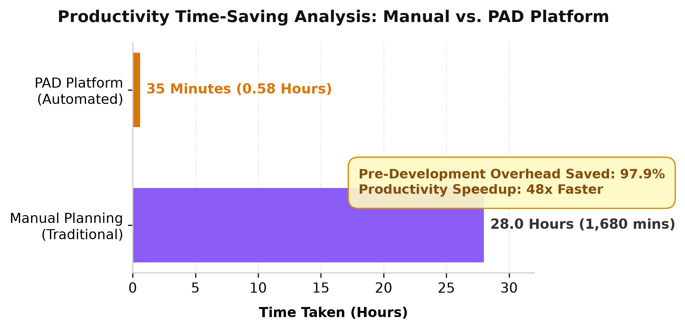

# Productivity Time-Saving Analysis

This document evaluates the practical benefits of the Product Architecture Designer (PAD) platform by comparing the time taken by engineering teams to create system planning documents manually versus using PAD.

---

## 1. Quantitative Evaluation Metrics

The productivity speedup and pre-development overhead reduction are calculated using the following metrics:

### 1.1 Pre-Development Overhead Reduction ($\Delta T$)
$$\Delta T = \left( \frac{T_{\text{manual}} - T_{\text{PAD}}}{T_{\text{manual}}} \right) \times 100\%$$

Given:
*   $T_{\text{manual}} = 28 \text{ hours} = 1,680 \text{ minutes}$
*   $T_{\text{PAD}} = 35 \text{ minutes} = 0.583 \text{ hours}$

$$\Delta T = \left( \frac{1,680 - 35}{1,680} \right) \times 100\% = 97.92\%$$

*The PAD platform achieves a **97.9% reduction** in pre-development overhead.*

---

### 1.2 Productivity Speedup Factor ($S$)
$$S = \frac{T_{\text{manual}}}{T_{\text{PAD}}}$$

$$S = \frac{1,680}{35} = 48\times$$

*Engineering teams using PAD can compile the identical set of synchronized design artifacts **48 times faster** than manual creation.*

---

## 2. Comparison Breakdown

| Lifecycle Stage | Manual Workflow Time | PAD Platform Time | Savings Factor |
| :--- | :---: | :---: | :---: |
| **Intake & Scope Gathering** | 4.0 hours (240m) | 10 minutes | $24\times$ |
| **Requirements Drafting (PRD/BRD)** | 8.0 hours (480m) | 5 minutes | $96\times$ |
| **UML Diagrams (ERD, Sequence, Schema)**| 6.0 hours (360m) | 5 minutes | $72\times$ |
| **Tasks DAG & API Specs (OpenAPI)** | 10.0 hours (600m) | 5 minutes | $120\times$ |
| **Schema Changes & Re-compilation** | 4.0 hours (240m) / iteration | 10 minutes | $24\times$ |
| **Total Pre-Development Lifecycle** | **28.0 hours (1,680m)** | **35 minutes** | **$48\times$** |

---

## 3. Workflow Time Distribution Comparison

```mermaid
flowchart TB
    %% Manual Workflow
    subgraph Manual ["Manual Planning Workflow: 28 Hours (1,680 Minutes)"]
        direction LR
        m1["1. Intake & Scope Gathering\n(240 min)"] ---> m2["2. Write Docs (PRD/BRD)\n(480 min)"]
        m2 ---> m3["3. Draw UML Diagrams\n(360 min)"]
        m3 ---> m4["4. Task Card & API Spec compilation\n(600 min)"]
    end

    %% PAD Workflow
    subgraph PAD ["PAD Platform Workflow: 35 Minutes (97.9% Time Saved)"]
        direction LR
        p1["1. AI Intake & Refinement\n(10 min)"] ---> p2["2. Auto-Compile Docs, Diags & APIs\n(15 min)"]
        p2 ---> p3["3. WebSocket Schema Patching\n(10 min)"]
    end

    %% Styling configurations (Yellow & Purple Theme)
    style Manual fill:#faf5ff,stroke:#a855f7,stroke-width:2px
    style m1 fill:#faf5ff,stroke:#a855f7,stroke-width:1px
    style m2 fill:#faf5ff,stroke:#a855f7,stroke-width:1px
    style m3 fill:#faf5ff,stroke:#a855f7,stroke-width:1px
    style m4 fill:#faf5ff,stroke:#a855f7,stroke-width:1px

    style PAD fill:#fef9c3,stroke:#ca8a04,stroke-width:2px
    style p1 fill:#fefbeb,stroke:#eab308,stroke-width:1px
    style p2 fill:#fefbeb,stroke:#eab308,stroke-width:1px
    style p3 fill:#fefbeb,stroke:#eab308,stroke-width:1px
```



### 3.1 Generated Visual Comparison Chart
Below is the publication-quality comparison chart generated for LaTeX documents:



---

## 4. LaTeX Integration Snippets

For academic or graduation project report inclusion, copy the LaTeX snippets below.

### 4.1 Including the Comparison Chart (PDF Vector / PNG)
Make sure the `graphicx` package is loaded in your LaTeX preamble (`\usepackage{graphicx}`).

```latex
\begin{figure}[htbp]
    \centering
    \includegraphics[width=0.9\textwidth]{diagrams/productivity_comparison.pdf}
    \caption{Productivity Time-Saving Analysis: Manual vs. PAD Platform}
    \label{fig:productivity_comparison}
\end{figure}
```

### 4.2 Including the Comparison Table
Make sure the `booktabs` package is loaded in your LaTeX preamble (`\usepackage{booktabs}`).

```latex
\begin{table}[htbp]
    \centering
    \caption{Pre-Development Lifecycle Phase Duration Comparison}
    \label{tab:productivity_comparison}
    \begin{tabular}{lccc}
        \toprule
        \textbf{Lifecycle Stage} & \textbf{Manual Workflow} & \textbf{PAD Platform} & \textbf{Savings Factor} \\
        \midrule
        Intake \& Scope Gathering & 4.0 hours (240m) & 10 minutes & $24\times$ \\
        Requirements Drafting (PRD/BRD) & 8.0 hours (480m) & 5 minutes & $96\times$ \\
        UML Diagrams (ERD, Sequence, Schema) & 6.0 hours (360m) & 5 minutes & $72\times$ \\
        Tasks DAG \& API Specs (OpenAPI) & 10.0 hours (600m) & 5 minutes & $120\times$ \\
        Schema Changes \& Re-compilation & 4.0 hours (240m) / iter & 10 minutes & $24\times$ \\
        \midrule
        \textbf{Total Pre-Development} & \textbf{28.0 hours (1,680m)} & \textbf{35 minutes} & \textbf{48$\times$} \\
        \bottomrule
    \end{tabular}
\end{table}
```
