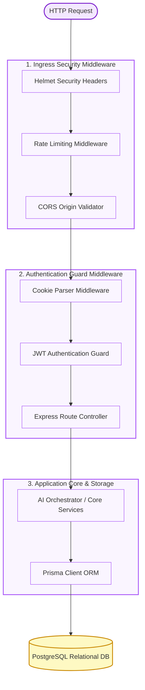

```mermaid
flowchart TB
    %% External Entities / Inputs
    req(["HTTP Request"])
    db[(PostgreSQL Relational DB)]

    %% Row 1: Ingress Security
    subgraph Row1 [1. Ingress Security Middleware]
        direction LR
        sec["Helmet Security Headers"] ---> limit["Rate Limiting Middleware"] ---> cors["CORS Origin Validator"]
    end

    %% Row 2: Authentication
    subgraph Row2 [2. Authentication Guard Middleware]
        direction LR
        cookies["Cookie Parser Middleware"] ---> jwt["JWT Authentication Guard"] ---> controller["Express Route Controller"]
    end

    %% Row 3: Application Core
    subgraph Row3 [3. Application Core & Storage]
        direction LR
        services["AI Orchestrator / Core Services"] ---> prisma["Prisma Client ORM"]
    end

    %% Styling configurations (Yellow & Purple Theme)
    style req fill:#f3e8ff,stroke:#7e22ce,stroke-width:2px
    style db fill:#fef9c3,stroke:#ca8a04,stroke-width:2px

    style Row1 fill:#faf5ff,stroke:#a855f7,stroke-width:2px
    style sec fill:#faf5ff,stroke:#a855f7,stroke-width:1px
    style limit fill:#faf5ff,stroke:#a855f7,stroke-width:1px
    style cors fill:#faf5ff,stroke:#a855f7,stroke-width:1px

    style Row2 fill:#faf5ff,stroke:#a855f7,stroke-width:2px
    style cookies fill:#faf5ff,stroke:#a855f7,stroke-width:1px
    style jwt fill:#faf5ff,stroke:#a855f7,stroke-width:1px
    style controller fill:#faf5ff,stroke:#a855f7,stroke-width:1px

    style Row3 fill:#faf5ff,stroke:#a855f7,stroke-width:2px
    style services fill:#faf5ff,stroke:#a855f7,stroke-width:1px
    style prisma fill:#faf5ff,stroke:#a855f7,stroke-width:1px

    %% Flow links connecting the rows
    req ---> sec
    cors ---> cookies
    controller ---> services
    prisma ---> db
```
