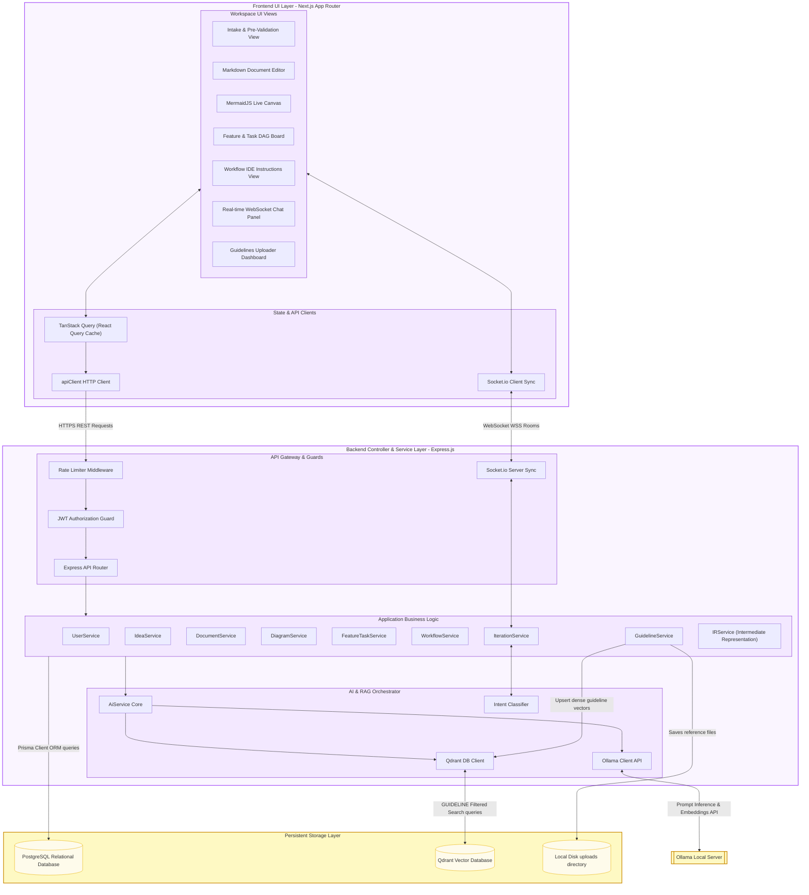

```mermaid
graph TB
    %% External Entities
    ollama_srv[["Ollama Local Server"]]

    %% Client subgraph
    subgraph Client [Frontend UI Layer - Next.js App Router]
        subgraph Views [Workspace UI Views]
            IntakeView["Intake & Pre-Validation View"]
            DocsView["Markdown Document Editor"]
            DiagsView["MermaidJS Live Canvas"]
            TasksView["Feature & Task DAG Board"]
            WorkflowView["Workflow IDE Instructions View"]
            ChatView["Real-time WebSocket Chat Panel"]
            GuidesView["Guidelines Uploader Dashboard"]
        end

        subgraph Core_Client [State & API Clients]
            TQ["TanStack Query (React Query Cache)"]
            apiClient["apiClient HTTP Client"]
            SIO_C["Socket.io Client Sync"]
        end
    end

    %% Server subgraph
    subgraph Server [Backend Controller & Service Layer - Express.js]
        subgraph Middleware [API Gateway & Guards]
            Router["Express API Router"]
            AuthGuard["JWT Authorization Guard"]
            RateLimit["Rate Limiter Middleware"]
            SIO_S["Socket.io Server Sync"]
        end

        subgraph Services [Application Business Logic]
            UserService["UserService"]
            IdeaService["IdeaService"]
            DocService["DocumentService"]
            DiagService["DiagramService"]
            FeatureService["FeatureTaskService"]
            WorkflowService["WorkflowService"]
            GuidelineService["GuidelineService"]
            IterationService["IterationService"]
            IRService["IRService (Intermediate Representation)"]
        end

        subgraph AI_Orchestrator [AI & RAG Orchestrator]
            AiService["AiService Core"]
            OllamaClient["Ollama Client API"]
            QdrantClient["Qdrant DB Client"]
            IntentClassifier["Intent Classifier"]
        end
    end

    %% Database & Storage
    subgraph Storage [Persistent Storage Layer]
        DB[(PostgreSQL Relational Database)]
        VectorDB[(Qdrant Vector Database)]
        Disk[(Local Disk uploads directory)]
    end

    %% Styling (Yellow & Purple Theme)
    style Client fill:#faf5ff,stroke:#a855f7,stroke-width:2px
    style Views fill:#f3e8ff,stroke:#7e22ce,stroke-width:1px
    style Core_Client fill:#f3e8ff,stroke:#7e22ce,stroke-width:1px
    
    style Server fill:#faf5ff,stroke:#a855f7,stroke-width:2px
    style Middleware fill:#f3e8ff,stroke:#7e22ce,stroke-width:1px
    style Services fill:#f3e8ff,stroke:#7e22ce,stroke-width:1px
    style AI_Orchestrator fill:#f3e8ff,stroke:#7e22ce,stroke-width:1px

    style Storage fill:#fef9c3,stroke:#ca8a04,stroke-width:2px
    style DB fill:#fefbeb,stroke:#eab308,stroke-width:1px
    style VectorDB fill:#fefbeb,stroke:#eab308,stroke-width:1px
    style Disk fill:#fefbeb,stroke:#eab308,stroke-width:1px
    style ollama_srv fill:#fef9c3,stroke:#ca8a04,stroke-width:2px

    %% Flow links
    
    %% Client Flows
    Views <---> TQ
    Views <---> SIO_C
    TQ ---> apiClient
    
    %% Client to Server Flows
    apiClient --->|HTTPS REST Requests| RateLimit
    SIO_C <--->|WebSocket WSS Rooms| SIO_S
    
    %% Gateway Middleware to Controller Routing
    RateLimit ---> AuthGuard
    AuthGuard ---> Router
    Router ---> Services
    SIO_S <---> IterationService
    
    %% Services database accesses
    Services --->|Prisma Client ORM queries| DB
    GuidelineService --->|Saves reference files| Disk
    
    %% Services calling AI logic
    Services ---> AiService
    IterationService <---> IntentClassifier
    
    %% AI Pipeline & RAG flows
    AiService ---> QdrantClient
    QdrantClient <--->|GUIDELINE Filtered Search queries| VectorDB
    AiService ---> OllamaClient
    OllamaClient <--->|Prompt Inference & Embeddings API| ollama_srv
    GuidelineService --->|Upsert dense guideline vectors| QdrantClient
```
