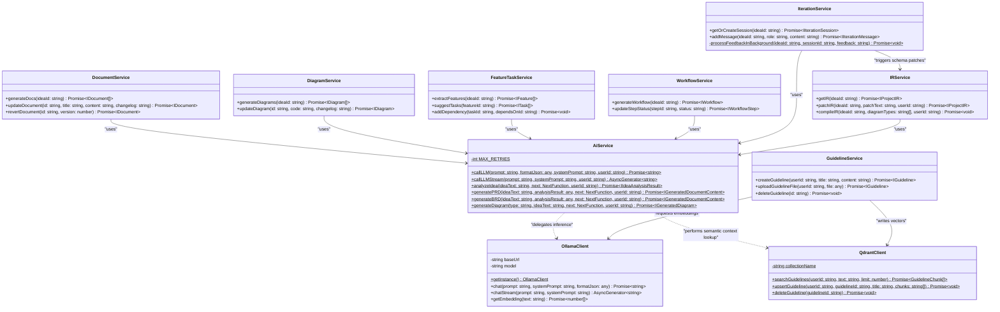

```mermaid
classDiagram
    class OllamaClient {
        -string baseUrl
        -string model
        +getInstance() OllamaClient$
        +chat(prompt: string, systemPrompt: string, formatJson: any) Promise~string~
        +chatStream(prompt: string, systemPrompt: string) AsyncGenerator~string~
        +getEmbedding(text: string) Promise~number[]~
    }

    class QdrantClient {
        -string collectionName$
        +searchGuidelines(userId: string, text: string, limit: number) Promise~GuidelineChunk[]~$
        +upsertGuideline(userId: string, guidelineId: string, title: string, chunks: string[]) Promise~void~$
        +deleteGuideline(guidelineId: string) Promise~void~$
    }

    class AiService {
        -int MAX_RETRIES$
        +callLLM(prompt: string, formatJson: any, systemPrompt: string, userId: string) Promise~string~$
        +callLLMStream(prompt: string, systemPrompt: string, userId: string) AsyncGenerator~string~$
        +analyzeIdea(ideaText: string, next: NextFunction, userId: string) Promise~IIdeaAnalysisResult~$
        +generatePRD(ideaText: string, analysisResult: any, next: NextFunction, userId: string) Promise~IGeneratedDocumentContent~$
        +generateBRD(ideaText: string, analysisResult: any, next: NextFunction, userId: string) Promise~IGeneratedDocumentContent~$
        +generateDiagram(type: string, ideaText: string, next: NextFunction, userId: string) Promise~IGeneratedDiagram~$
    }

    class IRService {
        +getIR(ideaId: string) Promise~IProjectIR~
        +patchIR(ideaId: string, patchText: string, userId: string) Promise~IProjectIR~
        +compileIR(ideaId: string, diagramTypes: string[], userId: string) Promise~void~
    }

    class DocumentService {
        +generateDocs(ideaId: string) Promise~IDocument[]~
        +updateDocument(id: string, title: string, content: string, changelog: string) Promise~IDocument~
        +revertDocument(id: string, version: number) Promise~IDocument~
    }

    class DiagramService {
        +generateDiagrams(ideaId: string) Promise~IDiagram[]~
        +updateDiagram(id: string, code: string, changelog: string) Promise~IDiagram~
    }

    class FeatureTaskService {
        +extractFeatures(ideaId: string) Promise~IFeature[]~
        +suggestTasks(featureId: string) Promise~ITask[]~
        +addDependency(taskId: string, dependsOnId: string) Promise~void~
    }

    class WorkflowService {
        +generateWorkflow(ideaId: string) Promise~IWorkflow~
        +updateStepStatus(stepId: string, status: string) Promise~IWorkflowStep~
    }

    class GuidelineService {
        +createGuideline(userId: string, title: string, content: string) Promise~IGuideline~
        +uploadGuidelineFile(userId: string, file: any) Promise~IGuideline~
        +deleteGuideline(id: string) Promise~void~
    }

    class IterationService {
        +getOrCreateSession(ideaId: string) Promise~IIterationSession~
        +addMessage(ideaId: string, role: string, content: string) Promise~IIterationMessage~
        -processFeedbackInBackground(ideaId: string, sessionId: string, feedback: string) Promise~void~$
    }

    %% Class Associations / Dependencies
    AiService ..> OllamaClient : "delegates inference"
    AiService ..> QdrantClient : "performs semantic context lookup"
    
    DocumentService --> AiService : "uses"
    DiagramService --> AiService : "uses"
    FeatureTaskService --> AiService : "uses"
    WorkflowService --> AiService : "uses"
    IterationService --> AiService : "uses"
    IRService --> AiService : "uses"
    GuidelineService --> QdrantClient : "writes vectors"
    GuidelineService --> OllamaClient : "requests embeddings"
    IterationService --> IRService : "triggers schema patches"
```
