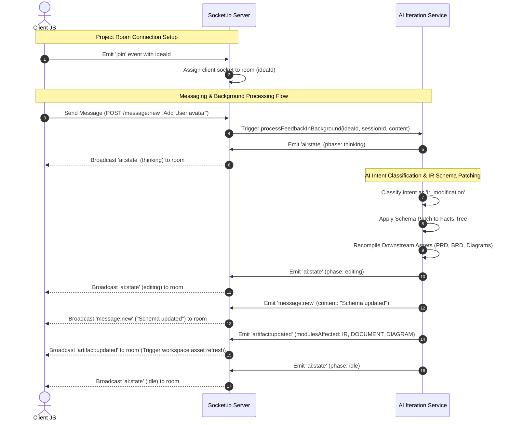

```mermaid
sequenceDiagram
    autonumber
    actor User as Client JS
    participant Srv as Socket.io Server
    participant AI as AI Iteration Service

    Note over User, Srv: Project Room Connection Setup
    User->>Srv: Emit 'join' event with ideaId
    Srv->>Srv: Assign client socket to room (ideaId)

    Note over User, AI: Messaging & Background Processing Flow
    User->>Srv: Send Message (POST /message:new "Add User avatar")
    Srv->>AI: Trigger processFeedbackInBackground(ideaId, sessionId, content)
    
    AI->>Srv: Emit 'ai:state' (phase: thinking)
    Srv-->>User: Broadcast 'ai:state' (thinking) to room

    Note over AI: AI Intent Classification & IR Schema Patching
    AI->>AI: Classify intent as 'ir_modification'
    AI->>AI: Apply Schema Patch to Facts Tree
    AI->>AI: Recompile Downstream Assets (PRD, BRD, Diagrams)

    AI->>Srv: Emit 'ai:state' (phase: editing)
    Srv-->>User: Broadcast 'ai:state' (editing) to room
    
    AI->>Srv: Emit 'message:new' (content: "Schema updated")
    Srv-->>User: Broadcast 'message:new' ("Schema updated") to room

    AI->>Srv: Emit 'artifact:updated' (modulesAffected: IR, DOCUMENT, DIAGRAM)
    Srv-->>User: Broadcast 'artifact:updated' to room (Trigger workspace asset refresh)

    AI->>Srv: Emit 'ai:state' (phase: idle)
    Srv-->>User: Broadcast 'ai:state' (idle) to room
```
