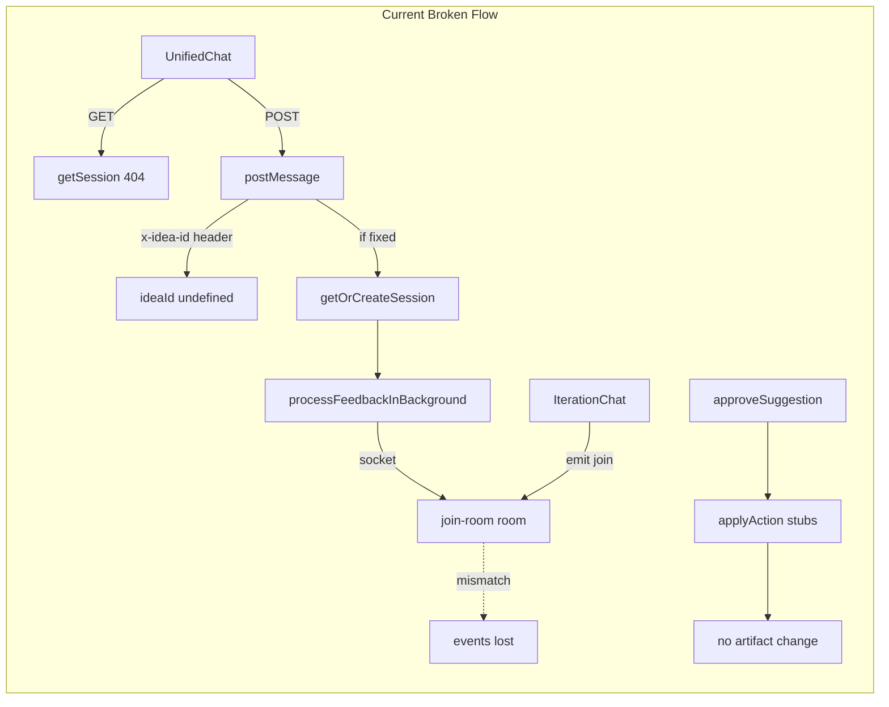
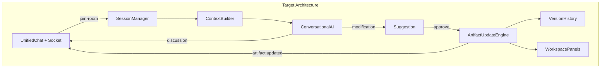
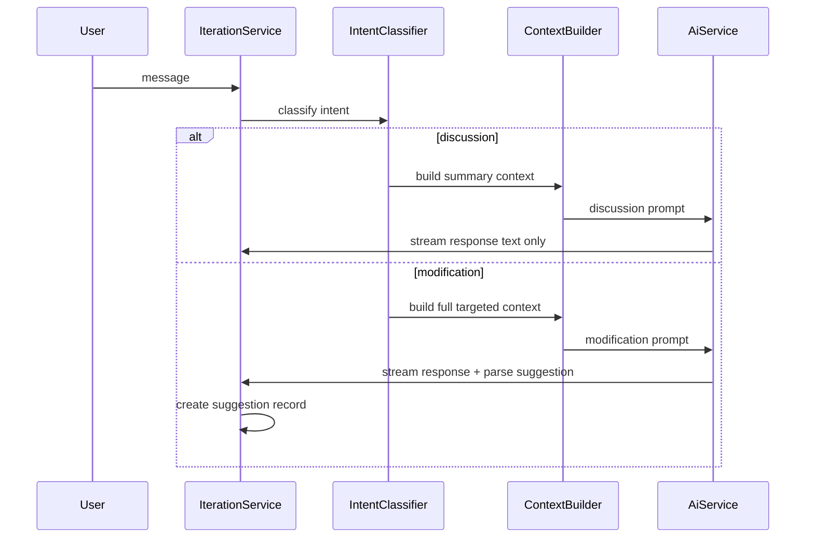

# Module 6 AI Project Copilot — Analysis & Refactor Plan

## Deliverable

After plan approval, create **[docs/modules/module-06-ai-project-copilot.md](docs/modules/module-06-ai-project-copilot.md)** (new `docs/` folder; existing specs live in [documents/modules/module_6_iterative_feedback_chat_based_updates.md](documents/modules/module_6_iterative_feedback_chat_based_updates.md)).

---

## Gap Analysis Summary

### Current State

Module 6 backend lives in [server/src/modules/iteration/](server/src/modules/iteration/). Frontend split across [web/components/workspace/UnifiedChat.tsx](web/components/workspace/UnifiedChat.tsx) (primary workspace UX) and [web/components/features/iteration/IterationChat.tsx](web/components/features/iteration/IterationChat.tsx) (orphaned `/ideas/[id]/iterate` page).



**What works (partially):**
- DB schema for sessions, messages, suggestions, actions ([schema.prisma](server/prisma/schema.prisma) lines 355–419)
- Message persistence + AI background job with socket streaming ([iteration.service.ts](server/src/modules/iteration/iteration.service.ts))
- Suggestion UI with approve button ([SuggestionCard.tsx](web/components/features/iteration/SuggestionCard.tsx))
- Version tables exist on all artifact modules (DocumentVersion, DiagramVersion, etc.) — reusable by `applyAction`

**What is broken:**

| # | Issue | Location | Impact |
|---|-------|----------|--------|
| 1 | `getSession` returns 404; `getOrCreateSession` only on first message | [iteration.service.ts:169-176](server/src/modules/iteration/iteration.service.ts) | Chat opens empty; unreliable session load |
| 2 | `postMessage` reads `req.headers["x-idea-id"]`, ignores `req.params.ideaId` | [iteration.controller.ts:20-24](server/src/modules/iteration/iteration.controller.ts) | **sendMessage likely broken** — frontend never sends header |
| 3 | `applyAction` all branches empty | [iteration.service.ts:222-241](server/src/modules/iteration/iteration.service.ts) | Approve marks `applied` but artifacts unchanged |
| 4 | Socket `join` vs `join-room` mismatch | [IterationChat.tsx:54](web/components/features/iteration/IterationChat.tsx) vs [socket.service.ts:29](server/src/services/socket.service.ts) | Real-time events never reach client |
| 5 | Dual chat transports | UnifiedChat polls 3s; IterationChat uses sockets | Inconsistent UX; workspace has no streaming |
| 6 | AI prompt always outputs JSON suggestion shape | [iteration.prompt.ts](server/src/modules/ai/prompts/iteration.prompt.ts) | Feels like suggestion engine, not conversational copilot |
| 7 | Incomplete context | [iteration.service.ts:78-83](server/src/modules/iteration/iteration.service.ts) | Missing `analysisResult`, idea status, applied suggestions history; full JSON dump risks token overflow |
| 8 | Stream emits raw JSON | `message:stream` sends unparsed LLM output | User sees JSON blocks while typing |
| 9 | No reject API | schema supports `rejected` | No way to dismiss bad suggestions |
| 10 | No panel refresh after approve | workspace panels | User doesn't see applied changes |
| 11 | `session:created` uses `emitToAll` | [iteration.service.ts:32](server/src/modules/iteration/iteration.service.ts) | Leaks sessions cross-tenant |
| 12 | `/iterate` page orphaned | no sidebar link | Dead code path diverges from main UX |

### Desired State

PAD acts as **project copilot** with full project awareness:

- Auto session on chat open, persistent history
- **Discussion Mode**: Q&A about docs/diagrams/features/tasks/workflow/reasoning — no forced suggestions
- **Modification Mode**: structured change proposals → user approve/reject → real artifact updates + cross-module sync + version history
- Socket-only realtime (no polling)
- Users can ask "Explain the architecture", "Why PostgreSQL?", "Add RBAC", etc.



---

## Document Structure (for `module-06-ai-project-copilot.md`)

### 1. Purpose

Reframe Module 6 from "iterative feedback chat" to **AI Project Copilot**: conversational assistant that understands the full generated project and can explain, modify, add, delete, and refine artifacts with user approval.

Reference product spec: [documents/modules/module_6_iterative_feedback_chat_based_updates.md](documents/modules/module_6_iterative_feedback_chat_based_updates.md).

### 2. Current Architecture

Document existing files:

**Backend**
- [iteration.route.ts](server/src/modules/iteration/iteration.route.ts) — 3 routes
- [iteration.controller.ts](server/src/modules/iteration/iteration.controller.ts)
- [iteration.service.ts](server/src/modules/iteration/iteration.service.ts)
- [iteration.repository.ts](server/src/modules/iteration/iteration.repository.ts)
- [iteration.prompt.ts](server/src/modules/ai/prompts/iteration.prompt.ts)
- [socket.service.ts](server/src/services/socket.service.ts)

**Frontend**
- [UnifiedChat.tsx](web/components/workspace/UnifiedChat.tsx) — primary
- [IterationChat.tsx](web/components/features/iteration/IterationChat.tsx), [ChatMessage.tsx](web/components/features/iteration/ChatMessage.tsx), [SuggestionCard.tsx](web/components/features/iteration/SuggestionCard.tsx)
- [web/lib/api.ts](web/lib/api.ts) `iterationApi`
- [web/lib/socket.ts](web/lib/socket.ts)

**Database** — 4 tables: `iteration_sessions`, `iteration_messages`, `iteration_suggestions`, `iteration_suggestion_actions`

Include sequence diagram of current request flow (GET 404 → POST broken header → AI background → empty applyAction).

### 3. Existing Problems

Expand the 12-item table above with user-visible symptoms:
- Cannot reliably open chat (404 on load)
- Messages may fail silently (`x-idea-id` bug)
- Approve button does nothing to project data
- Workspace shows "PAD is thinking..." via polling, never streams
- Cannot naturally ask questions (prompt forces modification JSON)

### 4. Target Architecture

Five layers (from user requirements):

1. **Session Management** — `GET` uses `getOrCreateSession`; one session per idea; history persisted
2. **Conversational AI Layer** — intent router → Discussion vs Modification prompts
3. **Project Context Builder** — structured, summarized context (not raw JSON dump)
4. **Artifact Update Engine** — `applyAction` delegates to existing module services + version records
5. **Real-Time Chat** — single socket transport; stream conversational text only (hide JSON until parsed)

### 5. Backend Tasks

**P0 — unblock chat**
- Fix `postMessage`: use `req.params.ideaId`
- Change `getSession` controller to call `getOrCreateSession` (or alias GET handler)
- Fix socket join: standardize on `join-room` everywhere

**P1 — conversational AI**
- Split [iteration.prompt.ts](server/src/modules/ai/prompts/iteration.prompt.ts) into:
  - `buildDiscussionPrompt` — Q&A, explanations, no suggestion unless user requests change
  - `buildModificationPrompt` — structured actions JSON
- Add lightweight intent classification (keyword/heuristic or small LLM call) before prompt selection
- Add `AiService.processIterationResponse()` using existing `extractJSON` pattern from [ai.service.ts](server/src/modules/ai/ai.service.ts)
- Stream only `response` text to `message:stream`; parse suggestion after stream completes

**P2 — context builder**
- New `IterationContextBuilder` service assembling:
  - Idea: `rawText`, `refinedText`, `status`, `analysisResult`
  - Documents: id, type, title, summary excerpt (not full content if large)
  - Diagrams: id, type, title, mermaid preview
  - Features + nested tasks: id, title, description, priority, status
  - Workflow steps: id, title, order, description
  - Applied suggestions history (last N from DB)
- Token budget strategy: summarize long content; include full content only for targeted `targetId` when in modification mode

**P3 — artifact update engine**
- Implement `applyAction` calling existing services:

| Module | CREATE | MODIFY | DELETE | REGENERATE |
|--------|--------|--------|--------|------------|
| DOCUMENT | DocumentService | updateDocument + createVersion | soft-delete or status | AI regen via existing generate prompts |
| DIAGRAM | DiagramService | updateDiagram + createVersion | delete | AI regen |
| FEATURE | FeatureService | updateFeature + createVersion | delete | AI regen |
| TASK | TaskService | updateTask + createVersion | delete | AI regen |
| WORKFLOW | WorkflowService | updateWorkflowStep + createVersion | delete step | AI regen |

- Changelog on versions: `"Applied via iteration suggestion {suggestionId}"`
- Cross-module sync rules (documented): e.g. feature change → optionally flag workflow for review
- Emit `artifact:updated` socket event with `{ module, targetId, ideaId }` for panel refresh

**P4 — API completeness**
- `POST /suggestion/:id/reject`
- Optional: `GET /idea/:ideaId/messages?cursor=` pagination
- Remove dead `createSuggestion` HTTP exposure or wire it

### 6. Frontend Tasks

**Consolidate to one chat**
- Merge socket logic from [IterationChat.tsx](web/components/features/iteration/IterationChat.tsx) into [UnifiedChat.tsx](web/components/workspace/UnifiedChat.tsx)
- Remove 3s polling entirely
- Extract shared `useIterationChat(ideaId)` hook: session load, socket join, message state, streaming
- Deprecate or redirect `/ideas/[id]/iterate` → workspace

**Socket integration in workspace**
- Connect socket when `ideaId` set in [WorkspaceLayout.tsx](web/components/workspace/WorkspaceLayout.tsx) or hook
- Listen: `message:new`, `message:stream`, `suggestion:new`, `suggestion:status`, `artifact:updated`
- On `artifact:updated`: invalidate/refetch relevant panel data

**UX improvements**
- Show streaming conversational text (not raw JSON)
- Discussion responses: no suggestion card
- Modification responses: suggestion card with approve + reject
- Error state when AI fails (today errors only logged server-side)
- Poll timeout replacement: socket `message:error` event

### 7. Database Changes

**Minimal (Phase 1)** — no migration required for P0 fixes.

**Recommended (Phase 2)** — new migration:

```prisma
// Optional additions to IterationMessage
mode String? // "discussion" | "modification"

// Optional additions to IterationSuggestionAction  
appliedAt DateTime?
resultVersionId String? // link to DocumentVersion/DiagramVersion/etc.
errorMessage String?

// Optional audit table
model IterationAppliedChange {
  id, suggestionId, actionId, module, targetId, versionId, appliedAt
}
```

Fix naming: add `@map("action_type")` on `actionType` for consistency (optional cleanup migration).

### 8. API Changes

| Endpoint | Current | Target |
|----------|---------|--------|
| `GET /iterations/idea/:ideaId` | 404 if no session | 200 with auto-created empty session |
| `POST /iterations/idea/:ideaId/message` | broken `x-idea-id` | use path param; return 202 or 201 + trigger AI |
| `POST /iterations/suggestion/:id/approve` | status-only update | apply artifacts, return applied suggestion + changed artifacts |
| `POST /iterations/suggestion/:id/reject` | missing | set status rejected |
| (new) `GET /iterations/idea/:ideaId/context` | missing | optional debug/preview of AI context |

Update [web/lib/api.ts](web/lib/api.ts) comment on `getSession` to match behavior; add `rejectSuggestion`.

### 9. AI Workflow Changes

**Current:** single prompt → always JSON with optional suggestion → stream raw output.

**Target:**



Prompt behavior examples:
- "Explain the architecture" → discussion, references diagrams + features in answer
- "Add RBAC" → modification, actions on FEATURE + DOCUMENT + possibly DIAGRAM
- "Why PostgreSQL?" → discussion, references idea analysis / document content

Remove duplicate `feedback` in prompt when already in history.

### 10. Socket Changes

**Standardize events:**

| Event | Direction | Payload |
|-------|-----------|---------|
| `join-room` | client→server | `ideaId` |
| `session:created` | server→room | session (change from emitToAll) |
| `message:new` | server→room | message |
| `message:stream` | server→room | `{ sessionId, text }` conversational only |
| `message:error` | server→room | `{ sessionId, error }` |
| `suggestion:new` | server→room | full suggestion |
| `suggestion:status` | server→room | `{ id, status }` |
| `artifact:updated` | server→room | `{ module, targetId, ideaId }` |

Fix [IterationChat.tsx](web/components/features/iteration/IterationChat.tsx) line 54: `socket.emit("join-room", ideaId)`.

Consider persistent socket at workspace level (not connect/disconnect per page).

### 11. Acceptance Criteria

Map to user examples:

- [ ] Open chat on any idea with generated project → no 404, history loads
- [ ] Send "Explain the architecture" → conversational answer referencing actual diagrams/features
- [ ] Send "Why did you choose PostgreSQL?" → answer from project context (or honest "not specified")
- [ ] Send "Add role-based access control" → modification suggestion with FEATURE/DOCUMENT actions
- [ ] Approve suggestion → artifacts actually update; version history records change
- [ ] Workspace panels refresh without manual reload
- [ ] Reject suggestion → status rejected, no artifact changes
- [ ] Streaming visible in workspace chat; no 3s polling
- [ ] Cross-module consistency: ERD update after "Update the ERD accordingly" reflects in diagrams panel

### 12. Migration Strategy

**Phase 0 — Document only** (this task): publish refactor plan markdown.

**Phase 1 — Unblock (1–2 days)**
- Fix `postMessage` ideaId
- GET auto-create session
- Socket join fix
- Wire UnifiedChat to sockets, remove polling

**Phase 2 — Conversational AI (2–3 days)**
- Context builder + dual prompts + intent routing
- Clean streaming UX

**Phase 3 — Artifact engine (3–5 days)**
- Implement `applyAction` for all modules/action types
- `artifact:updated` events + panel refresh
- Reject endpoint

**Phase 4 — Polish**
- Deprecate IterationChat standalone page
- DB audit fields (optional)
- Integration tests for session → message → approve → version flow

**Rollback:** Phase 1 changes are backward-compatible; Phase 3 behind feature flag on `applyAction` if needed.

---

## Key Code References

Session 404 vs auto-create split:

```169:176:server/src/modules/iteration/iteration.service.ts
    static async getSession(ideaId: string, next: NextFunction): Promise<IIterationSession | void> {
        const repo = IterationRepository.getInstance();
        const session = await repo.getSessionByIdeaId(ideaId);
        if (!session) {
            return next(new AppError(404, "Iteration session not found"));
        }
        return session;
    }
```

Broken controller:

```20:24:server/src/modules/iteration/iteration.controller.ts
export const postMessage = catchAsync(async (req: Request, res: Response, next: NextFunction) => {
    const ideaId = req.headers["x-idea-id"] as string;
    const { content } = req.body;
```

Empty applyAction:

```222:241:server/src/modules/iteration/iteration.service.ts
    private static async applyAction(action: any) {
        switch (action.module) {
            case "DOCUMENT":
                break;
            // ... all modules empty
        }
    }
```

Existing version pattern to reuse ([document.service.ts](server/src/modules/document/document.service.ts) `updateDocument` creates version on content change).

---

## Out of Scope (document explicitly)

- Multi-user real-time collaboration
- Auto-apply without user approval
- Module 5 IDE execution integration
- Full conflict-detection engine (Phase 4+ enhancement per original spec section 4.4)
