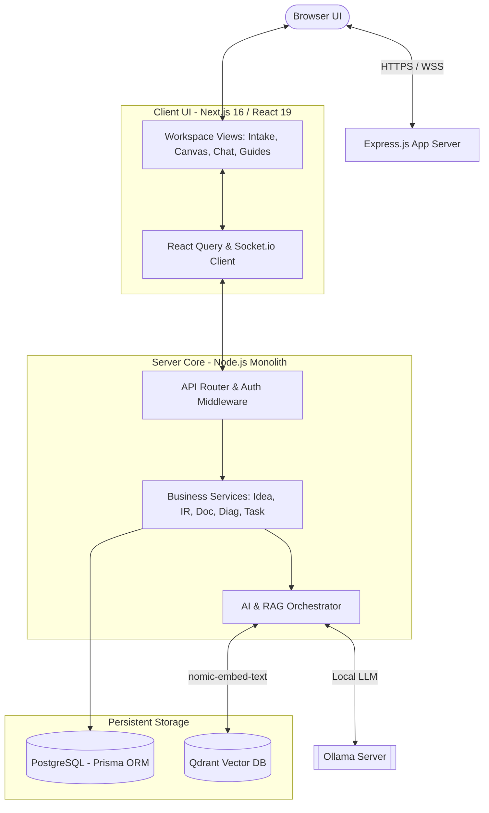
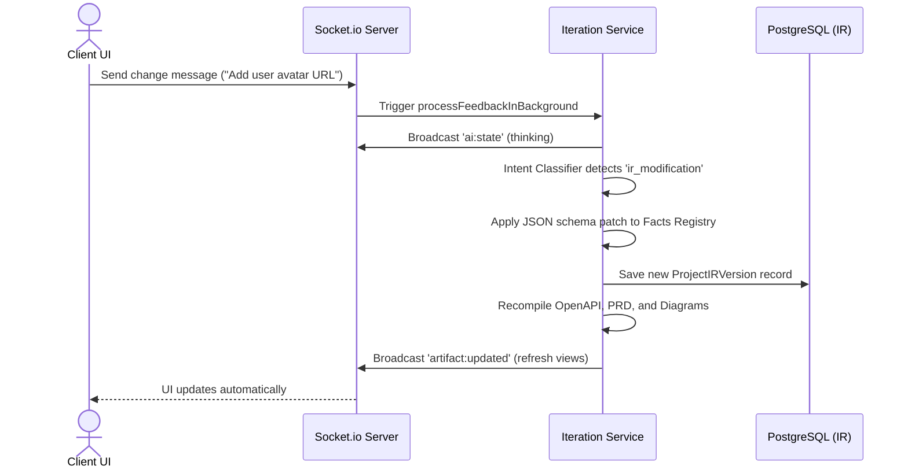
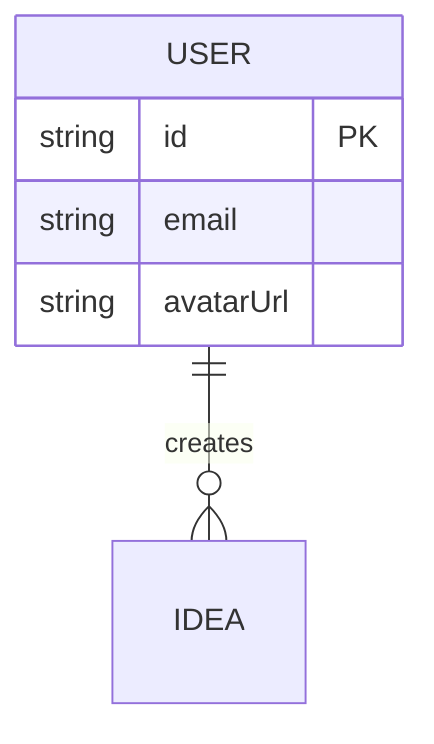
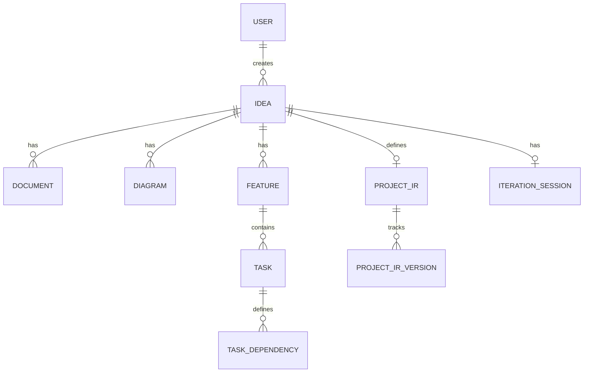

# Graduation Project Presentation: Product Architecture Designer (PAD)

This document contains the complete, slide-by-slide content, visual layouts, code snippets, and precise speaker scripts for the **Product Architecture Designer (PAD)** graduation project presentation.

---

## 📋 20-Slide Agenda & Timing Overview

| # | Slide | Focus Area | Spoken Timing | Word Count |
|---|---|---|---|---|
| 1 | **Title Slide** | Name, tagline, team, supervisor | 12s | ~30 words |
| 2 | **Agenda** | Visual roadmap (do not narrate) | 8s | ~18 words |
| 3 | **Problem & Motivation** | Documentation drift & AI inconsistency | 45s | ~100 words |
| 4 | **Existing Gaps** | Traditional vs. Prompt-based vs. PAD | 22s | ~50 words |
| 5 | **Our Solution: PAD** | One-sentence compiler-style value prop | 18s | ~40 words |
| 6 | **Objectives & Scope** | Core system capabilities | 12s | ~28 words |
| 7 | **System Architecture** | Full client-server-storage topography | 50s | ~115 words |
| 8 | **Core Innovation: IR Engine** | Analyzer, AST schema, compile backends | 42s | ~95 words |
| 9 | **Core Innovation: RAG** | Vector ingestion & prompt grounding | 32s | ~72 words |
| 10 | **End-to-End Flow** | Event-driven sequence diagram | 25s | ~58 words |
| 11 | **Tech Stack** | Visual tool chain (no text) | 10s | ~22 words |
| 12 | **User Journey Overview** | Visual roadmap of the live demo | 15s | ~35 words |
| — | **LIVE DEMO** | Step-by-step UI execution (off-deck) | ~110s | ~240 words |
| 13 | **Sample Generated Output** | Raw OpenAPI spec & Mermaid snippets | 28s | ~63 words |
| 14 | **Database Schema Design** | Full Postgres ERD & version models | 25s | ~55 words |
| 15 | **Functional Modules** | 8 core modules in a grid layout | 22s | ~50 words |
| 16 | **Quality Assurance** | Test framework & Vitest/Pytest metrics | 25s | ~58 words |
| 17 | **Security & Reliability** | JWT, Qdrant tenancy, STRIDE matrix | 15s | ~33 words |
| 18 | **Key Achievements** | Speedup factors & metrics summary | 20s | ~45 words |
| 19 | **Future Work** | SQL diff compiler, Git sync, code generator | 18s | ~40 words |
| 20 | **Thank You / Q&A** | Q&A prompt and reference links | 10s | ~20 words |

---

## 🛝 Slide-by-Slide Content & Script Guide

### Slide 1: Title Slide
* **Target Timing:** 12 seconds

#### 🎨 Visual Layout
* **Background:** Sleek dark-mode canvas with dynamic purple-to-yellow gradient accents.
* **Main Title:** `PAD: Product Architecture Designer` (Bold sans-serif font).
* **Subtitle:** `AI-Powered Systems Compilation & Planning Workspace` (Small, clean text).
* **Team Details:** 
  * Presented by: **Graduation Project Team**
  * Supervisor: **[Supervisor Name]**
  * Institution: **Department of Computer Science & Software Engineering**

#### 📝 Spoken Script
> "Good morning, members of the committee. Today, we are presenting PAD—Product Architecture Designer, a compiler-inspired platform that automates software system design and planning while ensuring absolute consistency across all development artifacts."

---

### Slide 2: Agenda
* **Target Timing:** 8 seconds

#### 🎨 Visual Layout
* **Header:** `Presentation Roadmap`
* **Visual Grid:** Two columns of three items with minimalist icons.
  1. *The Challenge:* Problem & Gaps
  2. *The Core Innovation:* IR Engine & RAG
  3. *Topography:* Architecture & Stack
  4. *In-Action:* User Journey & Demo
  5. *Deep Dive:* Database & QA Validation
  6. *Outcome:* Achievements & Future Roadmap

#### 📝 Spoken Script
> "This slide outlines our roadmap for today. We will move from the core problems to our architectural solution, culminating in a live system demonstration."

---

### Slide 3: Problem & Motivation
* **Target Timing:** 45 seconds

#### 🎨 Visual Layout
* **Title:** `The Cost of Documentation Drift`
* **Left Column (The Process):** 
  * "Pre-development planning takes **days to weeks**."
  * "PRDs, ERDs, and task boards are drawn in silos."
* **Right Column (The Drift - Visual Warning Card):**
  * **Hallucinatory Drift:** Standard LLMs lack system-level logic; they generate inconsistent artifacts (e.g., calling a field `customer_id` in the ERD but `userID` in the OpenAPI spec).
  * **Synchronization Fatigue:** Making a simple schema change forces engineers to manually rewrite specs, update diagrams, and re-allocate tasks, causing massive documentation drift.

#### 📝 Spoken Script
> "Traditional pre-development planning is siloed and painfully slow. When engineers try to accelerate this using standard LLMs, they encounter a critical issue: AI hallucinations. Plain AI models lack system-level validation, leading to contradictions between generated requirements, diagrams, and task boards. Furthermore, when the requirements inevitably change, the system lacks any memory of the structure, forcing engineers to manually synchronize every document. This creates 'documentation drift,' where your diagrams, specifications, and code files constantly slip out of alignment, introducing bugs before a single line of code is written."

---

### Slide 4: Existing Gaps
* **Target Timing:** 22 seconds

#### 🎨 Visual Layout
* **Title:** `Comparing Architectural Approaches`
* **Comparison Matrix Table:**

| Metric / Feature | Traditional Planning | Isolated GenAI Tools | PAD Platform |
|---|---|---|---|
| **Lifecycle Overhead** | Days / Weeks | Hours (High rework) | **35 Minutes** |
| **Artifact Consistency** | Manual check (Drift prone) | None (Hallucination prone) | **Guaranteed (AST Engine)** |
| **Change Propagation** | Manual Rewrite | Complete Re-prompting | **Single-Click Compilation** |
| **Grounding Rules** | Standard templates | Inconsistent prompts | **Isolated Vector RAG** |

#### 📝 Spoken Script
> "Traditional planning is too slow, and standard GenAI tools are too inconsistent, producing mismatched diagrams and requirements. PAD bridges this gap. By centralizing the system structure in a validated intermediate schema, we guarantee consistency, enable instant propagation of changes, and ground all output in custom architectural guidelines."

---

### Slide 5: Our Solution: PAD
* **Target Timing:** 18 seconds

#### 🎨 Visual Layout
* **Title:** `Product Architecture Designer`
* **Core Value Proposition Card:** 
  > *"A compiler-inspired system design platform that centralizes system specifications in a technology-agnostic Intermediate Representation (IR) to generate and synchronize consistent requirements, UML diagrams, and IDE workflows in minutes."*
* **Three Core Pillars:**
  1. **Consistent Compile:** Single source of truth schema.
  2. **Real-time Synchronization:** Bidirectional chat and editor synchronization.
  3. **Grounded RAG:** Dynamic corporate compliance guardrails.

#### 📝 Spoken Script
> "Our solution, PAD, applies compiler theory to software planning. By capturing raw business needs and translating them into a structured, technology-agnostic Intermediate Representation, PAD acts as a compiler. It automatically generates fully consistent, production-ready specifications, diagrams, and task charts, driven by the slogan: One change, total consistency."

---

### Slide 6: Objectives & Scope
* **Target Timing:** 12 seconds

#### 🎨 Visual Layout
* **Title:** `System Objectives & Scope`
* **Four Scope Points (Compact Bullet List):**
  * 🔘 **Structured Modeling:** Define a formal, version-controlled JSON Facts Registry matching physical data schemas.
  * 🔘 **Deterministic Translation:** Build code generators translating the Facts Registry into OpenAPI specs and MermaidJS UML.
  * 🔘 **Closed-Loop Feedback:** Implement a Socket.io change-plan reconciler for real-time iterative updates.
  * 🔘 **Strict Tenancy Safety:** Ground all generations in vector-isolated engineering policies.

#### 📝 Spoken Script
> "To achieve this, our scope was defined by four goals: building a structured, versioned schema model; creating deterministic code generators; establishing a closed-loop real-time updates pipeline; and securing user uploads through strict vector isolation."

---

### Slide 7: System Architecture
* **Target Timing:** 50 seconds

#### 🎨 Visual Layout
* **Title:** `System Topography`
* **Simplified Flowchart Diagram:**



#### 📝 Spoken Script
> "Here is our system architecture, designed as a client-server model. The frontend is built on Next.js 16 and React 19, managing state synchronization using TanStack Query and Socket.io. The backend runs on Node.js and Express, protecting routes with JWT guards and routing operations to dedicated micro-services. For persistent storage, we utilize a PostgreSQL database managed via Prisma ORM for relational schemas, alongside a Qdrant Vector database. The AI orchestrator handles local inference and embeddings via a local Ollama instance, querying Qdrant to pull relevant architectural constraints before compiling outputs."

---

### Slide 8: Core Innovation: IR Facts Engine
* **Target Timing:** 42 seconds

#### 🎨 Visual Layout
* **Title:** `The Three-Layer Compilation Pipeline`
* **Three-Tier Architecture Card:**

```
[Layer 1: The Analyzer (AI)] ➔ Parse brief into a structured, validated JSON AST
        │
[Layer 2: Facts Registry (IR)] ➔ Technology-agnostic single source of truth (PostgreSQL)
        │
[Layer 3: The Generators] ➔ Deterministic compilers (OpenAPI JSON, Mermaid UML, Prisma DSL)
```

* **Key Architecture Rule Table:**

| Layer | AI Dependency | Functionality |
|---|---|---|
| **Analyzer** | Yes (Ollama) | Text-to-JSON parsing |
| **Facts IR** | No | Schema validation & history |
| **Generators** | No (Deterministic) | Compiling IR into code/UML |

#### 📝 Spoken Script
> "The core innovation of PAD is its three-layer compilation pipeline. Instead of relying on AI to generate everything, we isolate the LLM's role to Layer 1—the Analyzer—which parses unstructured text into a structured JSON AST. Layer 2 is the Intermediate Representation, representing the facts of the system—such as entities, modules, and business rules—in our database. Layer 3 contains the Generators. These are pure, deterministic algorithms that read the IR and compile it into target specs: Mermaid ERDs, OpenAPI JSON, and Prisma schemas. Because no AI is involved in the generation phase, consistency is mathematically guaranteed."

---

### Slide 9: Core Innovation: RAG Pipeline
* **Target Timing:** 32 seconds

#### 🎨 Visual Layout
* **Title:** `Guideline-Grounded Generation`
* **Dual-Pipeline Process Visualization:**
  * **A. Ingestion & Indexing Pipeline:**
    `Text File Upload` ➔ `LangChain Splitter (750 Size / 150 Overlap)` ➔ `nomic-embed-text` ➔ `Qdrant DB`
  * **B. Retrieval & Context Injection Pipeline:**
    `User Command` ➔ `Embed Query` ➔ `Qdrant Cosine Similarity (top 4 matching chunks)` ➔ `Prompt Injection` ➔ `Ollama LLM`
* **Visual Callout:** Hard tenancy filter on `userId` vector payload ensures zero cross-user guideline leaks.

#### 📝 Spoken Script
> "To enforce custom rules, we built an isolated RAG pipeline. First, during ingestion, plain text guidelines are divided into overlapping chunks of 750 characters using LangChain's splitter, vectorized via Ollama's nomic embeddings model, and saved into Qdrant. When a user triggers any generation, their prompt is vectorized to execute a cosine similarity search, retrieving the top four relevant guideline chunks. These are injected directly into the LLM system prompt. A strict filter on the tenant's user ID ensures that no guideline data is ever shared across workspaces."

---

### Slide 10: End-to-End Flow
* **Target Timing:** 25 seconds

#### 🎨 Visual Layout
* **Title:** `Closed-Loop Change Propagation`
* **Sequence Diagram:**



#### 📝 Spoken Script
> "This sequence diagram illustrates our real-time change propagation flow. When a user posts a change request in the chat panel, the Socket.io server delegates it to the Iteration Service. The Intent Classifier identifies it as an IR modification, patches the Facts Registry, and writes a new version to PostgreSQL. The backend then automatically re-runs all generators, pushing a Socket update back to the browser to reload the UI."

---

### Slide 11: Tech Stack
* **Target Timing:** 10 seconds

#### 🎨 Visual Layout
* **Title:** `Technology Stack`
* **Visual Logos Only (Icons grid with minimalist labels):**
  * **Frontend:** Next.js 16 (App Router) • React 19 • Tailwind CSS • TanStack Query v5 • Socket.io Client
  * **Backend:** Node.js • Express.js • TypeScript • Prisma ORM
  * **Database & Vector:** PostgreSQL • Qdrant DB
  * **Generative AI:** Ollama Local Server (Qwen / Llama / nomic-embed-text)
  * **Diagram Canvas:** MermaidJS rendering engine

#### 📝 Spoken Script
> "Our technology stack consists entirely of modern, production-grade tools. The frontend client integrates React 19 with Next.js 16, while the backend relies on Express, PostgreSQL, Prisma, Qdrant, and local Ollama servers."

---

### Slide 12: User Journey Overview
* **Target Timing:** 15 seconds

#### 🎨 Visual Layout
* **Title:** `Live Demo Journey`
* **User Journey Step-Cards (Horizontal layout):**
  ```
  1. Intake View ➔ 2. Live Canvas ➔ 3. IREditor Tree ➔ 4. Chat & Recompile
  ```
  * **Intake:** Input brief & answer AI-generated clarifying questions.
  * **Canvas:** Review generated markdown specs & live MermaidJS ERDs.
  * **Facts Tree:** View and edit data entities directly inside the IREditor.
  * **Chat Recompile:** Prompt the chatbot, watch real-time Socket.io schema patches, and review compiled output.

#### 📝 Spoken Script
> "Before we switch to the laptop, this diagram shows the user journey we are about to demonstrate. We will go from a raw intake brief to generated requirements and UML diagrams, review the Facts Registry tree, and finally request a change via chat. I will now switch to the laptop."

---

### Slide —: LIVE DEMO (Laptop, Off-Deck)
* **Target Timing:** ~110 seconds

#### 📝 Step-by-Step Live Demo Script (For the Presenter)
* **[0:00 - 0:25] Intake & Pre-Validation:**
  > *"I will start by creating a new workspace. I'll paste a simple brief: 'A SaaS platform for tracking workspace tasks.' When I click submit, the AI analyzes the brief, returning missing constraints and direct clarifying questions. I will submit my answers, and the system transitions the workspace status to 'confirmed'."*
* **[0:25 - 0:50] Requirements & Live Diagrams Canvas:**
  > *"With the workspace confirmed, the compiler initializes the IR and automatically generates the PRD, BRD, and Mermaid diagrams. If I click on 'Diagrams', you can see our live ERD and sequence flow rendered in real-time. I can manually edit the Mermaid script on the right, and the canvas updates instantly."*
* **[0:50 - 1:15] Browsing the Facts Registry (IREditor):**
  > *"If we navigate to the 'Facts Registry' view, we can inspect the underlying Intermediate Representation. This is not markdown text; it's a structured JSON tree containing our entities, attributes, and user roles. I can edit this tree directly using the form, updating field constraints without using the AI."*
* **[1:15 - 1:50] Chat-based Patching & OpenAPI Specification:**
  > *"Now, let's test change propagation. I'll open the workspace chat and type: 'Add an avatar URL field to the User model.' You can see the thinking state broadcast via WebSockets. The Intent Classifier identifies this as an IR modification, patches the schema, updates the documents, and rebuilds the task DAG. If we view the compiled output, you can see the newly generated OpenAPI JSON schema containing the new User endpoints and fields."*

---

### Slide 13: Sample Generated Output
* **Target Timing:** 28 seconds

#### 🎨 Visual Layout
* **Title:** `Compiled Specifications & Code Output`
* **Left Code Box (OpenAPI JSON Output):**
```json
{
  "openapi": "3.0.0",
  "paths": {
    "/api/v1/users": {
      "get": {
        "summary": "List all users",
        "operationId": "listUsers"
      }
    }
  },
  "components": {
    "schemas": {
      "User": {
        "type": "object",
        "properties": {
          "id": { "type": "string" },
          "avatarUrl": { "type": "string" }
        }
      }
    }
  }
}
```
* **Right Code Box (MermaidJS ERD Script Output):**


#### 📝 Spoken Script
> "To prove the system produces real assets rather than mockups, here is a snippet of actual generated outputs. On the left is the compiled OpenAPI 3.0 JSON specification, mapping paths and database types dynamically. On the right is the compiled Mermaid JS database script. These are generated programmatically from the IR schema and are ready to be integrated into development workflows."

---

### Slide 14: Database Schema Design
* **Target Timing:** 25 seconds

#### 🎨 Visual Layout
* **Title:** `PostgreSQL Database Schema (Fig 5.1)`
* **Simplified Entity-Relationship Diagram:**



* **Core Highlights Callout:**
  * **Dual Version Control:** Separate version tables for Documents, Diagrams, Features, Tasks, and the IR ensure audit logs and full system rollback capabilities.

#### 📝 Spoken Script
> "This is our physical database schema, implemented in PostgreSQL via Prisma. The `ideas` table anchors all workspace resources. Crucially, rather than storing static assets, tables like `documents`, `diagrams`, and `project_ir` are paired with dedicated `version` tables. This supports full history logging, allowing developers to inspect diffs and rollback any asset to a prior version."

---

### Slide 15: Functional Modules Overview
* **Target Timing:** 22 seconds

#### 🎨 Visual Layout
* **Title:** `Functional Modules Grid`
* **8-Module Compact Grid:**

```
┌───────────────────────────────────────┬───────────────────────────────────────┐
│  M1: Idea Intake & Pre-Validation     │  M2: PRD & BRD Document Generation    │
│  (Refinement Q&A & Intake Logger)      │  (Rich text editor & version revert)  │
├───────────────────────────────────────┼───────────────────────────────────────┤
│  M3: System Architecture Diagrams     │  M4: Feature Breakdown & Task DAG     │
│  (Live Mermaid canvas & parser guard) │  (DAG dependency & effort metrics)    │
├───────────────────────────────────────┼───────────────────────────────────────┤
│  M5: Actionable Workflows             │  M6: Unified Chat Assistant           │
│  (Step-by-step IDE instructions)      │  (WebSocket streaming, Intent engine) │
├───────────────────────────────────────┼───────────────────────────────────────┤
│  M7: Facts Schema & IR Engine         │  M8: Guidelines & Uploads (RAG)       │
│  (Facts tree editor, OpenAPI compile) │  (Cosine search vector isolation)     │
└───────────────────────────────────────┴───────────────────────────────────────┘
```

#### 📝 Spoken Script
> "PAD's architecture is divided into eight functional modules. These cover the entire pre-development lifecycle—starting from intake and pre-validation, progressing to document and diagram compilers, task DAG and workflow step extraction, and ending with our WebSocket chat assistant, IR compiler engine, and guidelines uploader."

---

### Slide 16: Quality Assurance Approach
* **Target Timing:** 25 seconds

#### 🎨 Visual Layout
* **Title:** `Quality Assurance & Testing Framework`
* **Left Box (Vitest Front-End Suite):**
  * Verifies lazy Socket.io connections (`socket_lazy_chat.test.js`).
  * Asserts connection gating on `/chat/` page load to prevent dev server freezes.
* **Right Box (Pytest Back-End Suite):**
  * Automated endpoint health checks (`test_endpoints_health.sh`).
  * Unit tests validating rate limiting, vector similarity retrieval, token counters, and database transactions with automatic rollback fixtures.
* **Middle Chart:** 3 test execution profiles (`fast` <30s, `standard` <5m, `full` <15m).

#### 📝 Spoken Script
> "Our quality assurance approach uses a multi-layered testing framework. On the frontend, we use Vitest to verify UI behaviors, such as confirming lazy Socket.io connections on chat page load. On the backend, we run Pytest health checks and unit tests to validate our vector search and rate limiters. We use database fixtures to automatically rollback writes, keeping our test database clean."

---

### Slide 17: Security & Reliability
* **Target Timing:** 15 seconds

#### 🎨 Visual Layout
* **Title:** `Security & Multi-Tenant Isolation`
* **Left (Authentication & Tenancy):**
  * **JWT Guards:** HTTP request header protection (`Authorization: Bearer <token>`).
  * **Database Isolation:** Hard filtering on `userId` keys for all database queries.
  * **Vector Isolation:** Metadata filters in Qdrant prevent cross-tenant vector leaks.
* **Right (STRIDE Threat Matrix):**
  * *Spoofing:* Encrypted password hashing (bcrypt) + JWT signatures.
  * *Tampering:* Zod schema validation blocks on API entry points.
  * *Denial of Service:* Strict rate-limiting middlewares on API routers.

#### 📝 Spoken Script
> "To guarantee security in multi-tenant environments, we implement stateless JSON Web Tokens alongside Zod validation. Database queries and Qdrant vector searches enforce strict filters on user IDs. We also apply STRIDE modeling to protect the system against tampering and denial-of-service attacks."

---

### Slide 18: Key Achievements
* **Target Timing:** 20 seconds

#### 🎨 Visual Layout
* **Title:** `Key Achievements`
* **Four Core Metrics (Highlighted with bold purple cards):**
  * ⚡ **97.9% Pre-Development Reduction:** Planning cycle reduced from 28 hours (manual) to **35 minutes** (PAD).
  * ⚡ **48x Lifecycle Speedup:** Unified compilation generates requirements, diagrams, and task dependency graphs simultaneously.
  * ⚡ **Zero Artifact Drift:** The technology-agnostic IR schema acts as a single source of truth, ensuring total alignment.
  * ⚡ **On-Premises Privacy:** All AI operations run locally via Ollama, protecting proprietary corporate IP.

#### 📝 Spoken Script
> "Our results demonstrate significant improvements in planning efficiency. PAD achieves a 97.9% reduction in pre-development overhead, speeding up the planning process by forty-eight times. It eliminates artifact drift through the IR compiler and ensures complete data privacy by running all LLM inferences locally."

---

### Slide 19: Future Work
* **Target Timing:** 18 seconds

#### 🎨 Visual Layout
* **Title:** `Future Extensions Roadmap`
* **Future Features (Flowchart cards):**
  * ⚙️ **SQL Schema Migration Compiler:** Auto-diffing IR schemas to compile PostgreSQL SQL migration scripts (`ALTER TABLE`) and update ORM code.
  * ⚙️ **Bidirectional Git Sync:** Webhook-driven repository sync to auto-merge OpenAPI edits into the IR or push signed commits to GitHub/GitLab.
  * ⚙️ **Code Scaffolding Compiler:** Compiling IR schemas into physical React and Express workspaces, including typescript routes, Zod models, and client state hooks.

#### 📝 Spoken Script
> "Looking ahead, we have designed three key extensions: first, a SQL migration compiler to auto-generate database alteration scripts; second, a bidirectional Git sync to merge code-level edits back into the IR; and third, a code scaffolding compiler to generate project skeletons directly from compiled specs."

---

### Slide 20: Thank You / Q&A
* **Target Timing:** 10 seconds

#### 🎨 Visual Layout
* **Main Text:** `Thank You!` (Large center heading).
* **Subtitle:** `Questions & Answers`
* **Contact Details:** 
  * Repository: `github.com/ABDELRAHMAN-ELRAYES/PAD`
  * Emails: `contact@elrayes.dev` | `mohamed@elrayes.dev`
* **Visual Anchor:** Minimalist dashboard screenshot mock in background.

#### 📝 Spoken Script
> "Thank you for your time. I am now open to any questions or feedback you may have regarding our system."
